⟶ E-BOOK


# The Universal Render Pipeline cookbook: **Recipes for shaders and visual effects**


© 2025 Unity Technologies

## **Contents**

| Introduction 5                                   |
|--------------------------------------------------|
| Author and contributors 7                        |
| Unity contributors 7                             |
| Getting started with this guide 8                |
| Starting a new URP project 9                     |
| Importing e-book sample scenes 10                |
| Stencils 13                                      |
| Renderer Features 14                             |
| Instancing 20                                    |
| GPU Resident Drawer and GPU occlusion culling 21 |
| Instancing 23                                    |
| SRP Batcher 24                                   |
| GPU Instancing 26                                |
| RenderMeshPrimitives 28                          |
| Toon and outline shading 33                      |
| Simple toon shading 35                           |
| Shading 35                                       |
| Outlining 36                                     |
| Toon shading 37                                  |
| Shading 37                                       |
| Outlining 41                                     |
| Ambient occlusion 44                             |
| SSAO properties 46                               |

| Decals 49                          |  |
|------------------------------------|--|
| URP Decal Projection properties 51 |  |
| Creating the material 52           |  |
| Adding a decal with code 53        |  |
| Water 55                           |  |
| DepthFade subgraph 57              |  |
| TextureMovement subgraph 58        |  |
| Water shader 58                    |  |
| Color 59                           |  |
| Normal maps 61                     |  |
| Swell 62                           |  |
| LUT for color grading 64           |  |
| Adaptive Probe Volumes 72          |  |
| Using APVs in a scene 74           |  |
| Lighting Scenario asset 77         |  |
| Fixing issues with APVs 80         |  |
| Light leaks 82                     |  |
| Rendering Layers 83                |  |
| Streaming APVs 86                  |  |
| Sky occlusion 87                   |  |
| Light probes vs APVs 90            |  |
| Screen space refraction 92         |  |
| Volumetrics 102                    |  |
| Volumetric cloud 103               |  |

| Procedural noise 114                       |
|--------------------------------------------|
| Types of procedural noise 115              |
| Implementing procedural noise in Unity 115 |
| Procedural heightmap example 116           |
| Using noise to generate a wood texture 119 |
| Benefits of procedural noise 126           |
| Challenges and optimization 127            |
| Compute shaders 128                        |
| ParticleFun 129                            |
| Adding a mesh object 139                   |
| Conclusion 151                             |

## <span id="page-4-0"></span>Introduction

A dash of post-processing effects, a cup of decals, a pinch of color grading, and some sparkling water: It's time to cook up some high-quality lighting and visual effects in your games using the Universal Render Pipeline (URP).

Over 12 chapters, our URP cookbook offers up numerous recipes for creating popular effects. Additionally, sample scenes based on these recipes are available to download from [this](https://github.com/NikLever/Unity-URP-Cookbook-Unity6) GitHub repo maintained by the main author, Nik Lever.

This guide is aimed at intermediate Unity users who have developed projects in Unity, know how to use URP features, and have some knowledge of writing HLSL-based shaders.

You'll get all the ingredients you need to:

- Create an x-ray-like image effect with stencils.
- Build a toon and outline shader with Shader Graph.
- Add an ambient occlusion effect with post-processing.
- Use Photoshop and a LUT image to add color grading to your scenes.
- Produce reflections and refraction, and much more.


The e-book and the downloadable sample scenes for each recipe are now updated for Unity 6. New additions to this guide include:

- Two new recipes for procedural noise and compute shaders
- A full revision of the Toon shader
- A section on how to implement Adaptive Probe Volumes (APVs), a quick and flexible alternative to light probes
- Steps on how to use the new Render Graph API for creating Renderer Features

Reference this cookbook alongside the e-book *[Introduction to the Universal Render Pipeline for](https://unity.com/resources/introduction-to-urp-advanced-creators-unity-6)  [advanced Unity creators](https://unity.com/resources/introduction-to-urp-advanced-creators-unity-6)*. There is also a playlist of [URP tutorials](https://www.youtube.com/watch?v=NFBr21V0zvU&list=PLX2vGYjWbI0QRLkvupULwSZCPkLyHs-UX) on Unity's YouTube channel, providing both general and more specialized tips for creating lighting and effects for your games.

We hope you have fun creating beautiful effects for your game.

Many of the recipes in this e-book use [High-Level Shader](https://learn.microsoft.com/en-us/windows/win32/direct3dhlsl/dx-graphics-hlsl) [Language](https://learn.microsoft.com/en-us/windows/win32/direct3dhlsl/dx-graphics-hlsl) or HLSL. If you are new to this language then see the following resources for a good introduction:

- [Example](https://docs.unity3d.com/6000.0/Documentation/Manual/urp/writing-shaders-urp-landing.html) [of](https://docs.unity3d.com/6000.0/Documentation/Manual/urp/writing-shaders-urp-landing.html) [custom shaders from the Unity Manual](https://docs.unity3d.com/6000.0/Documentation/Manual/urp/writing-shaders-urp-landing.html)
- [Ronja's HLSL tutorials](https://www.ronja-tutorials.com/post/002-hlsl/)
- [Udemy: Learn Unity Shaders from Scratch](https://www.udemy.com/course/learn-unity-shaders-from-scratch/)
- [The Book of Shaders](https://thebookofshaders.com/)

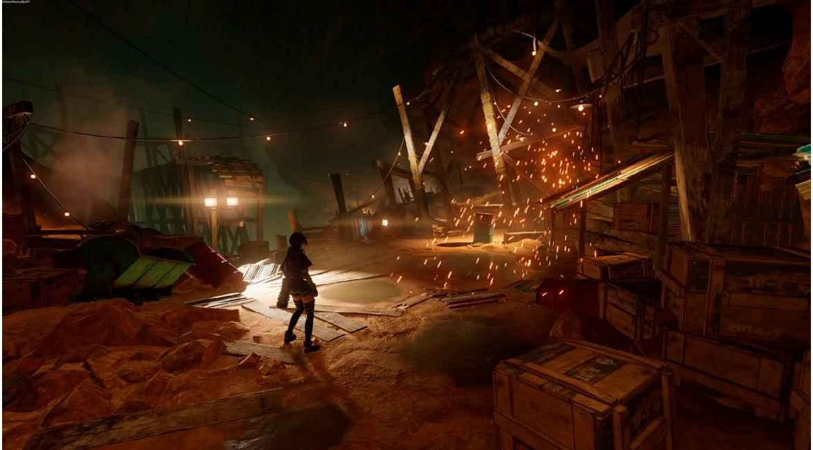

This image is from *PRINCIPLES,* a sample of what URP can achieve in the hands of experienced developers. *PRINCIPLES* is an adventure game from COLOPL Creators, the technology brand of COLOPL Inc, who developed the series of *Shironeko Project* and *Quiz RPG: The World of Mystic Wiz*. Experience a deep underworld that makes use of Unity's latest features, including URP, for stunning graphics and immersive 3D sound. *PRINCIPLES* is currently available on [App Store](https://apps.apple.com/jp/app/principles/id1620294510) or [Google Play](https://play.google.com/store/apps/details?id=jp.colopl.ruins). You can also watch an interview with the studio [here](https://www.youtube.com/watch?v=qKTX5GKKpwM).

## <span id="page-6-0"></span>Author and contributors

Nik Lever, the main author of this e-book, has been creating real-time 3D content since the mid-90s and using Unity since 2006. For over 30 years, he's led the small development company Catalyst Pictures, and has provided courses since 2018 with the aim of helping game developers expand their knowledge in a rapidly evolving industry.

#### **Unity contributors**

**Steven Cannavan** is a senior software development consultant at Unity, specializing in graphics and rendering. He has over 15 years of experience in the game development industry.

**MingWai Chan** is a senior technical artist on Unity's graphics engineering team. She has worked at Unity for eight years and has been using the Editor since 2012.

**Oliver Schnabel** is a senior technical product manager in Unity's graphics team, where he integrates customer insights and works with global studios to prioritize the development of a more performant, unified, and scalable rendering stack. He brings extensive experience in computer graphics and real-time development.

**Jonas Mortensen** is a senior technical artist on Unity's Graphics team.

**Adrien Moulin** is a senior graphics developer in Unity's render pipeline team. He has over eight years of experience in the simulation and real-time software industry. He is currently focused on delivering the best possible foundations and APIs to the Scriptable Render Pipeline users.

**Mathieu Muller** is the lead product manager for Graphics at Unity. He leads the Graphics product management team and oversees the Graphics roadmap and product vision.

**Damian Nachman** is a senior technical product manager in Unity's graphics team, specializing in low-level graphics development and optimization. He has 10 years of experience with working on real-time graphics engines and benchmarking across multiple industries.

## <span id="page-7-0"></span>Getting started with this guide

You can follow the steps in each recipe to recreate the lighting and visual effects by opening a new URP project. Additionally, you can access the [Github page](https://github.com/NikLever/Unity-URP-Cookbook-Unity6) that accompanies this guide, which provides you with downloadable sample scenes for each recipe.


All of the recipes have been updated extensively to work in Unity 6.

## <span id="page-8-0"></span>Starting a new URP project

Open a new project using URP via the Unity Hub. Click **New**, and verify that the Unity version selected at the top of the window is 6000.01 or newer. Choose a name and location for the project, select the **3D (URP)** template, and click **Create**.

|                           | New project<br>Editor Version: 6000.0.18f1 ≤ Silicon ( |                                                                                                                           |
|---------------------------|--------------------------------------------------------|---------------------------------------------------------------------------------------------------------------------------|
| =<br>All templates        | Q Search all templates                                 |                                                                                                                           |
| ම<br>Core<br>다.<br>Sample | Universal 2D<br>SRP<br>Core                            | SRF                                                                                                                       |
| ಳು<br>Learning            | Universal 3D<br>SRP<br>Core                            | Universal 3D                                                                                                              |
|                           | High Definition 3D<br>SRP<br>Core                      | This template includes the settings and<br>assets you need to start creating with the<br>Universal Render Pipeline (URP). |
|                           | Universal 3D sample<br>SRP<br>0<br>Sample              | 11<br>Read more<br>PROJECT SETTINGS                                                                                       |
|                           | High Definition 3D sample<br>SRP<br>C<br>Sample        | Project name<br>My project                                                                                                |
|                           |                                                        | Create project<br>Cancel                                                                                                  |

If you create a new project with the Universal 3D template, you might have to download the template for the first time.

**Note:** The template ensures that your project is set to use a linear color space, which is required for calculating lighting correctly.

|                                                                                             |                                                     |                          | SampleScene - Test - Windows, Mac, Linux - Unity 6 Preview (6000.0.18f1) <Metal> |                                                                                                                                                                    |
|---------------------------------------------------------------------------------------------|-----------------------------------------------------|--------------------------|----------------------------------------------------------------------------------|--------------------------------------------------------------------------------------------------------------------------------------------------------------------|
| Unity 6 PREVIEW   2 NL + Asset Store ▼ 0                                                    |                                                     | > 11 11                  |                                                                                  | ල<br>Q Layout ▼<br>4                                                                                                                                               |
| a :<br>= Hierarchy                                                                          | # Scene<br>Game                                     | TwoToneDither<br>TintSG  | 11                                                                               | O Inspector<br>· Lighting<br>a :                                                                                                                                   |
| ഇ<br>+ ▼ a. All<br>▼ SampleScene<br>11<br>Main Camera<br>Directional Light<br>Global Volume | Game<br>Display 1 ▼ Free Aspect                     | ▼ Scale @- 1x            | Play Focused ▼ 卷 岭 四 Stats Gizn                                                  | URP Empty<br>1<br>Template                                                                                                                                         |
|                                                                                             |                                                     |                          |                                                                                  | Welcome to the Universal Render<br>Pipeline<br>This template includes the settings and<br>assets you need to start creating with the<br>Universal Render Pipeline. |
|                                                                                             |                                                     |                          |                                                                                  | URP Documentation<br>Read more about URP                                                                                                                           |
|                                                                                             |                                                     |                          |                                                                                  | Forums<br>Get answers and support                                                                                                                                  |
|                                                                                             |                                                     |                          |                                                                                  | Report bugs<br>Submit a report                                                                                                                                     |
|                                                                                             |                                                     |                          |                                                                                  | Remove Readme Assets                                                                                                                                               |
| Project<br>Console<br>++<br>★ Favorites                                                     | * Project Settings<br>Rendering Debugger            | Render Graph Viewer<br>a | a :<br>2 3 # # 0 22                                                              |                                                                                                                                                                    |
| Q All Materials<br>Q All Models<br>Q All Prefabs                                            | Assets<br>InputSystem_Actions<br>Q Readme<br>Scenes |                          |                                                                                  |                                                                                                                                                                    |
| Assets<br>Scenes<br>Settings<br>> Tutorialinfo                                              | Settings<br>TutorialInfo                            |                          |                                                                                  |                                                                                                                                                                    |
| Packages                                                                                    |                                                     |                          |                                                                                  | Asset Labels<br>0                                                                                                                                                  |
|                                                                                             | Assets/Readme.asset                                 |                          |                                                                                  | · None ·<br>AssetBundle<br>None                                                                                                                                    |
|                                                                                             |                                                     |                          |                                                                                  | ※ & ◎                                                                                                                                                              |

This template is empty but has URP and its assets preconfigured and installed.

<span id="page-9-0"></span>Go to **Edit > Project Settings**, and open the **Graphics** panel. You'll see the **Default Render Pipeline Asset.** This [URP Asset](https://docs.unity3d.com/Packages/com.unity.render-pipelines.universal@17.0/manual/universalrp-asset.html) controls the global rendering and quality settings of a project and creates the rendering pipeline instance. Meanwhile, the rendering pipeline instance contains intermediate resources and the render pipeline implementation.

**PC\_RPAsset** is the default URP Asset selected, but you can switch to **Mobile\_RPAsset** for an asset more suited to a device with more restricted resources.

| Project                                                       | Project Settings |           | E Console                                                                                             | Rendering Debugger | Render Graph Viewer                   |                                                |    |   |
|---------------------------------------------------------------|------------------|-----------|-------------------------------------------------------------------------------------------------------|--------------------|---------------------------------------|------------------------------------------------|----|---|
|                                                               |                  |           |                                                                                                       |                    |                                       | Q                                              |    |   |
| Adaptive Performance<br>Audio<br>Burst AOT Settings<br>Editor |                  |           | Graphics                                                                                              |                    |                                       | 0                                              | 12 |   |
|                                                               |                  |           | 1<br>Set Default Render Pipeline Asset                                                                |                    |                                       |                                                |    |   |
| Graphics                                                      |                  |           | Set the Default Render Pipeline Asset that Unity uses when you don't have asset in the active Quality |                    |                                       |                                                |    |   |
| Input Manager<br>Input System Package<br>Settings             |                  | Level.    | Default Render Pipeline                                                                               |                    |                                       | D PC_RPAsset (Universal Render Pipeline Asset) | 0  |   |
| Memory Settings<br>Package Manager                            |                  |           | Shader Stripping<br>Lightmap Modes                                                                    |                    | Automatic                             |                                                | >  |   |
| Physics                                                       |                  | Fog Modes |                                                                                                       |                    | Automatic                             |                                                | >  |   |
| Settings<br>Physics 2D                                        |                  |           | Instancing Variants                                                                                   |                    | Strip Unused                          |                                                | >  |   |
| Player                                                        |                  |           | BatchRendererGroup Variants                                                                           |                    | Strip if no Entities Graphics package |                                                | >  |   |
| Preset Manager                                                | P                |           |                                                                                                       |                    |                                       |                                                |    | > |

The Graphics panel in Project Settings

### Importing e-book sample scenes

You can clone the repository from [here](https://github.com/NikLever/Unity-URP-Cookbook-Unity6) or download the code in a zip file and unzip it.

| > 0 tags         |                                                 | Go to file | Code -   | About                                          |
|------------------|-------------------------------------------------|------------|----------|------------------------------------------------|
|                  | Local                                           | Codespaces |          | Examples from the Unity URP Cookbook<br>e-book |
| Raymarching      | >-<br>Clone                                     |            | 3        | 13<br>O stars                                  |
| LUT              | HTTPS<br>GitHub CLI                             |            |          | 0<br>1 watching                                |
| Raymarching      | https://github.com/NikLever/Unity-URP-Coo       |            | 10       | ంది<br>0 forks                                 |
| Initial commit   | Use Git or checkout with SVN using the web URL. |            |          | Releases                                       |
| Added Instancing | Open with GitHub Desktop                        |            |          | No releases published                          |
| Initial commit   |                                                 |            |          |                                                |
|                  | ង្រ<br>Download ZIP                             |            | Packages |                                                |
|                  |                                                 |            |          | No packages published                          |
|                  |                                                 |            |          | Languages                                      |
|                  |                                                 |            |          | ShaderLab 68.4%<br>● C# 28.0%                  |
|                  |                                                 |            |          | HLSL 3.6%<br>0                                 |

The GitHub repository from where you can download the project by clicking the green Code button

Once the project is unzipped and downloaded, import it from the Unity Hub via **Open > Add project from disk.**

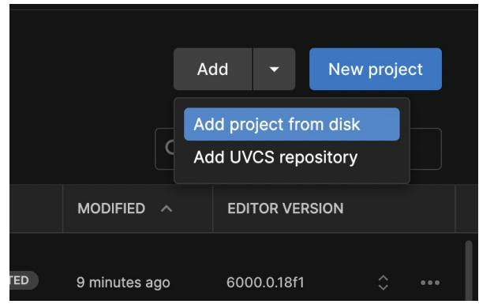

Import the sample project from Unity Hub.

It's important that you are working in the same version of the Editor as that used for the sample project. If the Editor versions don't match, the Hub will show a warning message about a missing Editor version. You can install the missing version from the blue button at the bottom right, as seen in this image.

| Unity6E-book: Warning                                                                                                                                                                                                                            | × |  |  |  |
|--------------------------------------------------------------------------------------------------------------------------------------------------------------------------------------------------------------------------------------------------|---|--|--|--|
| Missing Editor Version<br>il<br>To open your project, install Editor version 6000.0.4f1 or select a different version below.<br>Please note: using a different Editor version than the one your project was created with<br>may introduce risks. |   |  |  |  |
| MISSING VERSION                                                                                                                                                                                                                                  |   |  |  |  |
| 6000.0.4f1 @ Intel                                                                                                                                                                                                                               |   |  |  |  |
| 6000.0.4f1 & Silicon                                                                                                                                                                                                                             |   |  |  |  |
| INSTALLS                                                                                                                                                                                                                                         |   |  |  |  |
| C anno n 19f1 & cilinan                                                                                                                                                                                                                          |   |  |  |  |
| ു Install Other Editor Version<br>Cancel Install Version 6000.0.4f1                                                                                                                                                                              |   |  |  |  |

Install the version of the Unity Editor that matches any tutorial project you're following and/or downloading. This is easy to do via the Unity Hub.

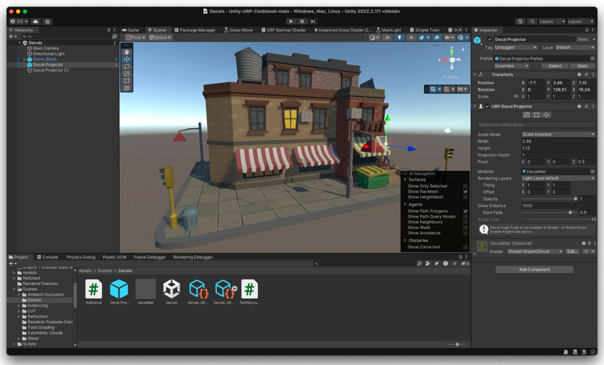

#### Once the correct Editor version is installed, you will be able to open the project as normal.

Each recipe is contained in a folder along with the steps and files referred to in this book.

## <span id="page-12-0"></span>Stencils


In the Made with Unity game *[TUNIC](https://tunicgame.com/)* (created by Andrew Shouldice, TUNIC Team, 22nd Century Toys LLC, and Isometricorp Games Ltd., published by Finji), the main character's silhouette is drawn when props are blocking him. This effect can be achieved with Renderer Features in URP. It's also explained in this [video tutorial.](https://www.youtube.com/watch?v=3CpEn_mmr3o)

<span id="page-13-0"></span>URP has two assets that control the final render, the [Universal Renderer Asset](https://docs.unity3d.com/Packages/com.unity.render-pipelines.universal@17.0/manual/urp-universal-renderer.html) and the [URP](https://docs.unity3d.com/Packages/com.unity.render-pipelines.universal@17.0/manual/universalrp-asset.html)  [Asset.](https://docs.unity3d.com/Packages/com.unity.render-pipelines.universal@17.0/manual/universalrp-asset.html) From the former, you can add [Renderer Features](https://docs.unity3d.com/Packages/com.unity.render-pipelines.universal@17.0/manual/urp-renderer-feature.html) to be injected into any stage of the rendering pipeline, such as:

- Rendering shadows
- Rendering prepasses
- Rendering G-buffer
- Rendering Deferred lights
- Rendering opaques
- Rendering Skybox
- Rendering transparents
- Rendering post-processing

## Renderer Features

Renderer features provide you with ample opportunity to experiment with lighting and effects. This section will focus on Stencils, using only the bare minimum of required code.

To work along, open the sample scene via **Scenes > Renderer Features Stencils > SmallRoom - Stencil** in the Editor.


Stencils in action: As the magnifying glass moves over the desk, it can see through to reveal what is in the drawers.

As the above image shows, the aim in this example is to convert the lens of the magnifying glass so it allows you to to see through the desk, like an X-ray image. The approach uses a combination of Layer Masks, shaders, and Renderer Features. The first step is to change the material used by the lens, in this case a material called **MaskMat,** with a shader called **Custom/StencilMask**.


```
Shader "Custom/StencilMask"
{
 Properties{}
    SubShader{
 Tags {
 "RenderType" = "Opaque"
 }
 Pass {
 ZWrite Off
 HLSLPROGRAM
 #pragma vertex vert
 #pragma fragment frag
 #include 
"Packages/com.unity.render-pipelines.universal/ShaderLibrary/Core.hlsl"
 struct Attributes
 {
 float4 positionOS : POSITION;
 };
 struct Varyings
 {
 float4 positionHCS : SV_POSITION;
 };
 Varyings vert(Attributes IN)
 {
 Varyings OUT;
 OUT.positionHCS = TransformObjectToHClip(IN.positionOS.xyz);
 return OUT;
 }
 half4 frag() : SV_Target
```


 { return (half4)0; } ENDHLSL } } }

> Notice that Custom/StencilMask has the command ZWrite Off. In most cases, if you set ZWrite Off for an object, it will disappear because the object doesn't write its depth value into the depth buffer, so it won't obstruct objects that are behind it anymore. The object will still be rendered with the same order, but the drawn pixel content is being overridden by the objects behind. To clarify, setting ZWrite Off doesn't change the render order (but setting render queue index does). If you change its render queue index to a higher value than Geometry, then it will reappear. For this example, it's been left at 2000, the Geometry value.

> The only action you want the lens to perform is to write a value to the Stencil buffer. Since you need to consider the stencil writes and not the output of the shader to the color buffer, you can disable the color writes, ColorMask 0. This is a slightly optimized approach, especially if you want this to work with the [Deferred Rendering path](https://docs.unity3d.com/6000.0/Documentation/Manual/urp/rendering/deferred-rendering-path-landing.html) as the scene would be rendered before the lens mask.

 This example uses two custom layers, **Mask** and **SeeThrough**. The lens is in the Mask layer, while the desk, but not its children, is in the SeeThrough layer.

This scene uses the Renderer Data object named **See Through Settings\_Renderer**, located in the same folder as the scene file, materials, and shader: **Scenes > Renderer Feature Stencils**. The script attached to the Main Camera, AutoLoadPipelineAsset, ensures this is set as the Scriptable Render Pipeline Asset in **Project Settings > Graphics**. Now let's check the settings for this asset.

| V Auto Load Pipeline Asset (Script) |                                                   | 2 T |
|-------------------------------------|---------------------------------------------------|-----|
| Script                              | AutoLoadPipelineAsset                             | 0   |
| Pipeline Asset                      | & SeeThroughSettings (Universal Render Pipeline ල |     |

Pipeline Asset set for the Main Camera > Auto Load Pipeline Asset script

Select the **SeeThrough Settings\_Renderer** via **Scenes > Renderer Feature Stencils**. The first setting changed from the default is the **Opaque Layer Mask**. Note that this excludes Mask and SeeThrough.

|                                                                                              |   | See Through Settings_Renderer (Universal Rende ® :  | Open        |
|----------------------------------------------------------------------------------------------|---|-----------------------------------------------------|-------------|
| Filtering<br>Opaque Layer Mask Mixed                                                         |   |                                                     | 9           |
| Transparent Layer M                                                                          |   | Nothing<br>Everything                               | A           |
| Rendering<br>Rendering Path<br>Depth Priming Mo<br>Depth Texture Mode<br>Depth Attachment Fi | 1 | Default<br>TransparentFX<br>Ignore Raycast<br>Water | P<br>D<br>V |
| Depth Texture Forma<br>RenderPass                                                            |   | UI<br>SeeBehind<br>Mask                             | P           |
| Native RenderPass                                                                            |   | See Through                                         |             |
| Shadows<br>Transparent Receive                                                               |   | Toon<br>sland                                       |             |

Change the Opaque Layer Mask in the See Through Settings\_Renderer.

In the Renderer Features list in the Inspector, there are two Render Objects features named **Mask** and **SeeThrough**. If you disable the SeeThrough option, the desk disappears. This happens because, as part of a filtered-out layer that's using the Opaque Layer Mask, it's not a part of the default render – it only gets rendered because of the Render Objects feature.

| V √ Mask (Render Objects) |                        |   | 9 |   |
|---------------------------|------------------------|---|---|---|
| Name                      | Mask                   |   |   |   |
| Event                     | BeforeRenderingOpaques |   |   | > |
| Filters<br>>              |                        |   |   |   |
| Queue                     | Opaque                 |   |   | V |
| Layer Mask                | Mask                   |   |   | P |
| LightMode Tags<br>A       |                        | 0 |   |   |
| V Overrides               |                        |   |   |   |
| Override Mode             | Material               |   |   | V |
| Material                  | None (Material)        |   |   | O |
| Pass Index                | O                      |   |   |   |
| Depth                     |                        |   |   |   |
| Stencil                   |                        |   |   |   |
| Value                     |                        | 1 |   |   |
| Compare Functio Always    |                        |   |   | P |
| Pass                      | Replace                |   |   | P |
| Fail                      | Keep                   |   |   | > |
| Z Fail                    | Keep                   |   |   | D |
| Camera                    |                        |   |   |   |

Settings for Mask (Render Objects)

The image above shows that Mask is set to use the Event **BeforeRenderingOpaques** and be filtered so it only works on rendered pixels in the Mask Layer. In the Overrides panel, the **Stencil** option is enabled. The value it will save to the buffer is 1. To make sure this write happens, the **Compare Function** is set to **Always**, and **Pass** is set to **Replace** so it always replaces the existing value. **Fail** and **Z Fail** are set to **Keep**.

URP will attempt to render the Mask Layer. Since no override material is set, it will use the materials defined by the objects in this Mask Layer, which is just the lens with the MaskMat material and the StencilMask shader. Setting Compare Function to **Always** and Pass to **Replace** ensures that the Stencil buffer is wherever the lens is in vision, with the value for each pixel set to 1.

| V > See Through (Render Objects) |                       |  |   |
|----------------------------------|-----------------------|--|---|
| Name                             | SeeThrough            |  |   |
| Event                            | AfterRenderingOpaques |  | > |
| V Filters                        |                       |  |   |
| Queue                            | Opaque                |  | > |
| Layer Mask                       | See Through           |  | V |
| LightMode Tags<br>A              | 0                     |  |   |
| T Overrides                      |                       |  |   |
| Override Mode                    | Material              |  | V |
| Material                         | None (Material)       |  | O |
| Pass Index                       | O                     |  |   |
| Depth                            |                       |  |   |
| Stencil                          |                       |  |   |
| Value                            | 1                     |  |   |
| Compare Functic Not Equal        |                       |  | D |
| Pass                             | Keep                  |  | V |
| Fail                             | Keep                  |  | V |
| Z Fail                           | Keep                  |  | V |
| Camera                           |                       |  |   |

The settings for See Through (Render Objects)

Let's look at the second Render Objects Renderer Feature (shown above). This is set to use the Event **AfterRenderingOpaques**, meaning it will apply after the Stencil buffer has been set. Its **Layer Mask** is set to **SeeThrough** and **Value** set to **1**. If the Value 1 is found, the pixel shouldn't be rendered.

The Compare Function setting is set to **Not Equal**, while Pass, Fail, and Z Fail are all set to **Keep**. This Render Objects pass will only read from the Stencil buffer but not write to it. So this pass will render any pixel in the layer See Through, where the Stencil buffer does not contain the value 1. It leaves the default render only where the lens is. Try changing the Compare Function to **Equal** to flip the result so the desk appears in the lens only.


The effect of changing the Compare Function to Equal

Renderer Features are a great way to achieve dramatic custom effects.

## <span id="page-19-0"></span>Instancing


The popular Made with Unity game *[Genshin Impact](https://genshin.hoyoverse.com/pc-launcher/?utm_source=EU_google_EUT2_search_20220719&mhy_trace_channel=ga_channel&new=1&gclid=CjwKCAiAwc-dBhA7EiwAxPRylGcsg_43UUG55LGlMh3WR8vYBuSHby1XJ3T78jU-_0aD5VapH8kRWhoCGMcQAvD_BwE#/GI008)*, by HoYoverse, features a vast open world with lush vegetation. It runs on all the major platforms, from mobile devices to the latest consoles. This section offers tips on how to recreate a similar grass effect in a performant way.

Exchanging data between the CPU and GPU is a major bottleneck in the rendering pipeline. If you have a model that needs to be rendered many times using the same geometry and material, then Unity provides some great tools to do so, which are covered in this chapter.

## <span id="page-20-0"></span>GPU Resident Drawer and GPU occlusion culling

Before starting on the instancing recipe, let's look at a generic solution new to Unity 6, GPU Resident Drawer, which is available via the Rendering section of the URP Asset**.**

The [GPU Resident Drawer](https://docs.unity3d.com/6000.0/Documentation/Manual/urp/gpu-resident-drawer.html) is a GPU-driven rendering system that's designed to optimize CPU time. It enables GameObjects to take advantage of the

BatchRenderGroup API, so they can benefit from its faster batching and improved CPU performance.

With GPU Resident Drawer, you can author your game using GameObjects, and when processed, they will be ingested and rendered via a special fast path that handles better instancing. When you enable this feature, games that are CPU-bound due to a high number of draw calls will see a reduction in this bottleneck as the amount of draw calls is reduced.

| Statistics                                                                                        |                                     | 2              |                                                      |                   | Open             |  |
|---------------------------------------------------------------------------------------------------|-------------------------------------|----------------|------------------------------------------------------|-------------------|------------------|--|
| Audio:                                                                                            | Rendering                           |                |                                                      |                   |                  |  |
| Level: - 74.8 dB<br>Clipping: 0.0%                                                                | DSP load: 0.1%<br>Stream load: 0.0% |                | Renderer List                                        |                   |                  |  |
| Graphics:<br>- FPS (Playmode Off<br>ender thread 27.7ms<br>Batches: 3569 Save<br>d by batching: 0 |                                     |                | 0 @ PC_High_Renderer (Universal Renderer Data)       |                   |                  |  |
|                                                                                                   |                                     |                | 1 @ PC_High_ScreenRenderer (Universal Renderer Data) |                   |                  |  |
|                                                                                                   |                                     |                |                                                      |                   | +                |  |
| Screen: 2128x1399 - 34.1 MB<br>SetPass calls: 185                                                 | Shadow casters: 736                 | Depth Texture  |                                                      |                   |                  |  |
| Visible skinned meshes: 0                                                                         |                                     | Opaque Texture |                                                      | 1                 |                  |  |
| Animation components playing: 0<br>Animator components playing: 0                                 |                                     |                | Opaque Downsampling                                  | 2x Bilinear       |                  |  |
|                                                                                                   |                                     | Terrain Holes  |                                                      |                   |                  |  |
|                                                                                                   |                                     |                | GPU Resident Drawer                                  | Disabled          |                  |  |
|                                                                                                   |                                     | SRP Batcher    |                                                      |                   |                  |  |
|                                                                                                   |                                     |                | Dynamic Batching                                     |                   |                  |  |
|                                                                                                   |                                     | Debug Level    |                                                      | Disabled          |                  |  |
|                                                                                                   |                                     | Store Actions  |                                                      | Auto              | V                |  |
| Statistics                                                                                        |                                     | 2              |                                                      |                   | Open             |  |
| Audio:                                                                                            |                                     |                |                                                      |                   |                  |  |
| Level: -74.8 dB<br>DSP load: 0.1%                                                                 |                                     | T Rendering    |                                                      |                   |                  |  |
| Clipping: 0.0%                                                                                    | Stream load: 0.0%                   | Renderer List  |                                                      |                   |                  |  |
| Granhies:                                                                                         | - FPS (Playmode Off                 |                | 0 @ PC_High_Renderer (Universal Renderer Data)       |                   | 0<br>Default     |  |
| CPU: main 25.7ms   ender thread 8.9ms<br>Batches: 506 Saved by batching: 0                        |                                     |                | 1 @ PC_High_ScreenRenderer (Universal Renderer Data) |                   | 0<br>Set Default |  |
| INDEZAREN VENS: 219.2k                                                                            |                                     |                |                                                      |                   | +                |  |
| Screen: 2128x1399 - 34.1 MB<br>SetPass calls: 183                                                 | Shadow casters: 339                 | Depth Texture  |                                                      |                   |                  |  |
| Visible skinned meshes: 0                                                                         |                                     | Opaque Texture |                                                      | V                 |                  |  |
| Animation components playing: 0                                                                   |                                     |                | Opaque Downsampling                                  | 2x Bilinear       | œ                |  |
|                                                                                                   | Animator components playing: 0      |                | Terrain Holes                                        |                   |                  |  |
|                                                                                                   |                                     |                | GPU Resident Drawer                                  | Instanced Drawing |                  |  |
|                                                                                                   |                                     |                | Small-Mesh Screen-Percentage                         | 0                 |                  |  |
|                                                                                                   |                                     |                | GPU Occlusion Culling                                | >                 |                  |  |
|                                                                                                   |                                     | SRP Batcher    |                                                      | >                 |                  |  |
|                                                                                                   |                                     |                | Dynamic Batching                                     |                   |                  |  |
|                                                                                                   |                                     | Debug Level    |                                                      | Disabled          |                  |  |
|                                                                                                   |                                     | Charo Actione  |                                                      | Auto              |                  |  |

The GPU Resident Drawer and GPU occlusion culling options available via the URP Asset in Unity 6

Notice from the screengrabs above that the batches necessary to render the garden environment from the [URP 3D Sample](https://discussions.unity.com/t/introducing-the-new-urp-3d-sample/929894) in Editor mode is 3569. When the GPU Resident Drawer is set to **Instanced Drawing** this drops to just 506.

The improvements you will see are dependent on the scale of your scenes and the amount of instancing you utilize. The more instanceable objects you render, the bigger the benefits gain.

GPU Resident Drawer is targeted for MeshRenderers. It will not handle Skinned Mesh Renderers, VFX Graphs, particle systems, or similar effects renderers. No changes to your existing content are required to take advantage of it. Also note that if you're using custom shaders, you'll need to ensure they're compatible with DOTS instancing; see [this simplified](https://github.com/Unity-Technologies/EntityComponentSystemSamples/blob/master/GraphicsSamples/URPSamples/Assets/SampleScenes/6. Misc/SimpleDotsInstancingShader/SceneAssets/CustomDotsInstancingShader.shader)  [version](https://github.com/Unity-Technologies/EntityComponentSystemSamples/blob/master/GraphicsSamples/URPSamples/Assets/SampleScenes/6. Misc/SimpleDotsInstancingShader/SceneAssets/CustomDotsInstancingShader.shader) as an example.

Note: GPU Resident Drawer requires the Forward+ renderer, and **Project Settings > Graphics > BatchRendererGroup Variants** needs to be set to **Keep All**.

| Graphics                                 |                                                                                                              | 0 |
|------------------------------------------|--------------------------------------------------------------------------------------------------------------|---|
| Set Default Render Pipeline Asset        |                                                                                                              |   |
|                                          | Set the Default Render Pipeline Asset that Unity uses when you don't have asset in the active Quality Level. |   |
| Default Render Pipeline                  | PC_RPAsset - Dither (Universal Render Pipeline Asset)                                                        | 0 |
| Shader Stripping                         |                                                                                                              |   |
| Lightmap Modes                           | Automatic                                                                                                    |   |
| Fog Modes                                | Automatic                                                                                                    |   |
| Instancing Variants                      | Strip Unused                                                                                                 |   |
| BatchRendererGroup Variants              | Keep All                                                                                                     |   |
| Shader Loading<br>Log Shader Compilation | Strip if no Entities Graphics package<br>Strip All<br>V Keep All                                             |   |

When you enable GPU Resident Drawer, [GPU occlusion culling](https://docs.unity3d.com/6000.0/Documentation/Manual/urp/gpu-culling.html) also becomes available as an option. This uses a GPU-driven approach to ensure you don't render things you can't see on the screen; depending on your content, it can reduce CPU work dramatically.

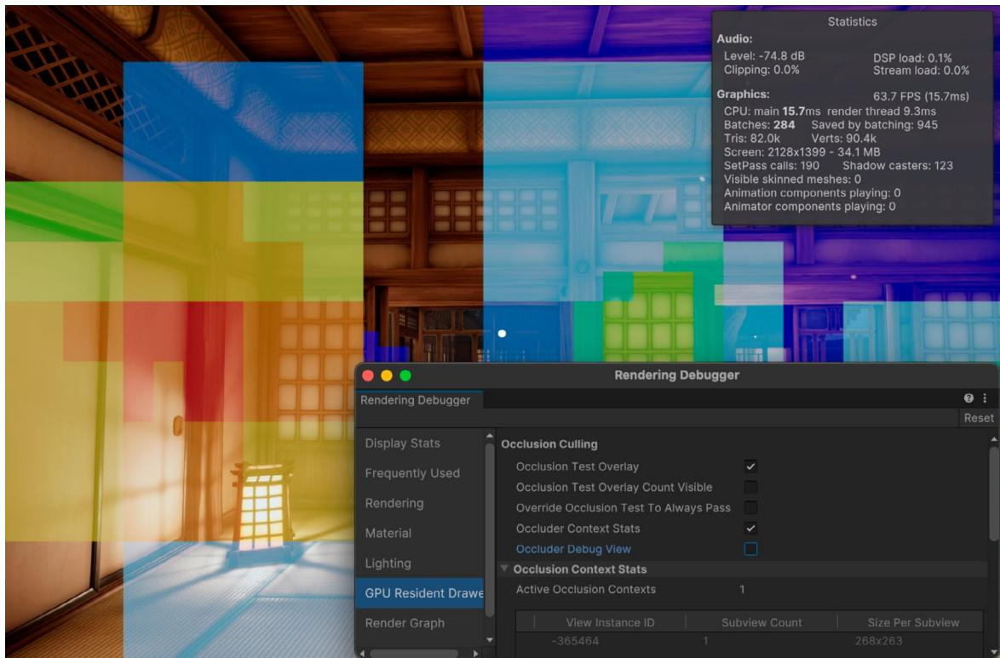

Viewing the Occlusion Test using the Rendering Debugger

<span id="page-22-0"></span>

To see if GPU occlusion culling is effective for your scene go to **Window > Analysis > Rendering Debugger**, and select **GPU Resident Drawer > Occlusion Test Overlay**. This displays a heatmap of culled instances. The heatmap displays blue if there are few culled instances, through to red if there are many culled instances. If you enable this setting, culling might be slower.

### Instancing

A field full of grass will be used to illustrate the concept of [instancing.](https://www.google.com/url?q=https://docs.unity3d.com/6000.0/Documentation/Manual/GPUInstancing.html&sa=D&source=docs&ust=1732790230224144&usg=AOvVaw3160DtiCnehcU3JiX-nbyw) It's far from photorealistic but sufficient to illustrate the techniques involved. You'll find the example in the **Scenes > Instancing** folder.

**Note:** Thanks go to the author of the article, ["Making Grass in Unity with GPU Instancing,](https://prog.world/making-grass-in-unity-with-gpu-instancing/)" for the assets.


A field of grass rendered using an SRP Batcher-compatible material

To start, you need a single blade of grass and just two triangles, to keep things simple. The UV is set so the base of each grass blade has a V value of **0** and the tip a V value of **1**. You can use this to offset the tip vertex to simulate wind.


Grass blade model and UV

## <span id="page-23-0"></span>SRP Batcher

Take a look at the Shader Graph subgraph in the folder **Scenes > Instancing > Common > Grass Wave.** The aim of this is to perturb the X value of the object's vertex based on WindSpeed, WindShiftStrength, and WindStrength. To ensure that all the grass blades behave slightly differently, a [Noise](https://docs.unity3d.com/Packages/com.unity.shadergraph@17.0/manual/Simple-Noise-Node.html) node is used in the subgraph called **Perturb Grass**. The vertex Y and Z positions are passed directly to the output, but the offset for the X value is processed using a [Lerp](https://docs.unity3d.com/Packages/com.unity.shadergraph@17.0/manual/Lerp-Node.html) node.

The T input, which controls the interpolation, comes from the UV's V value. At the base of the grass blade, this is 0, meaning the result of lerp will be the A input to the lerp, which is the modeled position. The tip of the blade V is 1, ensuring that the result of the lerp is the B input, the processed offset.

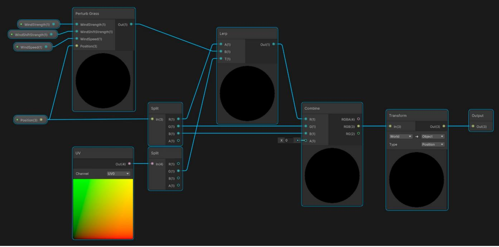

The Grass Wave subgraph

Now that you have a method of deforming each blade, it's time to turn this into a complete shader that you can use as the material shader for each blade of grass.

Take a look in the folder **Scenes > Instancing > 1 - SRP Batcher > SRP Batcher Shader**. This is a simple shader, just the Grass Wave subgraph controlling the Vertex > Position and a Sample Texture 2D acting as the base color input for the fragment shader.


Now, let's use the following code to populate a field of grass.

```
_startPosition = -_fieldSize / 2.0f;
_cellSize = new Vector2(_fieldSize.x / GrassDensity, _fieldSize.y / GrassDensity);

var grassEntities = new Vector2[GrassDensity, GrassDensity];
var halfCellSize = _cellSize / 2.0f;

for (var i = 0; i < grassEntities.GetLength(0); i++) {
     for (var j = 0; j < grassEntities.GetLength(1); j++) {
 grassEntities[i, j] =
 new Vector2(_cellSize.x * i + _startPosition.x, 
 _cellSize.y * j + _startPosition.y) + 
 new Vector2( Random.Range(-halfCellSize.x, halfCellSize.x),
 Random.Range(-halfCellSize.y, halfCellSize.y));
     }
}
_abstractGrassDrawer.Init(grassEntities, _fieldSize);
```
Looking more closely at this code example you see:

- \_fieldSize is (40, 40).
- \_startPosition is (-20, -20).
- GrassDensity is set to 250 in the GitHub sample.
- cellSize is (0.16, 0.16).
- Two loops are iterated through setting each element of the \_grassEntities 2D array.
- Base position for each blade is \_startPosition plus the current cell; then a small random factor is introduced.
- \_abstractGrassDrawer is a base class for two versions of using the grasspopulating code.
	- For the initial version, ignore GPU Instancing and see how well SRP batcher handles the problem by opening and running the scene **Scenes > Instancing > 1 - SRP Batcher > 1 - SRP**.
	- First, you need to populate the scene with the grass blade model Prefab, at each position in the grassEntities 2D Array. The code is in the file **Scenes > Instancing > Scripts > GameObjectGrassDrawer.cs**.

<span id="page-25-0"></span>

```
public override void Init(Vector2[,] grassEntities, Vector2 fieldSize) {
    _grassEntities = new GameObject[grassEntities.GetLength(0),
 grassEntities.GetLength(1)];
    for (var i = 0; i < grassEntities.GetLength(0); i++) {
 for (var j = 0; j < grassEntities.GetLength(1); j++) {
 _grassEntities[i, j] = 
 Instantiate(_grassPrefab,
 new Vector3(
 grassEntities[i, j].x, 
                           0.0f, 
                           grassEntities[i, j].y),
 Quaternion.identity);
 }
    }
}
```
Here, you iterate over the grassEntities array using Instantiate to create a new GameObject from the assigned prefab. It works but dramatically impacts the frame rate for the scene. You can see from the image of the grass field on [page 29](#page-28-0) that the frame rate is a sluggish 29 fps for 62,500 blades, running on a 2022 MacBook Air with the following specs:

- Built-in Retina Display
- Processor: Apple M2 2022
- Memory: 8 GB

How can you optimize the scene?

Note: For a non-square terrain, you could create a draw tool saving each blade position in a list. For example, [this blog post](https://bronsonzgeb.com/index.php/2021/08/08/unity-editor-tools-the-place-objects-tool/) by game developer Bronson Zgeb explains how to build a tool to streamline placing objects in the scene every time you click in it.

#### **GPU Instancing**

One optimization technique is to enable [GPU instancing.](https://docs.unity3d.com/Manual/GPUInstancing.html) Look at **Scenes > Instancing > 2 - GPU Instancing > 2 - GPU Instancing** from the GitHub samples for an example of this technique.

A material setting called **Enable GPU Instancing** instructs the renderer to batch any models that use the same material, thereby reducing the number of draw calls. The setting is available in the Advanced Options panel.

The SRP Batcher and GPU Instancing are mutually exclusive. When using URP, if a material is compatible with the SRP Batcher, then SRP Batcher will be used, even if Enable GPU Instancing is selected. A shader created with Shader Graph is compatible with SRP Batcher


by default. To disable SRP Batcher compatibility, select the Shader Graph that will create the HLSL shader, and click on **View Generated Shader** in the Inspector.


Generating an HLSL shader from Shader Graph

The shader will be created, placed in the Temp folder, and opened in your chosen text or code editor. Change the Shader name to: Shader "Custom/GPU Instancing Shader"

Then search for CBUFFER, and comment out the CBUFFER macros:

```
// Graph Properties
//CBUFFER_START(UnityPerMaterial)
 float4 _MainTexture_TexelSize;
 half _WindShiftStrength;
 half _WindSpeed;
 half _WindStrength;
//CBUFFER_END
```
Save the shader in Assets.

| # √ Grass Field (Script)               |                                   | 3 | 14 |   |
|----------------------------------------|-----------------------------------|---|----|---|
| Script                                 | # GrassField                      |   |    | O |
| Abstract Grass Drawer                  | Ground (Game Object Grass Drawer) |   |    | O |
| Field Size                             | Y 40<br>× 40                      |   |    |   |
| #<br>Game Object Grass Drawer (Script) |                                   | ? | 14 |   |
| Script                                 | GameObjectGrassDrawer             |   |    | 0 |
| Grass Prefab                           | GPU Instancing Grass Prefab       |   |    | O |

Scripts assigned to the Ground GameObject in the GPU Instancing scene

<span id="page-27-0"></span>

Notice the GPU Instancing scene uses the same version of Abstract Grass Drawer as the SRP Batcher scene. The only difference is the **GameObjectGrassDrawer** version in GPU Instancing is assigned a different prefab with a material that uses the GPU Instancing shader.

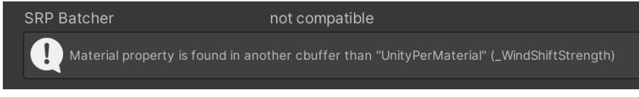

GPU Instancing Shader is not compatible with SRP Batcher

If you check the GPU Instancing shader in the Inspector, you can see it's not compatible with SRP Batcher.

Any change to the graph that you used to generate the code will necessitate repeating the customization steps:

- 1. View Generated Shader or Regenerate.
- 2. Edit the Shader name.
- 3. Comment out the CBUFFER macros.
- 4. Save to Assets.

However, after all this work, the testing shows only a marginal improvement over SRP Batcher, probably due to being CPU bound. There has to be a better way.

## RenderMeshPrimitives

The Unity [Graphics API](https://docs.unity3d.com/6000.0/Documentation/ScriptReference/Graphics.html) has a number of methods for directly rendering a mesh by bypassing the need for a GameObject. The method used here is [RenderMeshPrimitives,](https://docs.unity3d.com/6000.0/Documentation/ScriptReference/Graphics.RenderMeshPrimitives.html) a feature introduced in Unity LTS 2021. Prior to that, you would have needed to use [DrawMeshInstancedProcedural, w](https://docs.unity3d.com/6000.0/Documentation/ScriptReference/Graphics.DrawMeshInstancedProcedural.html)hich is now marked as obsolete.

With RenderMeshPrimitives, you should use a material that sources the individual mesh position using a ComputeBuffer. You can see it in action by viewing the scene **Scenes > Instancing > 3 - RenderMeshPrimitives > 3 - RenderMeshPrimitives**.


The Instancing scenes in the Project window

<span id="page-28-0"></span>

As you can see from the image of the grass field below, the improvement in frame rate is nothing short of remarkable – 377 fps. The scenes created with SRP Batcher and GPU Instancing were running at around 20 and 50 fps respectively.

The difference in this case is that the grass field is rendered using a single draw call.

| Event #4: Draw Mesh (instanced) (1 draw calls, 62500 instances) |                                                          |  |  |  |
|-----------------------------------------------------------------|----------------------------------------------------------|--|--|--|
| Shader                                                          | Shader Graphs/Instanced Grass Shader Graph, SubShader #0 |  |  |  |
| Pass                                                            | Universal Forward                                        |  |  |  |
| Keywords                                                        | PROCEDURAL INSTANCING ON                                 |  |  |  |
| Blend                                                           | One Zero                                                 |  |  |  |
| ZClip                                                           | True                                                     |  |  |  |
| ZTest                                                           | LessEqual                                                |  |  |  |
| ZWrite                                                          | On                                                       |  |  |  |
| Cull                                                            | Back                                                     |  |  |  |
| Conservative                                                    | False                                                    |  |  |  |

Frame Debugger stats for the grass field


The grass field is rendered using RenderMeshPrimitives.

You achieve this by making the positions of each blade a Material property. The data to render the blades resides on the GPU, which uses its parallelism to render the entire field at an optimal speed.

Let's review the code to generate the positions. You'll find it in the UpdatePositions method in the file **Scenes > Instancing > Scripts > InstancedGrassDrawer.cs**.


```
_positionsCount = _positions.Count;
_positionBuffer?.Release();
if (_positionsCount == 0) return;
_positionBuffer = new ComputeBuffer(_positionsCount, 8);
_positionBuffer.SetData(_positions);
_instanceMaterial.SetBuffer(Shader.PropertyToID("PositionsBuffer"), _positionBuffer);
```
\_positions holds a Vector2 List of grass positions. If \_positionsBuffer exists, then you release it. If you're unfamiliar with a "**?**" following a variable, it's a null check, meaning it's shorthand for:

```
if (positionsBuffer != null) _positionsBuffer.Release()
```
You create a ComputeBuffer that takes a count parameter and the byte size of each item. A Vector2 contains two floats. A single float is 32 bits or 4 bytes, making two floats 8 bytes. It's simple to populate a ComputeBuffer by using SetData passing the \_positions List. Now you can use the SetBuffer method to copy this to the material. You'll access this buffer in the material using the name positionsBuffer.

Take a look at the graph in **Scenes > Instancing > 3 - RenderMeshPrimitives > Instanced Grass Shader**.

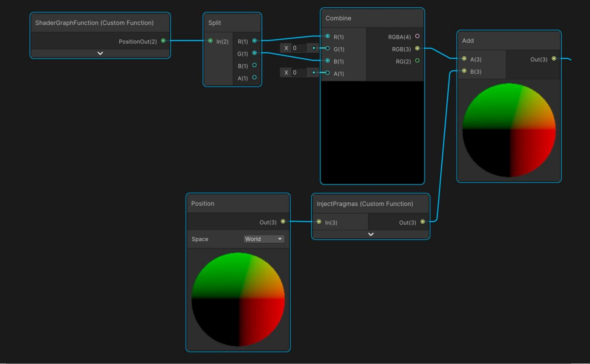

Getting the vertex position from a ComputeBuffer


Starting at the bottom, you can see the **Space** parameter for Grass Mesh vertex position is set to **World**. But there's an important code block that needs adding whenever you use this technique: A #pragma is required by any meshes rendered using RenderMeshPrimitive. This is done using a custom function. Instead of sourcing the function from a file, you add a string:

```
#pragma instancing_options procedural:ConfigureProcedural
Out = In;
```
The code method now used by this shader to generate positional values will come from a function with the name ConfigureProcedural. Other than that, this [Custom Function](https://docs.unity3d.com/Packages/com.unity.shadergraph@17.0/manual/Custom-Function-Node.html)  node simply passes its input, **In**, to its output, **Out**.

The heavy lifting is done in the Custom Function called ShaderGraphFunction, which is found in the file InstancedPosition, in the same folder as the scene file.

```
#if defined(UNITY_PROCEDURAL_INSTANCING_ENABLED)
StructuredBuffer<float2> PositionsBuffer;
#endif
float2 position;
void ConfigureProcedural () {
      #if defined(UNITY_PROCEDURAL_INSTANCING_ENABLED)
      position = PositionsBuffer[unity_InstanceID];
      #endif
}
void ShaderGraphFunction_float (out float2 PositionOut) {
      PositionOut = position;
}
```
The position is set using the ConfigureProcedural method and passed to the output using the ShaderGraphFunction for which the script has float and half versions.

At this point in the graph, the individual blade location is a float2 with the first float being the X value and the second the Z. A [Split](https://docs.unity3d.com/Packages/com.unity.shadergraph@17.0/manual/Split-Node.html) node is used to convert this into the individual floats, and a [Combine](https://docs.unity3d.com/Packages/com.unity.shadergraph@17.0/manual/Combine-Node.html) node to move the second float to the third. The Split and Combine nodes call the individual floats RGBA not XYZW, but by moving G to B, you're effectively moving Y to Z. The blade and vertex positions are now established, and you can combine these to get the actual world position of the vertex.

With this shader ready, you now use it with a material that has the inputs WindSpeed, WindStrength, WindShiftStrength, and MainTexture, the same as those used by the SRP Batcher and GPU Instancing versions. The only difference is in how the position of each vertex is calculated. Refer back to the script InstancedGrassDrawer.cs to see how to render the grass blades. The variables in the script are initialized in the Init method called by the Awake method of the GrassField.cs script.


```
public override void Init(Vector2[,] grassEntities, Vector2 fieldSize) {
      _grassEntities = grassEntities;
      _grassBounds = new Bounds(transform.position, 
 new Vector3(fieldSize.x, 0.0f, fieldSize.y));
      _positions = new List<Vector2>();
      _renderParams = new RenderParams(_instanceMaterial);
      _renderParams.worldBounds = _grassBounds;
      _renderParams.shadowCastingMode = ShadowCastingMode.Off;
}
```
To use Graphics.RenderMeshPrimitives, you need a RenderParams instance. This is created from the assigned Material, \_instanceMaterial. Two other properties are additionally assigned.

The actual rendering is done using the Update callback:

```
private void Update() {
      if (_positionsCount == 0) return;
      Graphics.RenderMeshPrimitives(_renderParams, _instanceMesh, 0, 
_positionsCount);
}
```
RenderMeshPrimitives takes four parameters, a RenderParams instance, the mesh to render, a submesh index, and a count value identifying how many copies to render. When using the shader, each copy will have a unique unity\_InstanceID, which will have the value 0 to count -1.

Rendering using a [ComputeBuffer](https://docs.unity3d.com/6000.0/Documentation/ScriptReference/ComputeBuffer.html) is a fast and fairly simple setup. By manipulating the \_positionBuffer, you could mow the grass or blow it away. To avoid passing data between the CPU and the GPU, this is best handled with a [ComputeShader](https://docs.unity3d.com/6000.0/Documentation/ScriptReference/ComputeShader.html). You'll find more information about performance boosts with compute shaders in a later recipe.

#### More resources

- The [assets](https://prog.world/making-grass-in-unity-with-gpu-instancing/) for this recipe
- [Example project](https://github.com/ColinLeung-NiloCat/UnityURP-MobileDrawMeshInstancedIndirectExample) using DrawMeshInstancedIndirect
- GPU Instancing [documentation](https://docs.unity3d.com/Manual/GPUInstancing.html)
- GPU Instancing [article](https://catlikecoding.com/unity/tutorials/rendering/part-19/Rendering-19.pdf) from CatLikeCoding
- Using [ComputeBuffers](https://www.udemy.com/course/compute-shaders/learn/lecture/22732855/?instructorPreviewMode=student_v4#overview) for instancing

## <span id="page-32-0"></span>Toon and outline shading

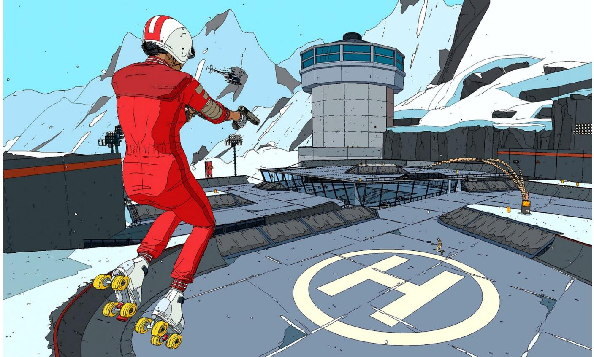

The third-person action-shooter and Made with Unity game *[Rollerdrome](https://www.roll7.co.uk/rollerdrome)*, by Roll7, has a distinctive art direction that makes the game look like a comic book, achieved with cel shading techniques. Don't miss this [interview](https://www.youtube.com/watch?v=G1NY0LKDqJo) with the creators.

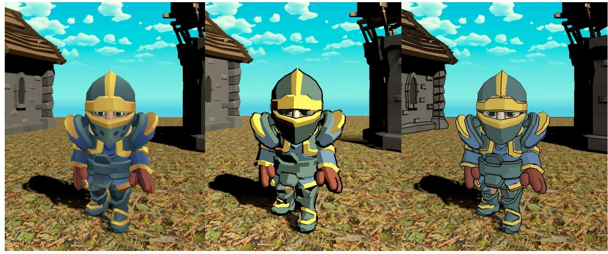

This recipe is based on common ways of creating a toon shader and an outline shader.

One scene, three different looks: Standard shading (left), simple toon shading (center), and toon shading (right)

Often used together, toon and outline shaders present two distinct challenges. The toon shader takes the color that would be created using a URPcompatible Lit shader, and ramps the output rather than allowing continuous gradients, thereby requiring a custom lighting model.


The scene with the simple ramped toon shader

<span id="page-34-0"></span>

## Simple toon shading

To see what the shader looks like, go to **Scenes > Toon Shading > Simple Toon Shading**. We'll split the challenge into two different shaders, with the first shader being the main color choice for each pixel in the model.

#### **Shading**

The simplest possible lighting model uses [Lambert lighting.](https://www.scratchapixel.com/lessons/3d-basic-rendering/introduction-to-shading/diffuse-lambertian-shading.html) This lighting model simply takes the dot product of the light direction and the world space normal at this point. The image below shows the shader graph for this shader.


The Simple Toon Shading Shader Graph

Starting on the left is a [Normal Vector](https://docs.unity3d.com/Packages/com.unity.shadergraph@17.0/manual/Normal-Vector-Node.html) node and a [Main Light Direction](https://docs.unity3d.com/Packages/com.unity.shadergraph@17.0/manual/Main-Light-Direction-Node.html) node. These two vectors are put into a [Dot Product](https://docs.unity3d.com/Packages/com.unity.shadergraph@17.0/manual/Dot-Product-Node.html) node. The output from this will be 1 when the two vectors are inline and -1 when the two vectors are in opposite directions. For lighting you want the maximum when the two vectors are in opposite directions.

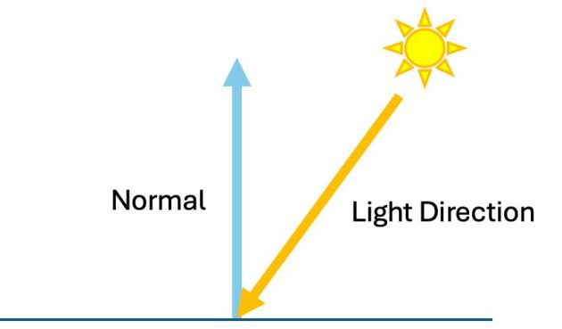

The Lambert Lighting model

<span id="page-35-0"></span>

A [Remap](https://docs.unity3d.com/Packages/com.unity.shadergraph@17.0/manual/Remap-Node.html) node is used here. This useful node can convert an input value from a range to a new value based on another range. The **In Min Max** is set to **-1, 1** and the **Out Min Max** is set to **1, 0**. Now if the In value is -1, the Out will be 1 and if the In value is 1 the Out value is 0.

The graph has two properties: Texture and Shades. Shades is an integer value defining how many ramped steps are allowed in the range 0 to 1. You need a mechanic that will step the value rather than give a continuous interpolation. First, use a [Divide](https://docs.unity3d.com/Packages/com.unity.shadergraph@17.0/manual/Divide-Node.html) node to divide 1 by the Shades property. If Shades is 4 then at this point the output of the Divide node will be 0.25. Then, use a second Divide node, dividing the output of the Remap node by the output from the Shades Divide node. The effect is to change the range from [0, 1] to [0, Shades]. Use a [Round](https://docs.unity3d.com/Packages/com.unity.shadergraph@17.0/manual/Round-Node.html) node to convert the value to an integer value. At this point the value can only be 0, 1, …, Shades.

#### **Outlining**

The simplest technique for adding outlines is to add a second pass that only renders backfacing polygons and uses a vertex shader that moves the vertex a small amount along the vertex normal. This shader is included in the GitHub samples via **Scenes > Toon Shading > VertexOutline**; its graph is shown here:

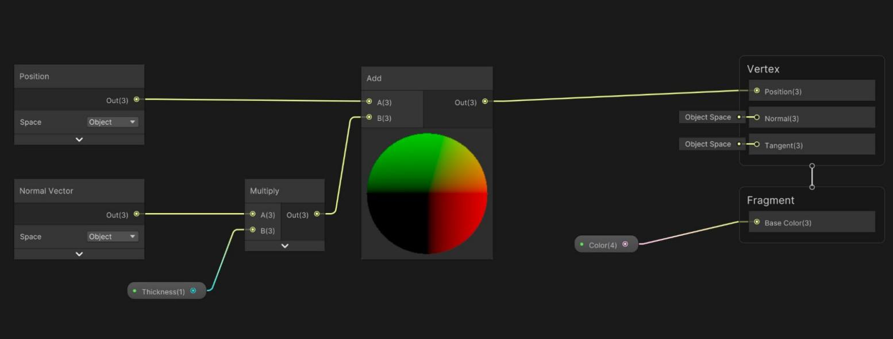

An outline shader using a back-facing vertex shift technique

The Normal Vector node, with Space set to **Object**, is fed into a [Multiply](https://docs.unity3d.com/Packages/com.unity.shadergraph@17.0/manual/Multiply-Node.html) node. This is multiplied by the **Thickness** value for the material. The output from this is added to the Object Position, moving the vertex position slightly out from the object modeled location. This is the input to the **Vertex Position** property. The shader property **Universal > Render Face** is set to **Back** using the panel in **Graph Inspector > Graph Settings**. A shader graph allows a single pass only so to add this to the render you need to add a second material using the GameObject Inspector.

<span id="page-36-0"></span>


Adding a second material

The scene in **Scenes > Toon Shading > Simple Toon Shading** shows the second material being used. View the material VertexOutline in the same folder, in the Inspector, and set Thickness to 0.02.

Using this technique is effective for simple convex shapes. But as shapes become more complex it does not create a consistent equal thickness line, as the image below demonstrates. Let's look at an alternative approach.

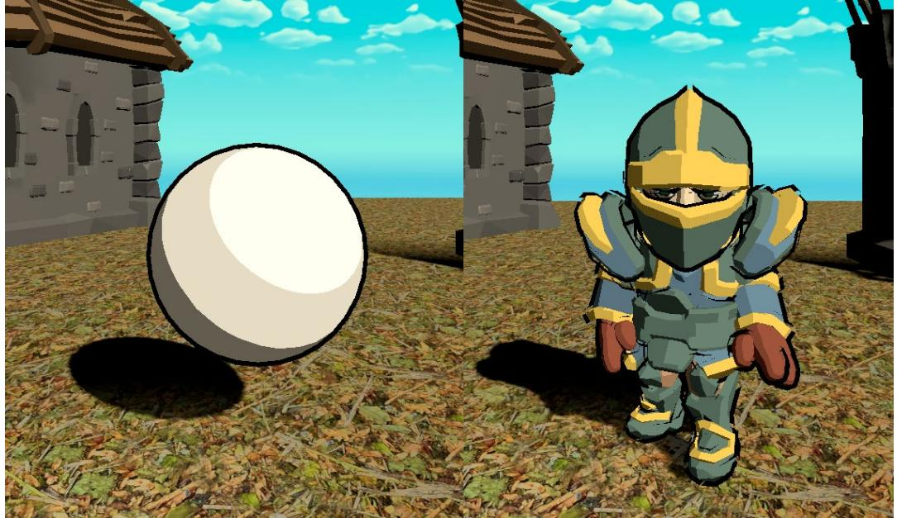

Outlining using an expanded back facing model: simple sphere (left), complex model (right)

### Toon shading

To see what the alternative shader looks like, go to **Scenes > Toon Shading > Toon Shading**. As before, the shading task is split into two different shaders: Shading and outlining. The first step is to set the main color choice for each pixel in the model.

#### **Shading**

The only Shader Graph node for the Main Light is the **Main Light Direction** node.

**Note**: In URP the Main Light is the Direction Light with the greatest intensity.


The Main Light Direction node was used in the simple toon shading recipe. To improve the simple version you can incorporate light color and shadows. Let's start by accessing the Main Light using a custom function, which you'll find in the file **Shaders > HLSL > Custom Lighting. hlsl**.

```
void MainLight_float(float3 WorldPos, out float3 Direction, out float3 Color, out 
float DistanceAtten, out float ShadowAtten)
{
#ifdef SHADERGRAPH_PREVIEW
 Direction = float3(0.5, 0.5, 0);
 Color = 1;
 DistanceAtten = 1;
 ShadowAtten = 1;
#else
     float4 shadowCoord = TransformWorldToShadowCoord(WorldPos);
 Light mainLight = GetMainLight(shadowCoord);
 Direction = mainLight.direction;
 Color = mainLight.color;
 DistanceAtten = mainLight.distanceAttenuation;
     #if !defined(_MAIN_LIGHT_SHADOWS) || defined(_RECEIVE_SHADOWS_OFF)
 ShadowAtten = 1.0h;
     #else
 ShadowSamplingData shadowSamplingData = GetMainLightShadowSamplingData();
 float shadowStrength = GetMainLightShadowStrength();
 ShadowAtten = SampleShadowmap(shadowCoord, 
 TEXTURE2D_ARGS(_MainLightShadowmapTexture,
 sampler_MainLightShadowmapTexture),
 shadowSamplingData, shadowStrength, false);
 #endif
#endif
}
```
It's good practice to add a block of code inside a #ifdef SHADERGRAPH\_PREVIEW preprocessor directive that defines the behavior while creating the [Shader Graph Asset.](https://docs.unity3d.com/Packages/com.unity.shadergraph@17.0/manual/Create-Shader-Graph.html) This specifies the values to default to in the graph preview window.

The WorldPos is converted into a shadow coordinate using the function TransformWorldToShadowCoord. The functions used in this code come from the [Universal Render Pipeline package](https://github.com/Unity-Technologies/Graphics/blob/master/Packages/com.unity.render-pipelines.universal/ShaderLibrary/RealtimeLights.hlsl) and are available to custom functions in Shader Graph. When the function GetMainLight is used with a float4, the **ShadowAttenuation** property of the returned light is set. This is needed in the graph that uses this custom function.


This code is used in the Main Light subgraph (see image below), which you'll find in the folder **Shaders > Subgraphs**. Let's review it.


Main Light subgraph

The [Custom Function](https://docs.unity3d.com/Packages/com.unity.shadergraph@17.0/manual/Custom-Function-Node.html) node takes a [Position](https://docs.unity3d.com/Packages/com.unity.shadergraph@17.0/manual/Position-Node.html) node set to **Absolute World** as its only input. The function returns Direction, Color, DistanceAtten (which remains unused), and ShadowAtten. To allow for self shadowing, you'll need to get the dot product of the light direction and the World normal, and clamp this between 0 and 1. You don't want negative values.


Now that you have a way of accessing the Main Light, you can use it to create a simple toon shader. Take a look at **Scenes > Toon Shading > Toon Shading** to see the graph (also in image below).

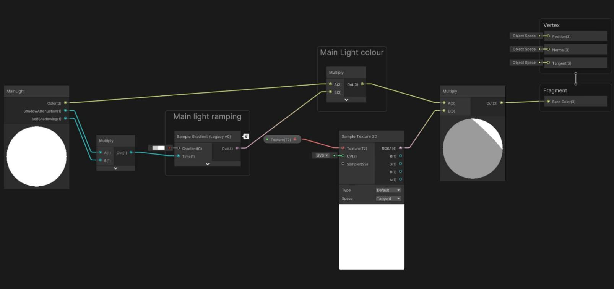

Simple Toon graph

The first node is the Main Light subgraph. The ShadowAttenuation and SelfShadowing outputs are multiplied together. The trick is to pass this output into a [Sample Gradient](https://docs.unity3d.com/Packages/com.unity.shadergraph@17.0/manual/Sample-Gradient-Node.html?q=sample gradient) node that works with a ramped gradient, so light levels are not smooth, but instead jump in stages based on the gradient.

Taking a smoothly changing input and processing it with a gradient is another useful technique for a number of shading challenges. The rest of the graph combines light color with the ramped level, then combines this with the sampled texture to generate the color to use for the base color.

<span id="page-40-0"></span>

#### **Outlining**

A more sophisticated technique for outlining uses [Sobel Filter](https://en.wikipedia.org/wiki/Sobel_operator) edge detection. You can use a postprocessing technique for this. Imagine the current pixel being analyzed is the orange square in the image to the right. You want to check how a buffer for the orange pixel differs from the gray squares. The buffers to check are the Color G-buffer and the Normal G-buffer. If the variation meets a property intensity then you can consider the orange pixel to be on an edge boundary and update its color to an **Outline Color** property.


Sobel Filtering

To handle this you can create a Shader Graph using **Create > Shader Graph > URP > Full Screen Shader Graph.**  Or you can change the behavior of an existing Shader Graph using the Graph Inspector which is accessed by clicking on the icon in the top right of the Shader Graph window (the "i" in a circle icon).

| Graph Inspector                                                                                                                            |                                                                                                                       |  |
|--------------------------------------------------------------------------------------------------------------------------------------------|-----------------------------------------------------------------------------------------------------------------------|--|
| Precision<br>Target Settings                                                                                                               | Single                                                                                                                |  |
| Active Targets                                                                                                                             |                                                                                                                       |  |
| Universal                                                                                                                                  |                                                                                                                       |  |
|                                                                                                                                            |                                                                                                                       |  |
| Universal                                                                                                                                  |                                                                                                                       |  |
| Material                                                                                                                                   | Fullscreen                                                                                                            |  |
| Allow Material Override<br>Blend Mode<br>Depth Test<br>Depth Write<br>Enable Stencil<br>Reference<br>Read Mask<br>Write Mask<br>Comparison | Sprite Unlit<br>Fullscreen<br>Unlit<br>Canvas<br>Decal<br>Lit<br>Six-way Smoke Lit<br>Sprite Custom Lit<br>Sprite Lit |  |

The Material property drop-down in the Shader Graph Inspector

Take a look at **Scenes > Toon Shading > Outline** to see the Shader Graph. Let's look first at the **Detect edges based on the world space normals** section of the graph, starting on the left.

- 1. The first node is a [Screen](https://docs.unity3d.com/Packages/com.unity.shadergraph@17.0/manual/Screen-Node.html) node, which gives the rendered image size in pixels. You can convert this into a [Vector2](https://docs.unity3d.com/Packages/com.unity.shadergraph@17.0/manual/Vector-2-Node.html).
- 2. Then you divide the **Outline Thickness** property by this vector using a Divide node. Now you have a value you can use as an offset value.
- 3. You use a [Split](https://docs.unity3d.com/Packages/com.unity.shadergraph@17.0/manual/Split-Node.html) node to access the x and y values of the offset value; the Split node provides RGBA outputs wherein r=x and g=y.
- 4. Create two Vector2s, one to give an offset in the x and the other in the y. The x offset has y=0 and the y offset has x=0. Now you can use [Add](https://docs.unity3d.com/Packages/com.unity.shadergraph@17.0/manual/Add-Node.html) and [Subtract](https://docs.unity3d.com/Packages/com.unity.shadergraph@17.0/manual/Subtract-Node.html) nodes to add and subtract the offset from the current [Screen Position.](https://docs.unity3d.com/Packages/com.unity.shadergraph@17.0/manual/Screen-Position-Node.html)
- 5. At this point you have four positions in screen space: [0,0] at the bottom left and [1,1] top right. Use four URP Sample Buffer nodes to get the world normal at this position.


- 6. Subtract the normal at the left from the normal at the right and get the [Length](https://docs.unity3d.com/Packages/com.unity.shadergraph@17.0/manual/Length-Node.html) of this new vector, and then subtract the lower normal from the upper normal to get the Length of the vector.
- 7. You now have a scalar value of the difference between the pixel to the left of the current screen pixel and the pixel to the right and between the pixel below and the one above.
- 8. Use an Add node to sum these values to give a total difference as a scalar value for the four pixels being analyzed. To complete the analysis use a [Step](https://docs.unity3d.com/Packages/com.unity.shadergraph@17.0/manual/Step-Node.html) node, returning 1 if the value is over the **Normal Threshold** property.


Detecting edges based on world-space normals.

9. You do more or less the same thing for the color buffer, except you'll access the Blit Source, not Normal World Space, and use Color Threshold rather than Normal Threshold.


For the Color edge detection, the sample Source Buffer is set to Blit Source.


- 10. After step 9 there should be two outputs that are either 0 or 1. The remainder of the graph is shown below. The lines appearing from the left are from the output of the normal edge detection (upper) and color edge detection (lower). Use an Add node to add these values and now you should have a value that can be 0, 1, or 2.
- 11. Use a [Saturate](https://docs.unity3d.com/Packages/com.unity.shadergraph@17.0/manual/Saturate-Node.html) node to clamp this value between 0 and 1.
- 12. Then use a [Lerp](https://docs.unity3d.com/Packages/com.unity.shadergraph@17.0/manual/Lerp-Node.html) node to interpolate between the existing pixel, supplied by a URP Sample Buffer node and the Outline Color property. There is an option to use an Overlay. If this is set to **On** then the output is the composite of the existing Blit Source and the Outline Color property. If Overlay is set to **Off** then just the Outline Color or black is passed. The final output goes to the Fragment Base Color input.

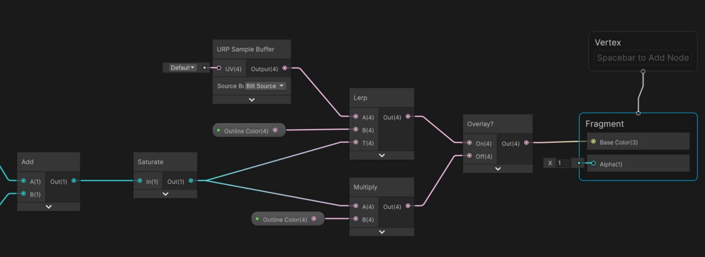

The final nodes of the Outline shader

This recipe provides the key techniques for toon shading.

#### **More resources**

- [Unity Open Project](https://github.com/UnityTechnologies/open-project-1/tree/devlogs/1-toon-shading) GitHub (most of the code from this chapter is from the Open Project)
- Unity Open Project on [YouTube](https://www.youtube.com/watch?v=O4N4s6BKNH0)
- [YouTube tutorials](https://www.youtube.com/watch?v=RC91uxRTId8) from Ned Makes Games (includes a short series on toon shading)
- [YouTube tutorial](https://www.youtube.com/watch?v=xgZ0NpaMByU) about using Unity's SobelFilter.shader from AE Tuts (a channel that focuses on Shader Graph tutorials)
- [Edge detection using a Sobel filter](https://alexanderameye.github.io/notes/edge-detection-outlines/) by Alexander Ameye
- Daniel Ilett's Cel Shading [series](https://danielilett.com/2019-05-29-tut2-intro/) and [Fullscreen outline shader tutorial](https://www.youtube.com/watch?v=VGEz8oKyMpY)

## <span id="page-43-0"></span>Ambient occlusion


The racing game, *[Circuit Superstars](https://www.circuit-superstars.com/)* by Original Fire Games, is a game made with Unity that uses URP features like Scree Space Ambient Occlusion (SSAO), to ground the cars and models in the environment and add depth to the visuals.

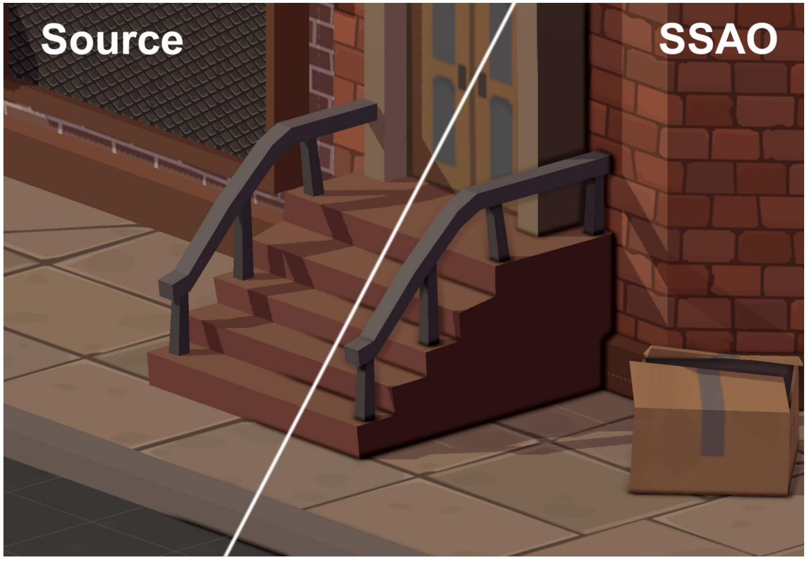

Ambient Occlusion

Ambient occlusion is a post-processing technique that darkens creases, holes, intersections, and surfaces that are close to one another. In the real world, such areas tend to block out or occlude ambient light, thereby appearing darker. In the image above, the left side is rendered without ambient occlusion and on the right, rendered with it. Notice how the edges around the steps are darkened.

URP implements the real-time [Screen Space Ambient Occlusion](https://docs.unity3d.com/Packages/com.unity.render-pipelines.universal@17.0/manual/post-processing-ssao.html) (SSAO) effect as a Renderer Feature. The pass code it uses can be viewed [here.](https://github.com/Unity-Technologies/Graphics/blob/master/Packages/com.unity.render-pipelines.universal/Runtime/Passes/ScreenSpaceAmbientOcclusionPass.cs)

**Note**: The SSAO effect is a Renderer Feature and works independently from the postprocessing effects in URP. This effect does not depend on or interact with Volumes.

To see it in action, open **Scenes > Ambient Occlusion > Ambient Occlusion**. This scene is a low-polygon city environment available as a [free asset](https://assetstore.unity.com/packages/3d/environments/urban/toony-tiny-city-demo-176087?utm_source=demand-gen&utm_medium=pdf&utm_campaign=render-with-quality-and-flexibility&utm_content=urp-cookbook) on the Unity Asset Store.

The scene uses the URP Asset named **Ambient\_Occlusion\_URP\_Settings**. This is loaded automatically when you open the scene via the AutoLoadPipelineAsset script attached to **Scene > Main Camera**. The URP Asset uses the **Ambient\_Occlusion\_URP\_Settings\_Renderer**.

<span id="page-45-0"></span>To add SSAO to your scene, view the Universal Renderer Data asset in the Inspector, and click on **Add Renderer Feature**. In the options drop-down menu, select **Screen Space Ambient Occlusion**.


Adding a SSAO Renderer Feature

## SSAO properties

Once you add a SSAO Renderer Feature, you can control the result via the Inspector. Let's look at the available properties.

| V > Screen Space Ambient Occlusion |                      |       |   |
|------------------------------------|----------------------|-------|---|
| Method                             | Interleaved Gradient |       |   |
| Intensity                          | 2.51                 |       |   |
| Radius                             | 0.07                 |       |   |
| Falloff Distance                   | 100                  |       |   |
| Direct Lighting Strength           |                      | 0.901 |   |
| Quality                            |                      |       |   |
| Source                             | Depth Normals        |       | - |
| Normal Quality                     | Medium               |       | 9 |
| Downsample                         |                      |       |   |
| After Opaque                       |                      |       |   |
| Blur Quality                       | High                 |       |   |
| Samples                            | Low                  |       | 0 |

SSAO options

- **Method**: Choose between Interleaved Gradient and Blue Noise
- **Intensity**: This controls the strength of the darkening.
- **Radius**: This controls how many samples of the normal texture are taken around the current pixel. Larger values have a significant impact on performance, so keep them as low as possible. The radius value is scaled based on the distance from the camera to the object that is being rendered at the target pixel.
- **Falloff Distance**: This controls the scene distance where ambient occlusion does not apply.


- **Direct Lighting Strength**: This property is dependent on the **After Opaque** option being disabled since it relies on being handled when lighting calculations are being done. It affects the strength of ambient occlusion where direct light hits.
- **Quality > Source**: This option selects the source of the normal vector values. The SSAO Renderer Feature uses normal vectors for calculating how exposed each point on a surface is to ambient lighting. **Available choices for Source**:
	- **Depth Normals**: SSAO uses the normal texture generated by the DepthNormals pass. This option lets Unity make use of a more accurate normal texture.
	- **Depth**: SSAO reconstructs the normal vectors using the depth texture instead. Use this option only if you want to avoid using the DepthNormals pass block in your custom shaders. Selecting this option enables the **Normal Quality** property.

When switching between these two options, there might be a variation in performance, which depends on the target platform and the application. In a wide range of applications the difference in performance is small. In most cases, Depth Normals produces a better visual look.

- **Quality > Source > Normal Quality**: This is active when the **Source** property is set to **Depth**.
	- The options in this property (Low, Medium, High) determine the number of samples of the depth texture that Unity takes when reconstructing the normal vector from the depth texture. The number of samples per quality level are:
	- Low: 1
	- Medium: 5
	- High: 9

The performance impact is regarded as medium.

- **Quality > Downsample**: Selecting this halves the resolution of the processing in both the X and Y directions. Since this effectively reduces the number of pixels to process by 75%, it also reduces GPU load significantly but results in an effect with fewer details.
- **Quality > After Opaque**: This option affects the look of the final render, but it comes with performance implications:
	- **If disabled:** SSAO has a Depth or Depth Normals prepass (see the Source option below). The SSAO is then calculated after them and applied in the DrawOpaques pass when doing the lighting calculations. It gives a better-looking Ambient Occlusion, and the user can control the Direct Lighting Strength value for SSAO, but it has a negative impact on performance.
	- **If enabled**: SSAO requires a Depth Normals if After Opaque is selected. If Depth is selected, then it either gets the depth from Depth prepass, if that was made, or a CopyDepth pass done after rendering opaques. The SSAO is then added on top

of everything after the DrawOpaques pass, instead of being part of the lighting calculations. The benefit here is that a prepass can be skipped, which can help performance.

**Note**: You want to also be able to render Depth + Normals in the Render Opaque pass so you can fully skip any prepass with that option enabled to save performance.

- **Quality > Blur Quality**: This can be set to High, Medium, or Low. On devices with limited resources use the lowest setting that gives satisfactory results.
- **Quality > Samples**: For each pixel, the SSAO Renderer Feature takes the number of samples within the specified radius to calculate the ambient occlusion value. Increasing this from low to medium to high makes the effect smoother and more detailed, but reduces the performance.

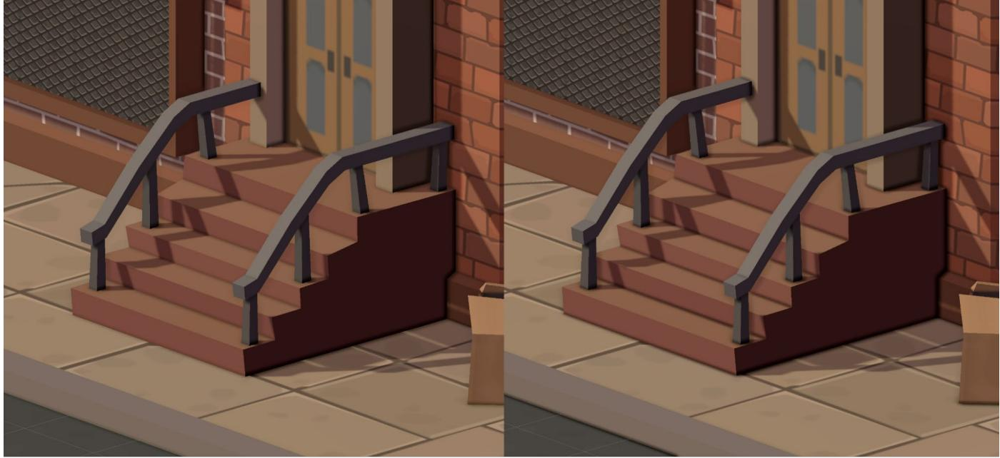

Two variations of Direct Lighting Strength: 0.2 (left) and 0.9 (right); note the darker lines in between each step on the image of the right

SSAO is a great example of the flexibility of URP. The number of problems that can be addressed using Renderer Features is limited only by your imagination.

#### More resources

- YouTube [tutorial](https://www.youtube.com/watch?v=pgM4pKG1aGE) from UGuruz
- Ambient occlusion [documentation](https://docs.unity3d.com/6000.0/Documentation/Manual/urp/post-processing-ssao.html)
- [Assets](https://assetstore.unity.com/packages/3d/environments/urban/toony-tiny-city-demo-176087?utm_source=demand-gen&utm_medium=pdf&utm_campaign=render-with-quality-and-flexibility&utm_content=urp-cookbook) used in recipe (thanks to [Marcelo Barrio](https://assetstore.unity.com/publishers/38782?utm_source=demand-gen&utm_medium=pdf&utm_campaign=render-with-quality-and-flexibility&utm_content=urp-cookbook))

## <span id="page-48-0"></span>Decals

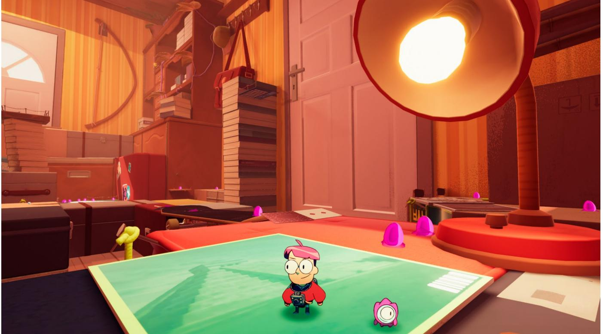

One of many use cases for decals is to project a blob shadow onto a 3D surface, like the character Milo from the game *[Tinykin](https://www.tinykingame.com/)*, made with Unity by Splashteam.

Decals are a great way to add overlays to a surface. They are often used to add visuals such as bullet holes or tire treads to the game environment as the player interacts with the scene. As you can see from the steps in the following image, the decal wraps around a mesh. You'll find the scene file and assets for this recipe in the folder **Scenes > Decals**.

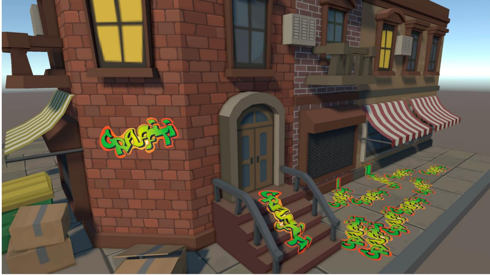

Decals added to a simple scene

Decals are rendered in a scene using a Renderer Feature. If you look at **Decals\_URP\_Settings\_ Renderer** from the recipe folder you'll see that the Decals Renderer Feature is added. As usual, the AutoLoadPipelineAsset.cs script attached to the Main Camera ensures the correct pipeline asset is used when you load the scene. To add decals to your custom scene, select the Universal Renderer Data asset currently being used by the Player for rendering, and in the Inspector, choose **Decal** from the Add Renderer Feature drop-down.


The Decal option in the Add Renderer drop-down

<span id="page-50-0"></span>

To add a decal to a scene when working in the Editor, right-click the Hierarchy window, and select **Rendering > URP Decal Projector**.

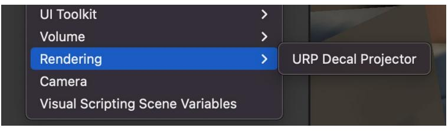

Creating a URP Decal Projector

Position and orient a URP Decal Projector in the Editor as you usually would. A Decal Projector uses orthographic projection, so the size of a decal cast on a surface is unaffected by the distance of the projector from the surface. Initially, a new Decal Projector will display as a white block. In addition to the axis arrows, you'll see a white arrow indicating the direction of projection.

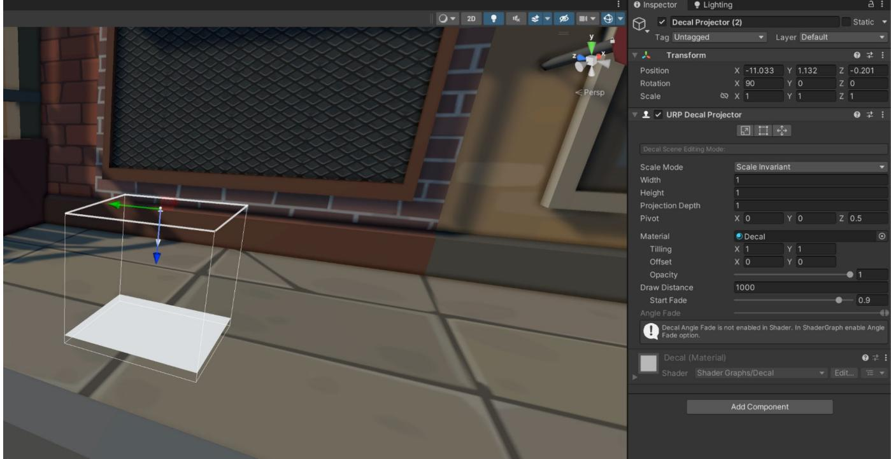

A new Decal Projector

## URP Decal Projection properties

— **Scale Mode:** By default, the URP Decal Projection component has **Scale Mode** set to **Scale Invariant**. That means the size of the decal is determined solely by the **Width** and **Height** properties. Switching to **Inherit from Hierarchy** will combine the GameObject's Transform Scale with the Width and Height properties.

<span id="page-51-0"></span>

- **Width and Height:** Properties that control the size of the decal
- **Projection Depth:** Sets the depth of the projector bounding box; the projector projects decals along the local Z axis
- **Pivot**: Sets the offset position of the center of the projector bounding box, relative to the origin of the root GameObject
- **Material**: Sets the Material to project; the Material must use the shader [Shader Graph/](https://docs.unity3d.com/6000.0/Documentation/Manual/urp/decal-shader-graph-reference.html) [Decal](https://docs.unity3d.com/6000.0/Documentation/Manual/urp/decal-shader-graph-reference.html) (more details about this shortly)
- **Tiling and Offset:** The tiling and offset values for the Decal Material along its UV axes
- **Opacity**: Lets you specify the opacity value; a value of 0 makes the decal fully transparent, a value of 1 makes the decal as opaque, as defined by the Material
- **Draw Distance:** Distance from the Camera to the decal at which this projector stops projecting the decal and URP no longer renders it
- **Start Fade**: Sets the distance (via a slider) from the Camera at which the projector begins to fade out the decal; values from 0 to 1 represent a fraction of the Draw Distance; with a value of 0.9, Unity starts fading the decal out at 90% of the Draw Distance and finishes fading it out at the Draw Distance
- **Angle Fade**: Sets the fade out range of the decal based on the angle between the decal's backward direction and the vertex normal of the receiving surface

#### **Creating the material**

A Decal Projector must use a material that uses the shader Shader Graph/Decal. This example uses the material called DecalMat found in the Scene folder. There is a base map assigned but no normal map; this is useful if you want the appearance of a lumpy surface for the decal.


The material is assigned to the Projector in the Inspector.

Assigning the URP Decal Projector Material

<span id="page-52-0"></span>

## Adding a decal with code

Although you can add a URP Decal Projector to your scene while developing in the Editor, it's more common to add them as a result of user interaction at runtime. You can create a prefab to establish the Material, Width, and Height properties, although you can easily update this at runtime in code. This code example focuses on instantiation, positioning, and orientation only. The complete code to add a decal as a result of a mouse press on a Collider can be found in the [AddDecal.cs](https://github.com/NikLever/Unity-URP-Cookbook-Unity6/blob/main/Assets/Scenes/Decals/AddDecal.cs) script in the recipe folder.

```
void AddDecalProjector(Vector3 pos, Vector3 normal)
{
 GameObject decalProjectorObject = Instantiate(decalProjectorPrefab);
 // Creates a new material instance for the DecalProjector 
 //if you want individual Decal control over the material
 //DecalProjector decalProjectorComponent = decalProjectorObject.
GetComponent<DecalProjector>();
 //decalProjectorComponent.material = new Material(decalProjectorComponent.material);
 //Move away from surface
 pos += normal * 0.5f;
 Quaternion up = Quaternion.AngleAxis(Random.Range(0, 360), Vector3.left);
 Quaternion rot = Quaternion.LookRotation(-normal, up.eulerAngles);
 decalProjectorObject.transform.SetPositionAndRotation(pos, rot);
}
```
This function is called when there is a RaycastHit after a mouse-down event over a Collider. pos is the hit.point and normal the hit.normal. The prefab called decalProjectorObject is instantiated. To get the position, you need to move the pos Vector3 away from the surface without exceeding the Projection Depth. This is achieved by moving the point along the normal. To orientate the decal, you first create a randomized up vector. To get the necessary rotation to align the decal to the surface and rotate a random amount around the normal, use the parameters inverse normal and the randomized up vector.


Decals have many uses in games, and the URP Decal Projector is a great tool in your toolbox.

A decal in the Scene view

#### More resources

- Decal Renderer [documentation](https://docs.unity3d.com/Packages/com.unity.render-pipelines.universal@17.0/manual/renderer-feature-decal.html)
- YouTube [tutorial](https://www.youtube.com/watch?v=5p8cKIu3P_8) by Llam Academy

## <span id="page-54-0"></span>Water

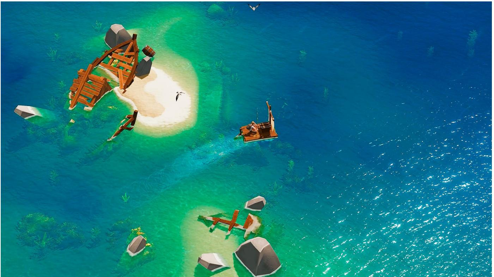

Water and aquatic vegetation are two important visual elements for creating beautiful open environments in video games. This image is from the survival game *[Len's island](https://www.lensisland.com)*, made with Unity by Flowstudio.


This recipe is for making a simple water shader. It's created in Shader Graph to make the steps more accessible to artists and designers.

The shader is built in three stages:

- Creating the water color
- Moving tiled normal maps to add wavelets to the surface
- Adding moving displacement to the vertex positions to create a swell effect


A still from a [video](https://youtu.be/qPE-nMPBylM) showing a simple water shader in motion.

To view the final result, open the Water scene in the folder **Scenes > Water**. The final shader uses two subgraphs, DepthFade and TextureMovement; it's a good idea to look at them before you review the water shader. The Water scene uses the **WaterURPSettings Asset**, with the **Depth Texture** and **Opaque Texture** options enabled. Note that the Opaque Texture is only required if you add further effects not covered in this recipe, such as refraction.

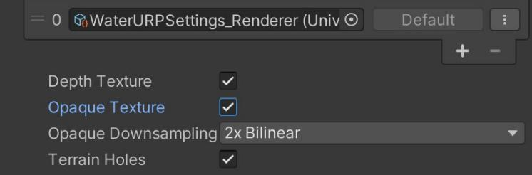

Depth Texture and Opaque Texture selected in the WaterURPSettings asset

<span id="page-56-0"></span>

## DepthFade subgraph

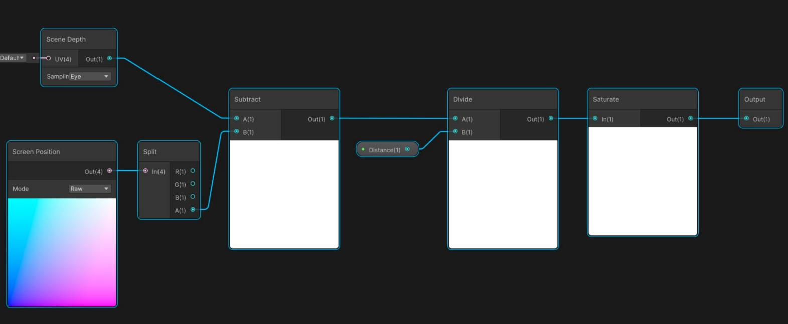

The DepthFade subgraph

The shallow and deep parts of the water each require their own color. The final color of the water will be a blend of these two colors, based on a **Depth** property. Depth is the distance between the surface of the water and the geometry below it. Since the water shader is set as transparent, opaque geometry will already be rendered, and because Depth Texture is selected for the URP Settings Asset, the current depth can be read.

A [Scene Depth](https://docs.unity3d.com/Packages/com.unity.shadergraph@17.0/manual/Scene-Depth-Node.html?q=Scene Depth) node with Sampling set to Eye mode gives the distance from the eye to the opaque geometry at the current pixel. The [Screen Position](https://docs.unity3d.com/Packages/com.unity.shadergraph@17.0/manual/Screen-Position-Node.html?q=screen position raw) node, with Raw selected as the mode of its output value, holds the information about rendering the current pixel of water. A Split node is used since you want the W component, which stores the distance from the eye to the current pixel of water.

Subtracting the water distance from the distance of the existing opaque geometry gives a guide to the depth of the water, albeit a ray from the eye position, not a ray directly down. Next, a [Divide](https://docs.unity3d.com/Packages/com.unity.shadergraph@17.0/manual/Divide-Node.html?q=Divide node) node controls where the edge between shallow and deep appears. The output from this subgraph should be between 0 and 1, so you'll use a [Saturate](https://docs.unity3d.com/Packages/com.unity.shadergraph@17.0/manual/Saturate-Node.html?q=Saturate node) node which acts as a specialized [Clamp](https://docs.unity3d.com/Packages/com.unity.shadergraph@17.0/manual/Clamp-Node.html?q=Clamp) node by always restricting the output between 0 and 1.

<span id="page-57-0"></span>

## TextureMovement subgraph


TextureMovement subgraph

The water shader has a number of moving textures that are handled using the TextureMovement subgraph. In this subgraph, a [Time](https://docs.unity3d.com/Packages/com.unity.shadergraph@17.0/manual/Time-Node.html?q=Time node) node is used as one input to a [Multiply](https://docs.unity3d.com/Packages/com.unity.shadergraph@17.0/manual/Multiply-Node.html?q=Multiply) node. The input Speed is divided by 100 and forms the second input to the Multiply node. The output from the Multiply node acts as the Offset input to a [Tiling and Offset](https://docs.unity3d.com/Packages/com.unity.shadergraph@17.0/manual/Tiling-And-Offset-Node.html?q=tiling) node. The **Scale** property forms the Tiling input. Over time, this simple subgraph will update the UV used by a [Sample Texture 2D](https://docs.unity3d.com/Packages/com.unity.shadergraph@17.0/manual/Sample-Texture-2D-Node.html?q=sample texture) node given a Speed and Scale input.

### Water shader

Now it's time to create the water shader, based on a Lit Shader Graph, via **URP > Lit Shader Graph.**

|  | Visual Scripting              |                    |  |                                |
|--|-------------------------------|--------------------|--|--------------------------------|
|  | Shader Graph                  | URP                |  | Lit Shader Graph               |
|  | Shader                        | Builtin            |  | Unlit Shader Graph             |
|  | Shader Variant Collection     | Blank Shader Graph |  | Sprite Custom Lit Shader Graph |
|  | Testing                       | Sub Graph          |  | Sprite Unlit Shader Graph      |
|  | Playables                     |                    |  |                                |
|  | Assembly Definition           |                    |  | Sprite Lit Shader Graph        |
|  | Assembly Definition Reference |                    |  | Decal Shader Graph             |
|  |                               |                    |  |                                |

Create > Shader Graph > URP > Lit Shader Graph

<span id="page-58-0"></span>

Next, you'll use the Graph Inspector to set the **Surface Type.**

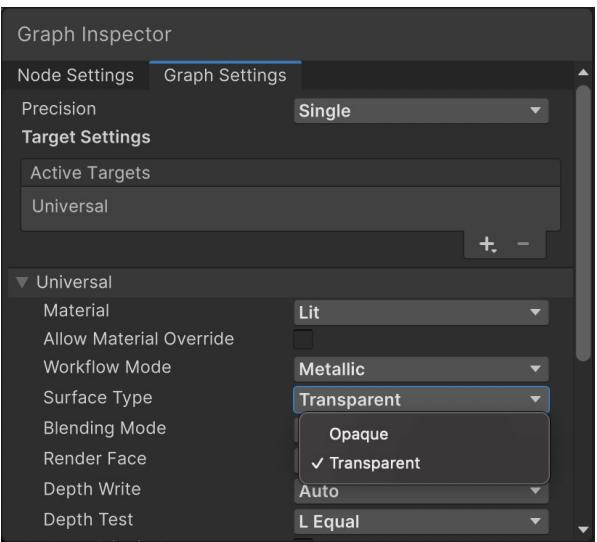

Setting the Surface Type

#### Edit the graph, starting with Color.

### Color

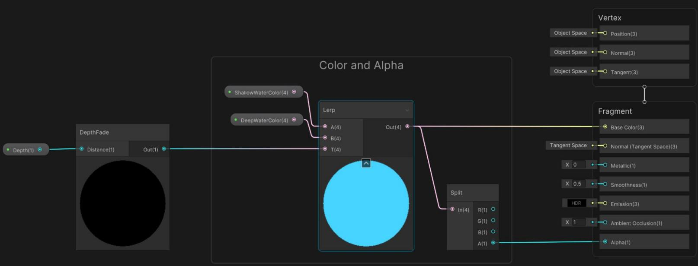

Color and Alpha

Color is handled by adding a DepthFade subgraph. The subgraph uses a float **Depth** property for control. If the output goes directly to the Base Color input of the Fragment shader, it results in the below image: shallow water is black and deeper water white. The higher the value of Depth, the more the black spreads. Black indicates 0 and white 1.

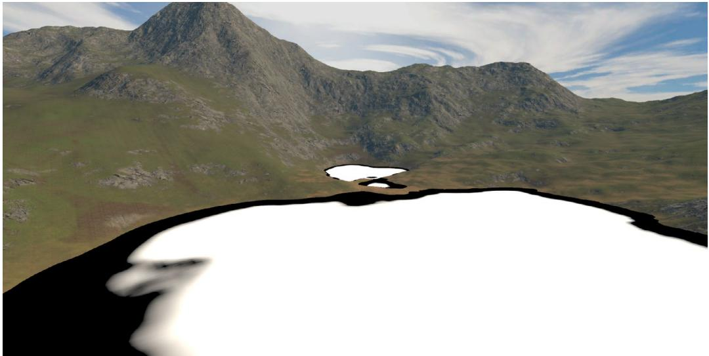

Plugging the output from DepthFade directly into **Fragment > Base Color**

Instead of linking the DepthFade directly to the Base Color input, it goes to a [Lerp](https://docs.unity3d.com/Packages/com.unity.shadergraph@17.0/manual/Lerp-Node.html?q=Lerp) node. **ShallowWaterColor** is input A, replacing the black color, and **DeepWaterColor** is input B, replacing the white. When setting the alpha for these colors make sure the shallow water is more transparent. The Lerp output goes to **Fragment > Base Color**. For the Alpha, you'll use a Split node, linking the A output with **Fragment > Alpha**. This produces the result seen in the following image.

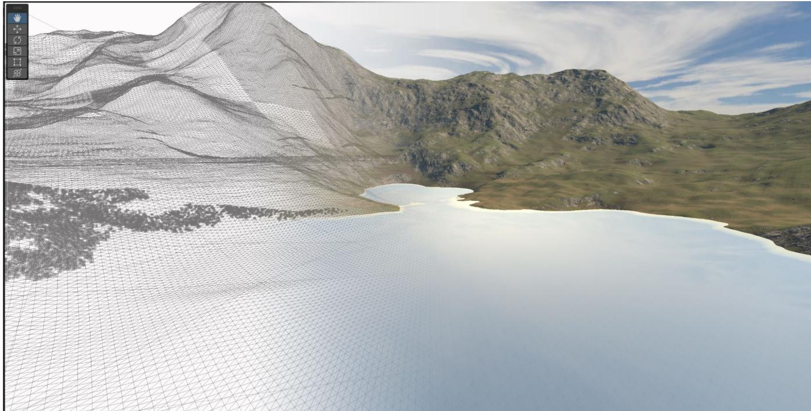

Dense mesh and colored water

<span id="page-60-0"></span>

The actual water is a plane, but to allow for vertex displacement, the mesh has many more vertices as the image shows.

This simple flat surface is a start but needs more work, namely, normal maps.

### Normal maps

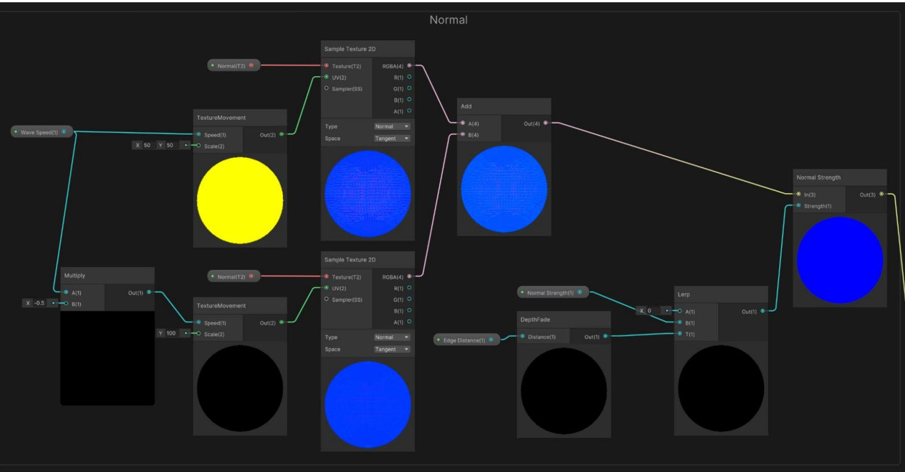

Controlling the **Fragment > Normal**

Normal maps add moving wavelets to the surface. The first input property is **Wave Speed**, which is used as the Speed input to a TextureMovement subgraph. **Scale** is hard set to 50,50, and, via a second TextureMovement node, **Speed** is preprocessed by a Multiply node to be minus half the Wave Speed property.

The next step in calculating the normal is to sample the Normal texture twice using the UV processed by the two TextureMovement subgraph nodes. Add the two normals together to get the combined effect of the two moving textures. The shader has a **Normal Strength** float property, which could be used as the Strength input to a Normal Strength node. But you want the wavelets to die back nearer to the edge. To control this, use the DepthFade subgraph node with the shader property **Edge Distance** controlling the spread. This is used as the T input to a Lerp node blending between 0 and Normal Strength. The output of this stage of the graph goes to Fragment > Normal.

<span id="page-61-0"></span>

Now you have controllable wavelets whose reflective property can be tweaked by controlling the **Smoothness** of the Fragment using a simple float property. The following image shows the effect of changing the Smoothness value.

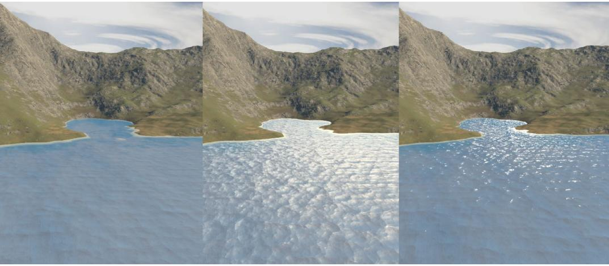

Applying different levels of smoothness to the wavelets, left to right: 0, 0.5, and 1

The next step is to enable vertex displacement to add motion to the water.

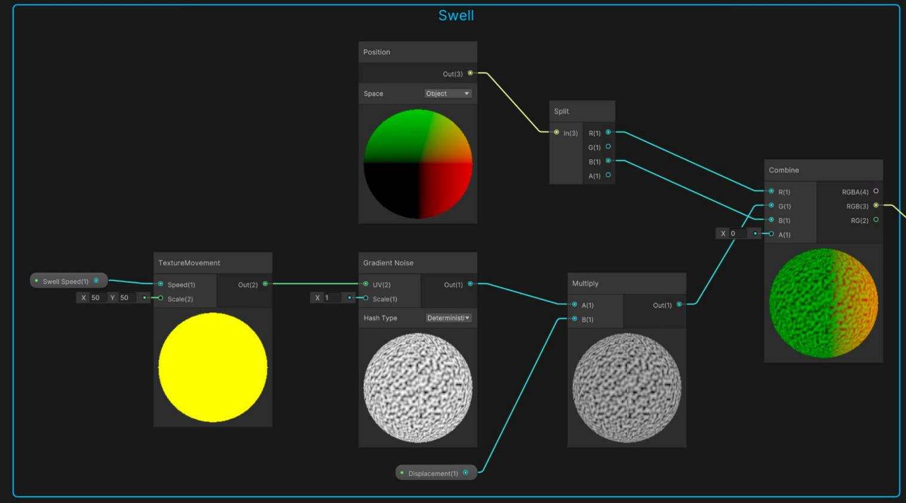

### Swell

Controlling the swell using Gradient Noise


For this step, you'll use a TextureMovement subgraph node again. Speed is set using the shader float property **Swell Speed**, and Scale is hard set to 50,50. This acts as the UV input to a [Gradient Noise](https://docs.unity3d.com/Packages/com.unity.shadergraph@17.0/manual/Gradient-Noise-Node.html?q=Gradient noise) node with Scale hard set to 1. You use a Multiply node to control this value using the shader float property **Displacement**. The purpose of these nodes is to set a Y value for vertex in object space. Notice the **Space** parameter of the Position node is set to Object. This links with a Split node and then a Combine node; Combine receives the R and B values directly from the Split node, with R being Position X and B being Position Z. The G value for Y comes from the Gradient Noise path. The RGB(3) output links to the Vertex > Position.

If you view the scene in Play mode you can see the swell moving through the water, especially at the edges.

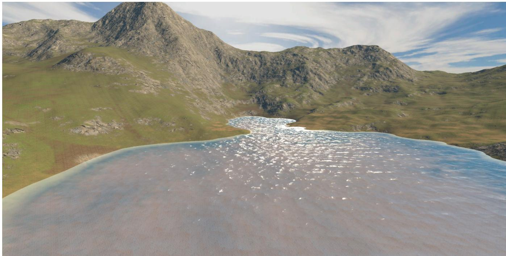

The final result

While this recipe forms the basis of a simple water shader, you can enhance it using caustic reflections, refraction, and foam. See the links below for additional guidance.

#### **More information**

- Unity [YouTube](https://www.youtube.com/watch?v=gRq-IdShxpU) tutorial
- [Caustic reflections](https://www.alanzucconi.com/2019/09/13/believable-caustics-reflections/) tutorial by Alan Zucconi
- [Stylized water](https://www.youtube.com/watch?v=1yevpCAA_rU&t=831s) tutorial by Binary Lunar

## <span id="page-63-0"></span>LUT for color grading

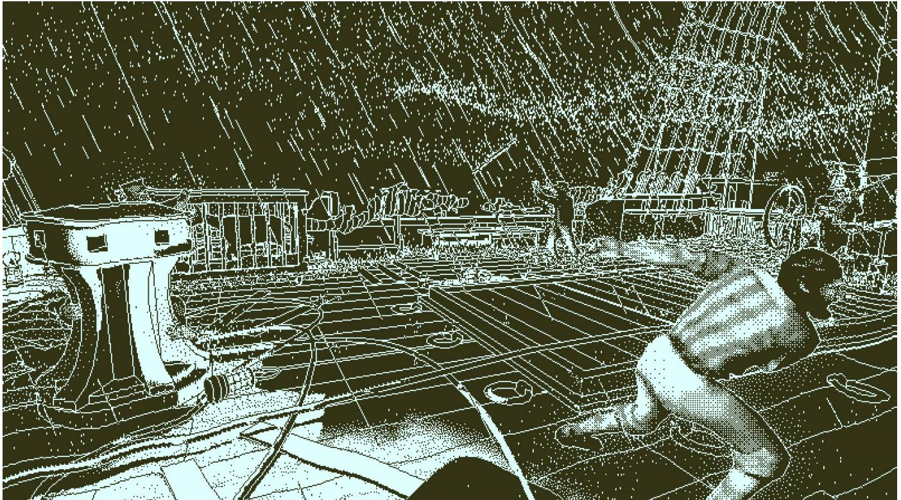

The mystery adventure FPS game *[Return of the Obra Dinn](https://obradinn.com/)*, made with Unity by Lucas Pope, achieves a unique look and feel thanks to its lo-fi art style and unique color palette that could be achieved following this recipe.

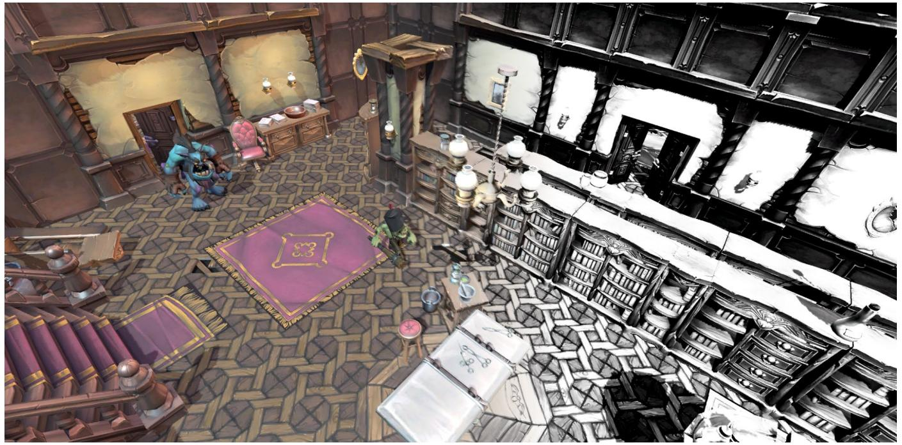

Using Color Lookup to create grading effects

If you've yet to use the post-processing filters available with URP, you're in for a treat. This recipe involves using one filter, but the steps employed apply to all them. By default, a new URP scene has post-processing disabled, so make sure to enable it via the **Camera > Rendering** panel.


Select Post Processing in Camera > Rendering

#### Additionally, you'll need to enable post-processing in the Universal Renderer Data asset.

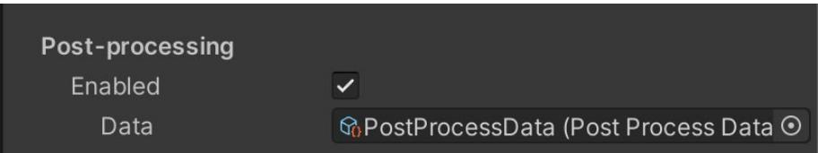

Selecting post-processing in the Universal Renderer Data asset

To apply the filter where the camera is located, add a Global Volume. Right-click in the Hierarchy window, and select **Volume > Global Volume**.

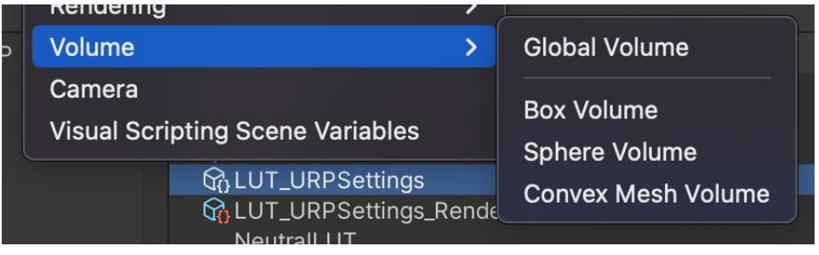

Creating a Global Volume

Select the new GameObject, and create a new Profile by clicking **New**.

| DV<br>Volume  |                                                                        |   | ?)<br>14 |  |  |  |
|---------------|------------------------------------------------------------------------|---|----------|--|--|--|
| Mode          | Global                                                                 |   |          |  |  |  |
| Weight        |                                                                        |   |          |  |  |  |
| Priority      | O                                                                      |   |          |  |  |  |
| Profile       | None (Volume Profile)                                                  | ن | New      |  |  |  |
| to the scene. | Please select or create a new Volume profile to begin applying effects |   |          |  |  |  |

Creating a new Profile

Now you can add an override. Press the **Add Override** button, select post-processing, then choose **Color Lookup**.


Adding a Color Lookup post-processing filter

Click the **All** button. Now you need a LUT (Lookup Table) image texture. This is a strip image that will be used by the filter to change the default rendered colors. You'll find the image file in **Scenes > LUT > NeutralLUT.png,** or download it using [this link](https://github.com/NikLever/Unity-URP-Cookbook-Unity6/blob/main/Assets/Scenes/LUT/NeutralLUT.png).


A LUT image must have **sRGB (Color Texture)** disabled, which you do by selecting the image and viewing the Inspector.

| Neutral LUT (Texture 2D) Import Settings | 8 花                 |      |
|------------------------------------------|---------------------|------|
|                                          |                     | Open |
|                                          |                     |      |
| Texture Type                             | Default             |      |
| Texture Shape                            | 2D                  |      |
| sRGB (Color Texture)                     |                     |      |
|                                          |                     |      |
| Alpha Source                             | Input Texture Alpha |      |
| Alpha Is Transparency                    |                     |      |

Disable sRGB (color Texture) for all LUT textures

Count the blocks in the NeutralLUT image above, and you'll find there are 32 of them. Alternatively, you can use 16 blocks; whether you choose 32 or 16 blocks, ensure the settings for your URP Asset match your choice. If you choose 32, make sure the post-processing panel has **LUT size** set to **32**. Feel free to experiment with the **Grading Mode** option.

| Post-processing      |                                                                                                            |
|----------------------|------------------------------------------------------------------------------------------------------------|
| Grading Mode         | High Dynamic Range                                                                                         |
|                      | The high dynamic range color grading mode works best on<br>platforms that support floating point textures. |
| LUT size             | 32                                                                                                         |
| Alpha Processing     |                                                                                                            |
| Fast sRGB/Linear con |                                                                                                            |

Setting the LUT size

If you assign **NeutralLUT.png** as the Lookup Texture using the **Color Lookup** settings panel, you'll see no change to the rendered image. The filter uses the texture to set a new color. The code takes the current pixel color and uses this to find a texel on the LUT image. With a neutral LUT image, the texel color will be the same as the current pixel color.

The real magic occurs when you process the image you use as the Lookup Texture using a paint program, such as Photoshop or Krita (there's a link under More resources, at the end of this section, to a YouTube video explaining how to use Krita for color grading).

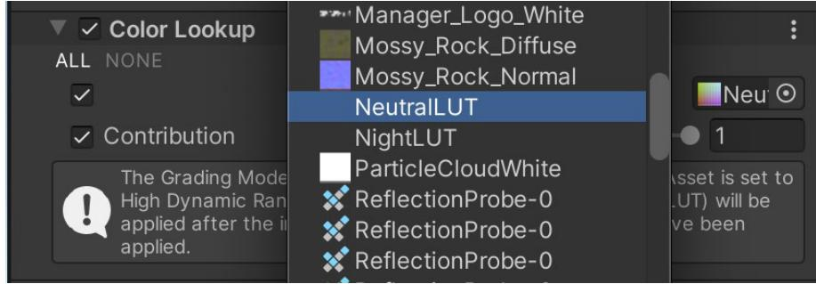

Assigning the Lookup Texture

Take a screen grab of your scene, and open it in Photoshop. At the bottom of the **Layers**  panel, find the half black/half white circular button. Select it, and in the panel find **Gradient Map**. A new color adjustment layer is added.

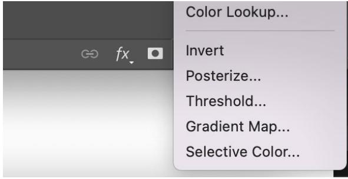

Creating a color adjustment layer

To create a color adjustment layer that results in a high-contrast black-and-white image, click the Gradient Map drop-down and select Basics, black and white.


Selecting a black and white gradient


To boost the contrast, click the gradient to open a new window. Use the stops to adjust the contrast.


Changing the stops to boost the contrast

#### The screengrab should now look black and white.

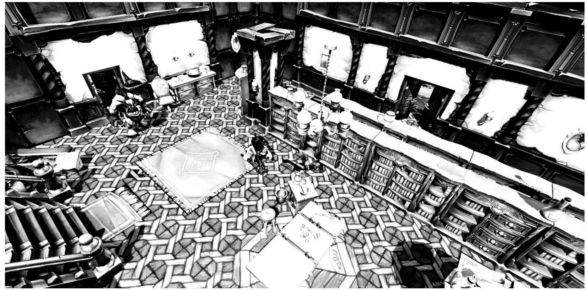

The effect of the Gradient Map

Once you have the grading of your choice, you need to apply this layer to the NeutralLUT. png file. Open the file in Photoshop. Back in the screen grab, right-click the adjustment layer, and select **Duplicate Layer**. In the new panel, select NeutralLUT.png as the **Destination > Document.**

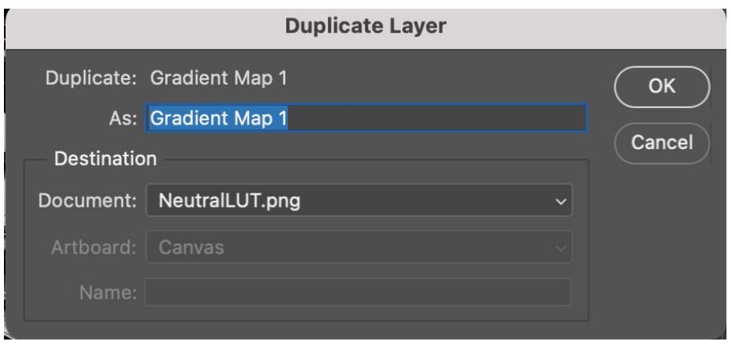

Duplicating the adjustment layer

Now the texture looks like this:

B&WLUT.png

Save it, and drag it to your project's Assets folder. Make sure to disable sRGB (Color Texture) in the Inspector panel. The last step is to assign the new LUT texture as the Lookup Texture for the Color Lookup filter.


Using various LUT textures

Using LUT Textures is an efficient way to create dramatic color grading, and this approach can be useful in many games.


#### **More resources**

- [Documentation](https://docs.unity3d.com/6000.0/Documentation/Manual/urp/add-post-processing.html) for post-processing in URP
- YouTube [tutorial](https://www.youtube.com/watch?v=zTuCTYbvxac) by PHLEARN
- YouTube [tutorial](https://www.youtube.com/watch?v=Iurcp8xdpJY) by GDQuest

## <span id="page-71-0"></span>Adaptive Probe Volumes


The Unity and URP-made game *[LEGO® Bricktales](https://thunderfulgames.com/games/lego-bricktales/)* by Clockstone immerses players in the world of LEGO, where great lighting plays a huge role in creating its atmosphere and realism of the blocks.

Adaptive Probe Volumes (APVs) are the latest Unity solution for mixed mode lighting and are easier to set up and maintain than light probes. If you are new to lighting techniques available with URP then check out the Unity e-book [Introduction to the Universal Render Pipeline for](https://unity.com/resources/introduction-to-urp-advanced-creators-unity-6)  [advanced Unity creators](https://unity.com/resources/introduction-to-urp-advanced-creators-unity-6).

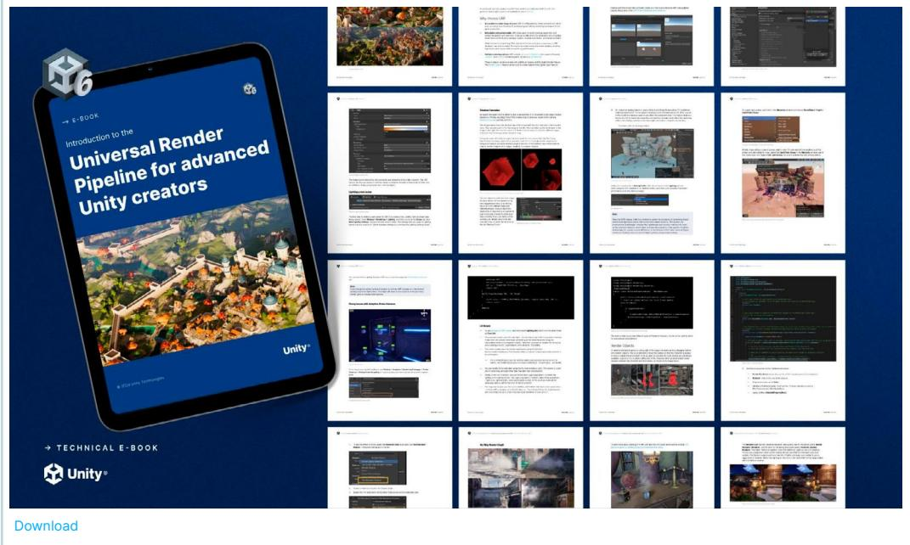

You can combine baked and dynamic objects using the Mixed Mode setting for your lights. When using Mixed Mode it's recommended to also add probes to your scene, for which there are two options in Unity 6: Light probes or APVs. The two options solve the same problem, namely allowing dynamic objects to move through a scene and be affected by global illumination. But APVs bring additional benefits and setup efficiency compared to traditional light probes.

A probe is simply a point in your scene. At design time the global illumination at this location is calculated. At run time, when rendering a frame, a URP shader that includes lighting calculations uses a blend of the nearest probes for global illumination values.

Note:

Global illumination (GI) is a system that models how light bounces off surfaces onto other surfaces, to create indirect light, rather than being limited to just the light that hits a surface directly from a direct light source.

## <span id="page-73-0"></span>Using APVs in a scene

Any technical artist who has carefully positioned light probes for a scene only to find the scene layout has changed will immediately see the benefits of APVs because in many scenes you can use APVs to place all the probes in a matter of seconds. Let's look at a practical example using the [FPS Sample: The Inspection.](https://github.com/NikLever/Unity6E-book)

1. First make sure the active URP Asset has the **Light Probe System** option set to **Adaptive Probe Volumes**.


2. In the Hierarchy window right-click and select **GameObject > Light > Adaptive Probe Volume** (APV).

| Light                            | >                 | Directional Light       |
|----------------------------------|-------------------|-------------------------|
| Video                            | >                 | Point Light             |
| Ul Toolkit                       | >                 | Spot Light              |
| Rendering                        | >                 | Area Light              |
| Spline                           | >                 | Reflection Probe        |
| Volume                           | >                 |                         |
| Camera                           |                   | Adaptive Probe Volume   |
| Cinemachine                      |                   | Probe Adjustment Volume |
| Visual Scripting Scene Variables | Light Probe Group |                         |

3. Set the Mode to **Global** and accept the default settings – Subdivisions of 1, 3, 9 and 27 meters.

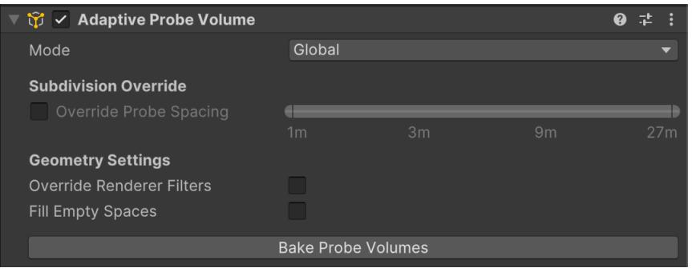

4. Bake the volume by pressing **Bake Probe Volumes**. The current scene is scanned and the probes are placed based on the geometry in the scene. Probes are at their densest where there is the most geometry.

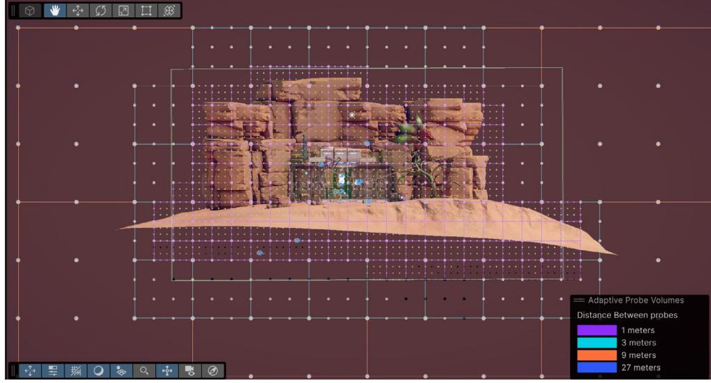

5. To view the result of the bake open **Analysis > Rendering Debugger**. Select **Probe Volumes** and select **Display Probes**. To view the different resolutions choose **Display Bricks**.

| Project<br>Console  | Render Graph Viewer        | Rendering Debugger | Project Settings | @    |
|---------------------|----------------------------|--------------------|------------------|------|
|                     |                            |                    |                  | Rese |
| Frequently Used     | Subdivision Visualization  |                    |                  |      |
| Probe Volumes       | Display Cells              |                    |                  |      |
|                     | Display Bricks             |                    | 1                |      |
| Rendering           | Debug Draw Distance        |                    | 500              |      |
| Material            | Subdivision Preview        |                    |                  |      |
|                     | Live Updates               |                    |                  |      |
| Lighting            | Probe Visualization        |                    |                  |      |
| GPU Resident Drawer | Display Probes             |                    | J                |      |
| Render Graph        | Probe Shading Mode         |                    | SH               | V    |
| Volume              | Debug Size                 |                    | - 0.73           |      |
|                     | Exposure Compensation      |                    | 0                |      |
|                     | Max Subdivisions Displayed |                    | 0                | 3    |
|                     | Min Subdivisions Displayed |                    |                  | O    |

For many scenes that would complete the job, and you can head off for a coffee break. But APVs provide much more fidelity. You can add multiple volumes with different subdivisions to have precise control over the placement and density of probes.

Take the oasis environment in the URP 3D Sample as an example. Imagine most of the action in the scene is around the tent and therefore, you want to place most of the probes around it. To achieve this you would:

1. Open **Rendering > Lighting > Adaptive Probe Volumes** and change **Max Probe Spacing** to 81m.

| @ Inspector       | . Lighting |                                              |    |     |                                    |     |      |
|-------------------|------------|----------------------------------------------|----|-----|------------------------------------|-----|------|
|                   |            | Scene   Adaptive Probe Volumes   Environment |    |     |                                    | 2   |      |
|                   |            |                                              |    |     | Realtime Lightmaps Baked Lightmaps |     |      |
| Baking            |            |                                              |    |     |                                    |     |      |
| Probe Placement   |            |                                              |    |     |                                    |     |      |
| Probe Positions   |            | Recalculate                                  |    |     |                                    |     |      |
| Probe Offset      |            | O                                            |    | O   | O                                  |     |      |
| Min Probe Spacing |            | 1                                            |    |     |                                    |     |      |
| Max Probe Spacing |            |                                              |    |     |                                    |     |      |
|                   |            |                                              | 9m | 27m |                                    | 81m | 243m |

2. Add an **Adaptive Probe Volume** set as **Global** and set the **Override Probe Spacing** to 27m>81m.


3. Add an Adaptive Probe Volume set as **Local** and set the **Override Probe Spacing** to 1m>9m. Set the Volume to be a bit bigger than the tent.

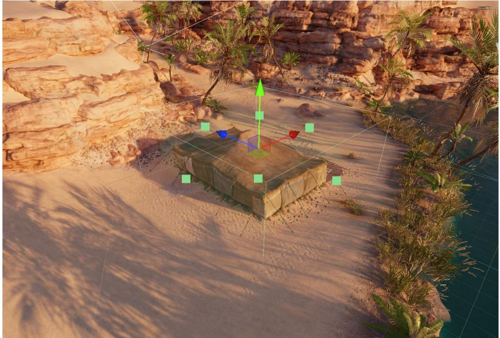

<span id="page-76-0"></span>

#### 4. Bake the probe Volumes.

As you can see from the image below, most probes are around the tent.


Probe placement

## Lighting Scenario asset

Another feature of APVs is the ability to switch between indirect lighting data. A **Lighting Scenario** asset contains the baked lighting data for a scene or **[Baking Set](https://docs.unity3d.com/Packages/com.unity.render-pipelines.universal@17.0/manual/probevolumes-usebakingsets.html)**. You can bake different lighting setups into different lighting scenarios, and change which one URP uses at runtime or at design time using the Rendering Debugger.

| Project<br>글 Console | Rendering Debugger                | @ ::  |
|----------------------|-----------------------------------|-------|
|                      |                                   | Reset |
| Frequently Used      | Display Probes                    |       |
| Probe Volumes        | Debug Probe Sampling              |       |
|                      | Virtual Offset Debug              |       |
| Rendering            | Debug Draw Distance               | 200   |
| Material             | Probe Adjustment Volumes          |       |
|                      | Auto Display Probes               | >     |
| Lighting             | Isolate Affected                  | >     |
| GPU Resident Drawer  | Scenario Blending                 |       |
|                      | Number Of Cells Blended Per Frame | 10000 |
| Render Graph         | Turnover Rate                     | 0.1   |
| Volume               | Scenario Blend Target             | Night |
|                      | Scenario Blending Factor          | 0 261 |

Scenario Blending using the Rendering Debugger

For example, you can create one Lighting Scenario asset for day, and another one for night. At runtime, you can switch or blend between the two.

|     | r Baking<br>Baking Mode                                 | Baking Set                                                             |        |
|-----|---------------------------------------------------------|------------------------------------------------------------------------|--------|
|     | Current Baking Set                                      | ് APV-Example Baking Set (Probe Volum () New                           |        |
|     | Scenes in Baking Set                                    | Status                                                                 | Bake : |
|     | �APV-Example                                            | O Active                                                               | ><br>+ |
|     | Probe Placement                                         |                                                                        |        |
|     | Probe Positions                                         | Recalculate                                                            |        |
|     | Probe Offset                                            | y o<br>Z 0<br>× 0                                                      |        |
|     | Min Probe Spacing                                       | 1                                                                      |        |
|     | Max Probe Spacing                                       | 9<br>9m<br>27m<br>81m                                                  | 243m   |
|     |                                                         | Baked Probe Volume data will contain up-to 4 different sizes of Brick. |        |
|     | > Renderer Filter Settings                              |                                                                        |        |
|     | ▼ Lighting Scenarios                                    |                                                                        |        |
|     | Scenario                                                | Active                                                                 | Status |
|     | Day                                                     |                                                                        |        |
|     | 1888                                                    |                                                                        |        |
|     |                                                         |                                                                        | + -    |
|     | > Sky Occlusion Settings                                |                                                                        |        |
|     | Probe Invalidity Settings                               |                                                                        |        |
|     | Dilation<br>CARTIA LIMINATION LIANA F                   | LINEAR LE PARTER PRODUCTION PARTICIPALIES                              |        |
|     | ▼ Baking                                                |                                                                        |        |
|     | Baking Mode                                             | Baking Set                                                             |        |
|     | Current Baking Set                                      | APV-Example Baking Set (Probe Volum () New                             |        |
|     | Scenes in Baking Set                                    | Status                                                                 | Bake : |
|     | @ APV-Example                                           | O Active                                                               | >      |
|     |                                                         |                                                                        | +      |
|     | ▼ Probe Placement                                       |                                                                        |        |
|     | Probe Positions<br>Probe Offset                         | Recalculate<br>× 0<br>Y O<br>Z O                                       |        |
|     | Min Probe Spacing                                       | 1                                                                      |        |
|     | Max Probe Spacing                                       | 9m<br>81m                                                              | 243m   |
| 1 c |                                                         | 27m                                                                    |        |
|     |                                                         | Baked Probe Volume data will contain up-to 4 different sizes of Brick. |        |
|     | ► Renderer Filter Settings                              |                                                                        |        |
|     | ▼ Lighting Scenarios                                    |                                                                        |        |
|     | Scenario                                                | Active                                                                 | Status |
|     | Do                                                      |                                                                        |        |
|     | = Night                                                 |                                                                        | + -    |
|     |                                                         |                                                                        |        |
|     | > Sky Occlusion Settings<br>V Probe Invalidity Settings |                                                                        |        |
|     |                                                         |                                                                        |        |

Day/night Lighting Scenarios

1. To use a Lighting Scenario asset, go to the active URP Asset and enable **Lighting > Light Probe Lighting > Lighting Scenarios**.

| Lighting                           |                        |   |  |
|------------------------------------|------------------------|---|--|
| Main Light                         | Per Pixel              |   |  |
| Cast Shadows                       | V                      |   |  |
| Shadow Resolution                  | 2048                   |   |  |
| Light Probe System                 | Adaptive Probe Volumes | œ |  |
| Memory Budget                      | Memory Budget Medium   | P |  |
| SH Bands                           | Spherical Harmonics L1 |   |  |
| Enable GPU Streaming               |                        |   |  |
| Enable Disk Streaming              |                        |   |  |
| Enable Lighting Scenarios          | >                      |   |  |
| Enable Lighting Scenario Blending  | V                      |   |  |
| Blending Memory Budget             | Memory Budget Medium   |   |  |
| Estimated GPU Memory cost: 111 MB. |                        |   |  |


- 2. To create a new Lighting Scenario asset so you can store baking results inside, do the following:
	- a. Open the **Adaptive Probe Volumes** panel in the **Lighting** window.
	- b. In the **Lighting Scenarios** section, select the **Add** (+) button to add a Lighting Scenario asset.

|  | ▼ Lighting Scenarios |        |        |
|--|----------------------|--------|--------|
|  | Scenario             | Active | Status |
|  | Day                  | ●      |        |
|  | Night<br>==          |        |        |
|  |                      |        | +      |

3. In the Lighting window, under the **Adaptive Probe Volume** tab, make sure the **Probe Positions** are set to **Don't Recalculate**. This ensures that Unity will only rebake lighting without changing the probe positions, which could otherwise invalidate previously baked scenarios.

| C Inspector<br>Cighting            |                                              |                                 |                     |  |  |  |
|------------------------------------|----------------------------------------------|---------------------------------|---------------------|--|--|--|
|                                    | Scene   Adaptive Probe Volumes   Environment |                                 |                     |  |  |  |
| Realtime Lightmaps Baked Lightmaps |                                              |                                 |                     |  |  |  |
| Baking                             |                                              |                                 |                     |  |  |  |
| Probe Placement<br>Recalculate     |                                              |                                 |                     |  |  |  |
|                                    |                                              | Probe Positions<br>Probe Offset | V Don't Recalculate |  |  |  |
| Min Probe Spacinc 0.4              |                                              |                                 |                     |  |  |  |

- 4. To bake into a Lighting Scenario, follow these steps:
	- a. In the Lighting Scenarios section, select a Lighting Scenario to make it active.
	- b. Select **Generate Lighting**. URP stores the baking results in the active Lighting Scenario.
	- c. Use the drop-down button next to **Generate Lighting** to only focus on the probes if you're not using lightmaps.

| GPU Baking Profile | Automatic         |                        |
|--------------------|-------------------|------------------------|
|                    | Generate Lighting | Bake Probe Volumes     |
| Scenario Size      | 7.3 MB            | Bake Reflection Probes |
| Baking Set Size    | 18.6 MB           | Clear Baked Data       |

<span id="page-79-0"></span>You can set which Lighting Scenario URP uses at runtime using the [ProbeReferenceVolume](https://docs.unity3d.com/Packages/com.unity.render-pipelines.universal@17.0/manual/probevolumes-bakedifferentlightingsetups.html) API.

#### Note:

If you change the active Lighting Scenarios at runtime, URP changes only the indirect lighting data in the light probes. You might still need to use scripts to move geometry, modify lights or change direct lighting.

### Fixing issues with APVs

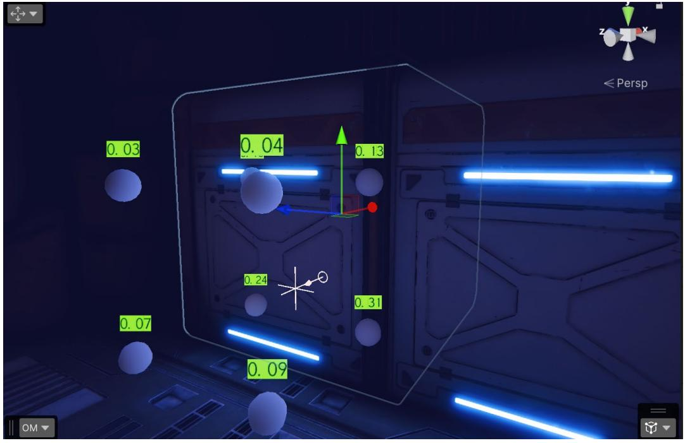

Debug Probe Sampling

To fix issues such as APV artifacts, use **Window > Analysis > Rendering Debugger > Probe Volumes > Debug Probe Sampling** to inspect probes and how they are sampled for a given pixel.


Visualizing Probe Sampling per pixel

Since light probes are added in a grid, placement can sometimes cause rendering errors such as dark areas where it should be light and vice versa. The Editor provides several tools to let a technical artist quickly fix these issues.

Light probes inside geometry are called invalid probes. URP marks a probe as invalid when it fires sampling rays to capture surrounding light data, but the rays hit the unlit backfaces inside geometry. The APV system has several tools to fix these issues.

| Probe Invalidity Settings |                                   |        |
|---------------------------|-----------------------------------|--------|
| Dilation                  | >                                 |        |
| Search Radius             | 1                                 |        |
| Validity Threshold        |                                   | 0.75   |
| Dilation Iterations       |                                   |        |
| Squared Distance We ✔     |                                   |        |
| Virtual Offset            | V                                 |        |
| Validity Threshold        |                                   | 0.75   |
| Search Distance Multi-    |                                   | 0.2    |
| Geometry Bias             |                                   | 0.01   |
| Ray Origin Bias           |                                   | -0.001 |
| Layer Mask                | Default, TransparentFX, Water, UI |        |
|                           | Refresh Virtual Offset Debug      |        |

The Probe Invalidity Settings available in the [Adaptive Probe Volumes panel](https://docs.unity3d.com/Packages/com.unity.render-pipelines.universal@17.0/manual/probevolumes-lighting-panel-reference.html)

**Virtual Offset** tries to make invalid light probes valid, by moving their capture points so they're outside any colliders. And **Dilation** detects light probes that remain invalid after Virtual Offset, and gives them data from valid probes nearby.


You can check which light probes are invalid using the Rendering Debugger**.**

In the left-side scene in the image above, Virtual Offset isn't active and dark bands are visible. In the scene on the right side, Virtual Offset is active.

<span id="page-81-0"></span>

In the left-side scene in the image above, Dilation isn't active and some areas are too dark. In the scene on the right, Dilation is active.

#### **Light leaks**

Light leaks are areas that are too light or dark, often in the corners of a wall or ceiling.

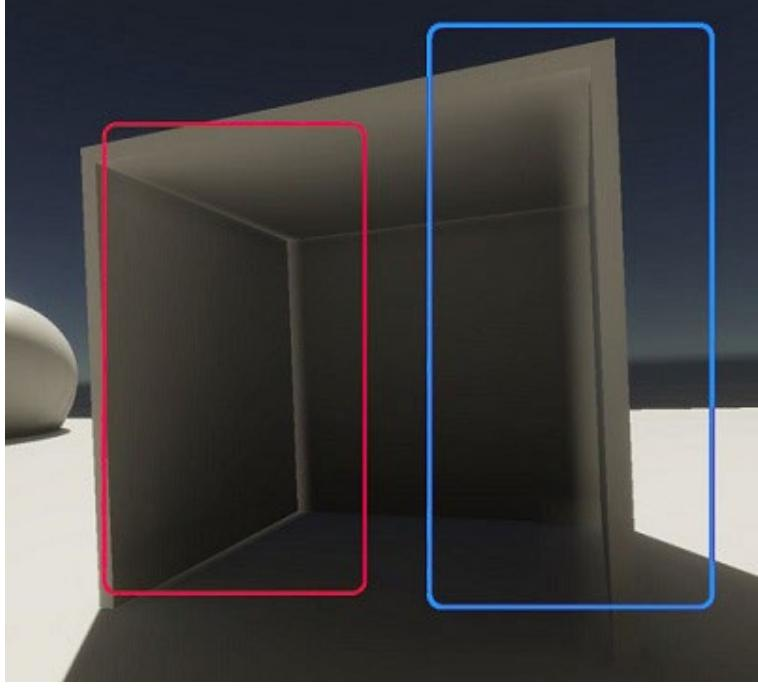

A light leak

Light leaks often occur when geometry receives light from a light probe that isn't visible to the geometry, for example due to the light probe being on the other side of a wall. APVs use regular grids of light probes, so light probes might not follow walls or be at the boundary between different lighting areas.

<span id="page-82-0"></span>

Try the following techniques to fix light leaks:

- [Create thicker walls.](https://docs.unity3d.com/Packages/com.unity.render-pipelines.universal@17.0/manual/probevolumes-fixissues.html#create-thicker-walls)
- Add an [Adaptive Probe Volumes Options override](https://docs.unity3d.com/Packages/com.unity.render-pipelines.universal@17.0/manual/probevolumes-fixissues.html#add-an-adaptive-probe-volumes-options-override-to-your-scene) to your scene:
	- Add a [Volume,](https://docs.unity3d.com/Packages/com.unity.render-pipelines.universal@17.0/manual/volumes-landing-page.html) then an **Adaptive Probe Volumes Options** override to the Volume. This adjusts the position that GameObjects use to sample the light probes.
- [Enable Rendering Layers](https://docs.unity3d.com/Packages/com.unity.render-pipelines.universal@17.0/manual/probevolumes-fixissues.html#layers):
	- In the Lighting window, configure the **Rendering Layer Masks** in the [Adaptive](https://docs.unity3d.com/Packages/com.unity.render-pipelines.universal@17.0/manual/probevolumes-lighting-panel-reference.html)  [Probe Volumes panel](https://docs.unity3d.com/Packages/com.unity.render-pipelines.universal@17.0/manual/probevolumes-lighting-panel-reference.html) to allow the APV to assign a Rendering Layer Mask to each light probe.
- [Adjust Baking Set properties](https://docs.unity3d.com/Packages/com.unity.render-pipelines.universal@17.0/manual/probevolumes-fixissues.html#probevolumesettings):
	- If adding a Volume doesn't work, use the Adaptive Probe Volumes panel in the Lighting window to adjust Virtual Offset and Dilation settings.
- [Use a Probe Adjustment Volume](https://docs.unity3d.com/Packages/com.unity.render-pipelines.universal@17.0/manual/probevolumes-fixissues.html#probevolumeadjustment) component:
	- Use this component to make light probes invalid in a small area. This triggers Dilation during baking, and improves the results of Leak Reduction Mode at runtime.

#### **Rendering Layers**

When switching the URP 3D Sample oasis environment from using light probes/lightmaps to using APV only, an issue arises with light leaks, which you can see on the bright roof and wall in the image below.

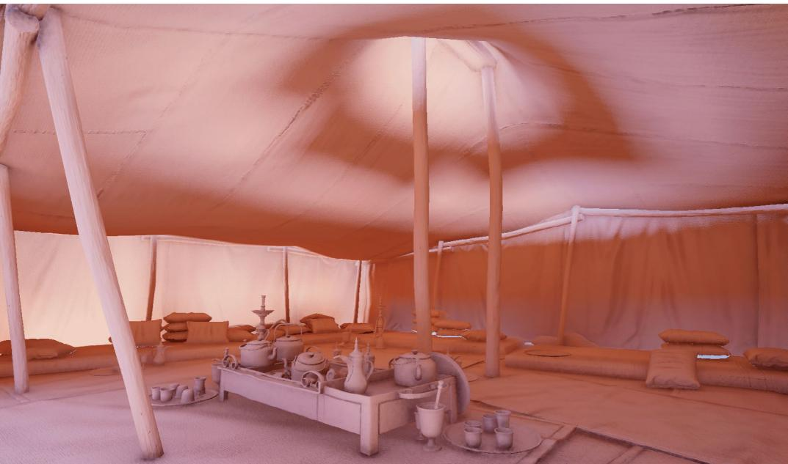

Light leaking in the tent in the oasis environment from the URP 3D Sample

This is because some pixels are blending between probes on the inside and outside of the tent. By using **Window > Analysis > Rendering Debugger > Probe Volumes > Debug Probe Sampling**, you can spot which probes are used when interpolating the value for a pixel.

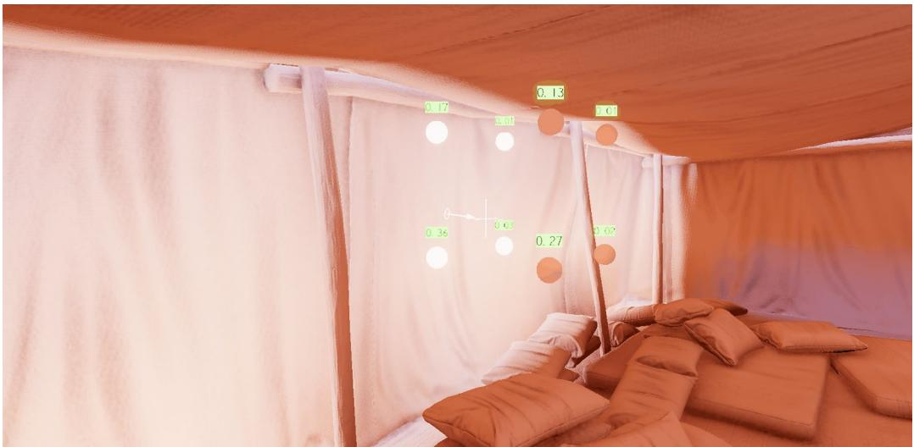

Viewing the interpolated probes for a pixel

One option to fix this is to use a Volume to modify how the APV is sampled at runtime using the **Adaptive Probe Volume Options** override. The **NormalBias** and **ViewBias** settings can be useful for adjusting the sampling position: NormalBias pushes it along the normal (away from walls), while ViewBias pushes it towards the camera (keeping it on the same side of the wall as the camera). When you change these properties in the Volume, you can see the updates in real-time in both the lighting results and the **Debug Probe Sampling View**, where the sampling position and weights are updated accordingly. But a better option is to use Rendering Layers.

APVs support Rendering Layers, allowing you to create up to four different masks and restrict sampling to those specific masks for certain objects. This can be useful to prevent interior objects from sampling exterior probes, or vice versa. Activate and add them using **Window > Rendering > Lighting > Adaptive Probe Volumes > Rendering Layers**.

| T Rendering Layers    |   |          |   |
|-----------------------|---|----------|---|
| Rendering Layer Masks | > |          |   |
| Exterior<br>ll        |   | Default  | D |
| Interior              |   | Interior |   |
|                       |   |          |   |

You'll also need to add a layer via **Project Settings > Tags and Layers > Rendering Layers**:

| Tags and Layers<br>A la fin Rim Billing in a " |          | 0 花 |
|------------------------------------------------|----------|-----|
| ► Layers                                       |          |     |
| ▼ Rendering Layers                             |          |     |
| Layer O                                        | Default  |     |
| Layer 1                                        | Screen   |     |
| Layer 2                                        | Lamps    |     |
| Layer 3                                        | Interior |     |
|                                                |          | +   |

To implement this, edit the meshes themselves to ensure they are divided between the different areas you want to create. In this project for example, the meshes are edited to separate the interior and exterior into multiple meshes. Once the meshes are split, assign the correct Rendering Layers to them, and specify which ones APV should use in the **Adaptive Probe Volume Tab**.

You don't need to assign layers to every object in the tent, only to those susceptible to leaking, like the walls or objects near the walls.

When generating lighting, the system will automatically assign layers to the probes during the bake process based on the nearby objects, eliminating the need to manually assign layers per probe. To facilitate this automatic probe assignment, you need to assign layers to larger objects. In the oasis environment tent example, the interior layer is assigned to the walls and ceiling of the tent to ensure that most of the interior probes hit them during baking and are automatically assigned to the interior mask. Probes are assigned to the layer they encounter most frequently.

Once this is done, click **Generate Lighting** and observe that leaking is eliminated for the tent, thanks to the separate interior and exterior masks.


Light leaks without and with rendering layers

Get more information [here](https://docs.unity3d.com/Packages/com.unity.render-pipelines.universal@17.0/manual/probevolumes-fixissues.html) about fixing issues with APVs

## <span id="page-85-0"></span>Streaming APVs

[APV streaming](https://docs.unity3d.com/Packages/com.unity.render-pipelines.universal@17.0/manual/probevolumes-streaming.html) enables you to use APV-based lighting in large worlds. APV streaming bakes APV data that's larger than the available CPU or GPU memory, and loads it at runtime when it's needed. At runtime, as the camera moves, URP loads only APV data from cells within the camera's view frustum.

You can enable and disable streaming for different URP quality levels. Enable streaming with the following steps:

- 1. Select **Edit > Project Settings > Quality** from the main menu.
- 2. Select a Quality Level.
- 3. Double-click the Render Pipeline Asset to open it in the Inspector.
- 4. Expand the Lighting tab.
- 5. You can now enable two types of streaming:
	- a. Enable Disk Streaming to stream from disk to CPU memory.
	- b. Enable GPU Streaming to stream from CPU memory to GPU memory. You must enable Enable Disk Streaming first.

| T Lighting                         |                        |   |
|------------------------------------|------------------------|---|
| Main Light                         | Per Pixel              | D |
| Cast Shadows                       | V                      |   |
| Shadow Resolution                  | 2048                   | D |
| Light Probe System                 | Adaptive Probe Volumes |   |
| Memory Budget                      | Memory Budget Medium   | D |
| SH Bands                           | Spherical Harmonics L1 |   |
| Enable GPU Streaming               |                        |   |
| Enable Disk Streaming              |                        |   |
| Enable Lighting Scenarios          | V                      |   |
| Enable Lighting Scenario Blending  | >                      |   |
| Blending Memory Budget             | Memory Budget Medium   |   |
| Estimated GPU Memory cost: 111 MB. |                        |   |

You can configure streaming settings in the same window. Refer to URP Asset for more information.

<span id="page-86-0"></span>

#### **Debug streaming**

The smallest section URP loads and uses is a cell, which is the same size as the largest brick in an APV. You can influence the size of cells in an APV by adjusting the density of light probes

Use the Rendering Debugger to view the cells in an APV or debug streaming.

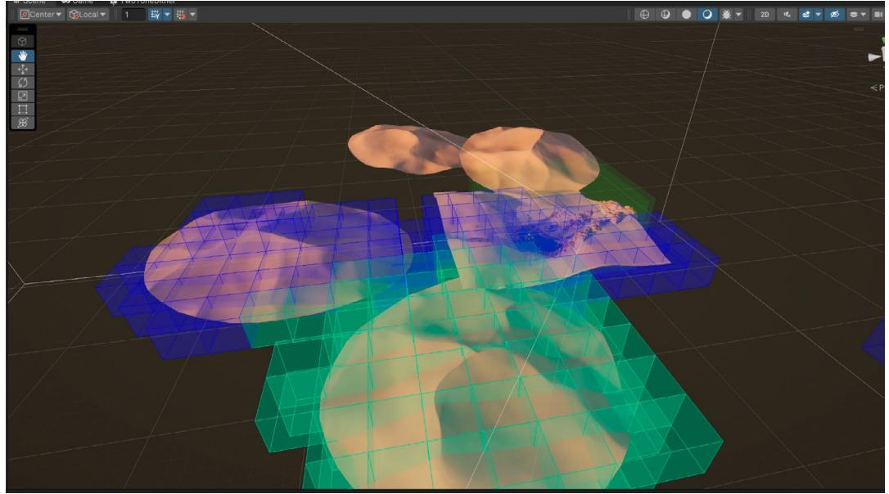

APV Streaming

### Sky occlusion

Sky occlusion is the process whereby if a GameObject samples a color from the sky, Unity will dim the color if the light can't reach the GameObject. Sky occlusion in Unity uses the sky color from the ambient probe, which updates at runtime. This means you can dynamically light GameObjects as the sky color changes. For example, you can change the sky color from light to dark to simulate the effect of a day-night cycle.

**Note**: If you enable sky occlusion, APVs might take longer to bake, and Unity might use more memory at runtime.

When you [enable sky occlusion](https://docs.unity3d.com/Packages/com.unity.render-pipelines.universal@17.0/manual/probevolumes-skyocclusion.html), Unity bakes an additional static sky occlusion value into each probe in an APV. The sky occlusion value is the amount of indirect light the probe receives from the sky, including light that bounced off static GamesObjects.

The main benefit of using sky occlusion is you can modify the sky lighting at runtime.


Let's look at the series of images on the left to illustrate this:

- The top image shows the problem that occurs when you can't bake the sky lighting because you need it to change at runtime. In this image only an ambient probe is used with no baking resulting in a poor result.
- In the second to fifth images the ambient probe is used together with sky occlusion. You could also light this image with a regular APV bake, with sky occlusion disabled but then the lighting would not change at runtime.

An example of the results of using sky occlusion in a scene. The images are from the Unity Asset Store package [Azure\[Sky\] Dynamic Skybox](https://assetstore.unity.com/packages/tools/particles-effects/azure-sky-dynamic-skybox-36050) by 7stars.


Follow these steps to enable sky occlusion:

- 1. Enable the GPU Light Baker (formerly called Progressive GPU Lightmapper). Unity doesn't support sky occlusion if you use Progressive CPU. Go to **Window > Rendering > Lighting**.
- 2. Go to the Scene panel.
- 3. Set Lightmapper to Progressive GPU.

| ▼ Lightmapping Settings |                 |  |
|-------------------------|-----------------|--|
| Lightmapper             | Progressive GPU |  |
| Importance Sampling     |                 |  |

- 4. Open the Adaptive Probe Volumes panel.
- 5. Enable Sky Occlusion.

| Sky Occlusion Settings |   |  |  |      |
|------------------------|---|--|--|------|
| Sky Occlusion          | > |  |  |      |
| Samples                |   |  |  | 2048 |
| Bounces                |   |  |  | 2    |
| Albedo Override        |   |  |  | 0.6  |
| Sky Direction          |   |  |  |      |

To update the lighting data, you must also bake the APV after you enable or disable sky occlusion. Once the sky occlusion is baked, the scene lighting will respond to the ambient probe updates. In URP, the ambient probe is updated in real-time only when using the Color or Gradient Mode, not the Skybox mode. This means you'll probably have to manually animate a color to match the animated sky visuals.

**Note**: URP now supports per-vertex quality sampling for probes. This is especially useful to boost performance on lower-end devices. To set the sampling mode use the **URP Asset** in the Lighting section. **Advanced Properties** must be active to view the option; press the ellipsis at the top right of the Lighting panel to activate it. With Advanced Properties active, the **SH Evaluation Mode** drop-down will appear.

| AND OF OF<br>SH Evaluation Mode | V Auto     |
|---------------------------------|------------|
| Shadows                         | Per Vertex |
| Post-processing                 | Mixed      |
| Volumes                         | Per Pixel  |

#### **More Information**

- Adaptive Probe Volume[s documentation](https://docs.unity3d.com/Packages/com.unity.render-pipelines.universal@17.0/manual/probevolumes.html)
- GDC 2023 session: [Efficient and impactful lighting with Adaptive Probe Volumes](https://www.youtube.com/watch?v=iU7X5xICkc8)

### <span id="page-89-0"></span>Light probes vs APVs


Light Probe Groups in use in the top image, and APVs in the bottom image; images are from the Unity Asset Store package [ArchVizPRO](https://assetstore.unity.com/packages/3d/environments/industrial/archvizpro-photostudio-urp-225832)  [Photostudio URP](https://assetstore.unity.com/packages/3d/environments/industrial/archvizpro-photostudio-urp-225832) by ArchVizPro

The bottom image shows how smoothly a transition from dark to light works with APV. In the top image, the Light Probe Group results in a bright light on the car door because a single interpolated probe is used per object. This is because the door is a separate GameObject to the rest of the door and uses a different probe, resulting in a rendering error.


The table below compares the features of light probes and APVs.

| Light Probe Groups                                                                   | Adaptive Probe Volumes                                                                                                                                                       |  |  |
|--------------------------------------------------------------------------------------|------------------------------------------------------------------------------------------------------------------------------------------------------------------------------|--|--|
| Time-consuming to place probes and move                                              | Fast to place and easy to update as                                                                                                                                          |  |  |
| them if geometry changes                                                             | geometry changes                                                                                                                                                             |  |  |
| A single interpolated probe is used for                                              | Each pixel is individually lit:                                                                                                                                              |  |  |
| lighting objects:                                                                    | —                                                                                                                                                                            |  |  |
| —                                                                                    | This ensures smooth transitions.                                                                                                                                             |  |  |
| Objects cannot transition well from                                                  | —                                                                                                                                                                            |  |  |
| darkness to light and stand out.                                                     | Volumetric effects work well using                                                                                                                                           |  |  |
| —                                                                                    | APV because the APV grid is easy to                                                                                                                                          |  |  |
| It can cause problems for big objects.                                               | sample at any location.                                                                                                                                                      |  |  |
| Static objects are usually lit using light maps.<br>Only dynamic objects use probes. | No need for lightmaps or lightmap UVs:<br>—<br>Use a single lighting solution for all<br>objects in a scene.<br>—<br>Light large worlds with a constrained<br>memory budget. |  |  |
| Probes can be freely placed and moved at                                             | Probes are placed in a grid structure and                                                                                                                                    |  |  |
| runtime.                                                                             | cannot be moved at run time.                                                                                                                                                 |  |  |
| Switch GI is not supported.                                                          | The Lighting Scenario asset allows for<br>switching between different lighting, e.g.,<br>from day to night, turning a light on or off,<br>and so on.                         |  |  |

## <span id="page-91-0"></span>Screen space refraction


In the indie game *[Arctico](https://www.playarctico.com/)*, by the developers Claudio and Antonio, you have to build your base camp and explore a glacier landscape. The abundant water in the game reflects the surface, an effect that can be achieved with screen space reflection. Screen space reflection is used to fake a reflective surface in real-time, while screen space refraction is used to simulate transparency and the bending of light as it passes through a medium.

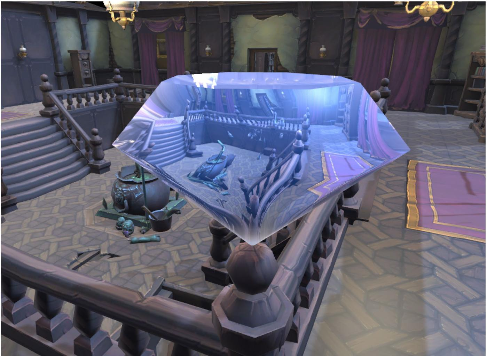

An example of screen space refraction

Screen space refraction uses the current opaque texture created by the render pipeline as the source texture to map pixels to the model being rendered. It can't show models that are not part of the opaque texture. The method is about deforming the UV used to sample the image.

In this recipe, you'll learn how to use a normal map to create refraction effects as well as tint a refraction effect. The additional tinting seen in the image above is achieved by lerping the calculated pixel color with a **Color** property.

To see the effect in action, take a look at **Scenes > Refraction > Refraction**.

The technique requires the opaque texture to be available to the shader. Find the URP Settings Asset currently assigned in **Edit > Project Settings… > Graphics > Scriptable Render Pipeline Settings**. In the Inspector, make sure **Opaque Texture** is enabled. If you also enable Opaque Downsampling, you'll get a small performance boost. It also introduces a small blur to what you see through the refractive object, which can improve the visual appearance.


| Depth Texture                     |   |  |
|-----------------------------------|---|--|
| Opaque Texture                    | V |  |
| Opaque Downsampling   2x Bilinear |   |  |
| Terrain Holes                     | > |  |

Setting Opaque Texture and Opaque Downsampling

The first step to creating the shader is to create a new Shader Graph Asset. Right-click in the Project window, and select **Create > Shader Graph > URP > Lit Shader Graph.**

| Shader Graph                         | URP                             | Lit Shader Graph                                            |
|--------------------------------------|---------------------------------|-------------------------------------------------------------|
| Shader                               | Builtin                         | Unlit Shader Graph                                          |
| Shader Variant Collection<br>Testing | Blank Shader Graph<br>Sub Graph | Sprite Custom Lit Shader Graph<br>Sprite Unlit Shader Graph |
| Playables<br>Assembly Definition     | Custom Render Texture           | Sprite Lit Shader Graph                                     |

Creating a new Lit Shader Graph

Create a material using this shader by selecting the Shader Graph Asset and choosing **Create > Material**. Apply this material to the object you want to be refractive.

Now double-click on the Shader Graph Asset to open it. Create a **Scene Color** node, and connect this to **Fragment > Base Color.**

|                                | Vertex                                        |
|--------------------------------|-----------------------------------------------|
|                                | Object Space · · O Position(3)                |
|                                | Object Space · O Normal(3)                    |
|                                | Object Space · · O Tangent(3)                 |
|                                |                                               |
| Scene Color                    | Fragment                                      |
| Default > 0- 0 UV(4) Out(3) 0- | @ Base Color(3)                               |
|                                | Tangent Space · · O Normal (Tangent Space)(3) |

Using a Scene Color node

Scene Color only works with transparent materials since it relies on opaque objects having been rendered. In the render pipeline, transparent objects are rendered after opaque objects. Set **Graph Inspector > Graph Settings > Surface Type** to **Transparent**.


The Scene Color node by default uses normalized screen coordinates for the UV and so maps the opaque texture to each pixel with lighting affected by the smoothness, resulting in the image below.


The result of using Scene Color

Since the goal is to manipulate the UV used by the Scene Color node, you need to override the default UV behavior. Create a **Screen Position** node and an **Add** node. Drag the output of the Screen Position node to input A of the Add node and set the B input as [0.1, 0.1, 0, 0].

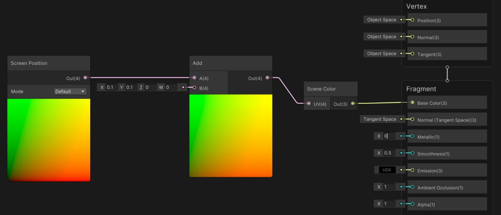

Adding nodes to control the UV


#### Now you'll see the Opaque Texture offset.


Opaque Texture offset

For each rendered pixel, you want the offset to be controlled by the camera's view direction, the normal for the object at the current screen position, and a scaling value. Shader Graph has a node that will calculate refraction given these three inputs; it actually has two scaling values, but you'll only use one.

You can add a new float property called **IOR**, short for [Index of Refraction](https://en.wikipedia.org/wiki/Refractive_index) for scaling. Set it as a slider, with min 1 and max 6. For view direction, add a [View Direction](https://docs.unity3d.com/Packages/com.unity.shadergraph@17.0/manual/View-Direction-Node.html?q=view direction) node and link it to a [Normalize](https://docs.unity3d.com/Packages/com.unity.shadergraph@17.0/manual/Normalize-Node.html?q=Normalize) node to guarantee it's of unit length.

Add a Normal node set to World Space, and again link it to a Normalize node. Create a Refract node, and link the normalized View Direction to the Incident input. Link the normalized Normal to the Refract node Normal input and link the IOR property to the IORMedium input.


At this point, the Refracted output is in World space, but to offset the Screen space UV we need it in Tangent space. Add a Transform node setting the input as World and the output as Tangent. For the type, choose Direction. Use this as the A input to the Add node with Screen Position as the B input. You get the graph you see below.

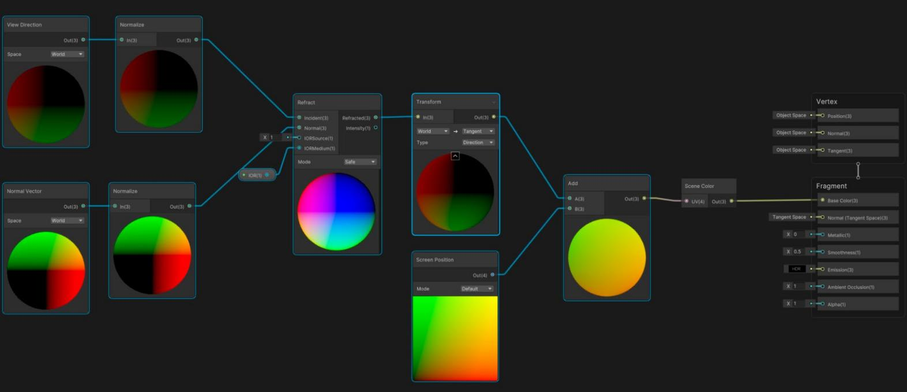

Basic refraction graph


An IOR of 5.44 will result in the visual effect seen in the following image.

Basic Screen Space Refraction


You can tint the result by adding a **Color** property. Add a Lerp node, and use an **Opacity** property set to slider mode, range 0-1, as the T input. The output from Scene Color is set as input A and Color as input B.

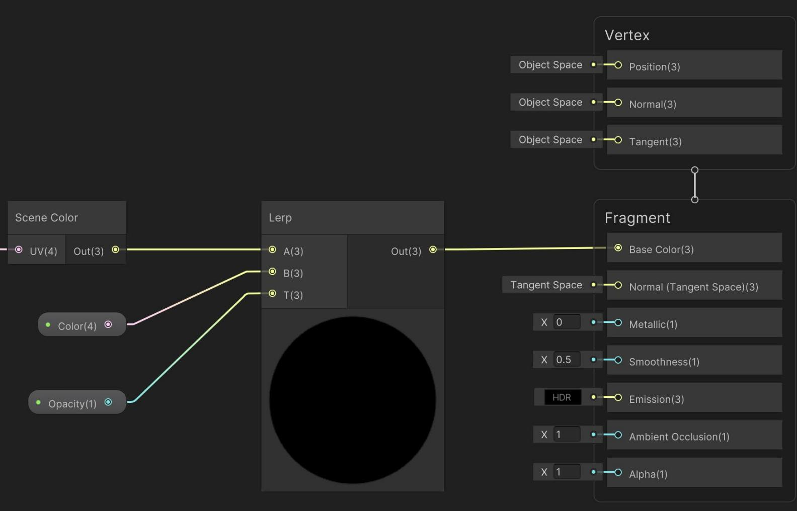

Adding a tinting stage to the graph


#### You should now be able to tint the output.

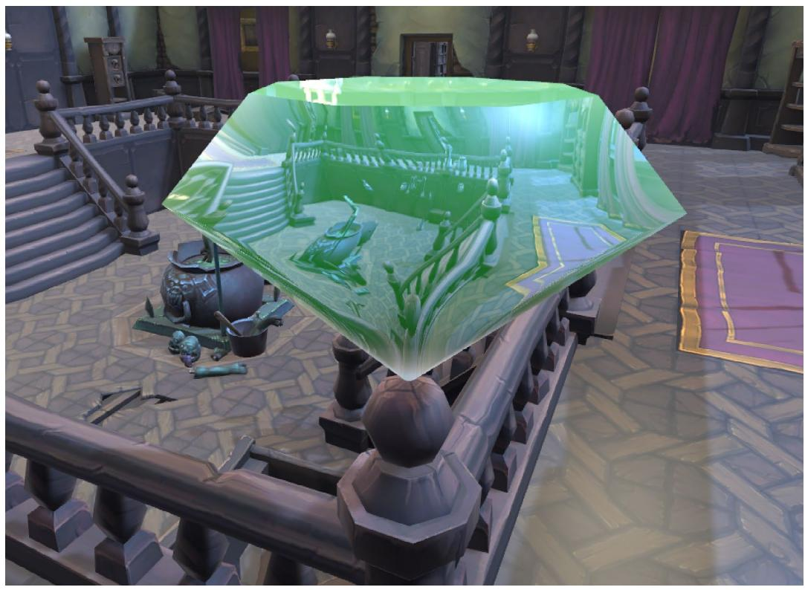

A tinted version

The normal affects the refraction, so a single plane will just get an offset version of the Opaque Texture.

Now it's time to add a normal map. You start by adding a **Texture 2D** property to the shader that you name **Normal Map**, and a float property as a slider, called **Normal Strength**, with a range of 0-1. Create a Sample Texture 2D node, and set it as **Type Normal, Space Tangent**. Set the **Texture** input to the **Normal Map** property. Create a **Normal Strength** node and set input as the RGBA(4) output from the Sample Texture 2D node. Set the **Strength** input as the **Normal Strength** property. Create an Add node with input A as the output from the Normal Strength node and input B from the Transform World to the Tangent node. Follow these steps, and you should end up with this graph.


Adding a normal map


Using a suitable normal map should result in the effect seen in the image below, in this case using a single quad instead of the diamond. Refraction for a planar mesh simply shows an offset of the Opaque Texture. Using a normal map with a planar mesh can be a useful way to hide this artifact.

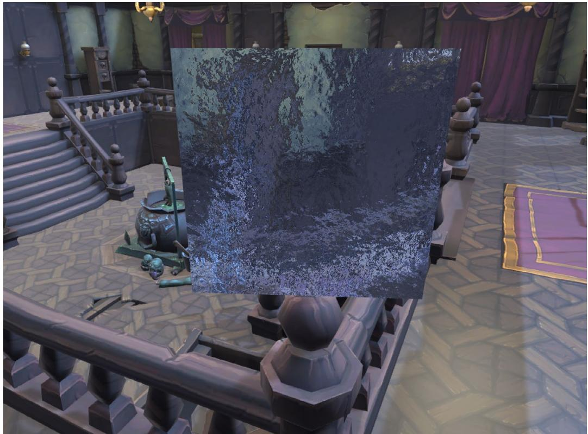

Using a Normal Map

An alternative to using the Refract node is to add a Custom Function Node with a Vector3 viewDir input, a Vector3 normal input, and an IOR input. If you use this option, set your IOR property as a slider with the range -0.15 to 2, not 1-6. Set a Vector3 as the output. The code is very simple so just use a String not a file:

Out = refract(viewDir, normal, IOR);

It gives different results and is worth experimenting with.

#### **More resources**

- [Screen space refraction](https://lettier.github.io/3d-game-shaders-for-beginners/screen-space-refraction.html) by David Lettier
- [ScreenSpace planar reflection](https://github.com/Steven-Cannavan/URP_ScreenSpacePlanarReflections) GitHub repo by Steven Cannavan
- [Reflection probes vs Screen space reflection](https://bootcamp.uxdesign.cc/reflection-probe-vs-screen-space-reflection-4b134c46ca16) by Kyle W. Powers
- [Shader Graph refraction](https://www.youtube.com/watch?v=C5YfSmSLZHI) tutorial by AE Tuts
- [Crystal Shader Graph in Unity](https://www.youtube.com/watch?v=Qri_fN01hMc) by Binary Lunar

## <span id="page-101-0"></span>Volumetrics


The game *[Lost in Random](https://www.ea.com/en-gb/games/lost-in-random)* by Zoink! immerses players into a fantasy kingdom with a very unique art direction where great lighting plays a huge role in creating its atmosphere. They recreated volumetric fog in URP, as seen in this [article.](https://agentlien.github.io/fog/)

<span id="page-102-0"></span>

Volumetric cloud

This is a recipe for using ray marching to render a 3D texture. Unity supports 3D textures, which are an array of images placed in a grid on a single texture, rather like a Texture Atlas. The difference is that each image is the same size. Using a 3D UV value, you can source a texel from the grid of images with UV.Z defining the row and column of the individual image to use. The image below shows a typical 3D texture, its import settings, and a preview in the Inspector.


Left to right: A 3D texture, its import settings, and a preview of it in the Inspector


Here is a great [YouTube short](https://www.youtube.com/shorts/IGx_I4nzfxQ) explaining how to use [Blender](https://www.blender.org/) to create a 3D cloud texture.

YouTube short explaining how to create a 3D cloud texture

As with the previous recipes, this shader will be built with Shader Graph. To view the finished product, go to **Scenes > Volumetric Clouds**, and open the **VolumetricClouds** scene. Note that the scene includes a Camera, Directional Light, and a cube. The cube uses the Material RaymarchMat.

To start the recipe, you'll need to give the RaymarchMat material the shader named **Shader Graphs/Raymarchv1SG,** created by Nik Lever. You should now see a sphere. If you adjust the **densityScale**, you can begin to see transparency at the edges.


Using the Shader Graph Raymarchv1SG

You're supposed to be rendering a cube, but instead you see a sphere: What's going on? The answer is [ray marching.](https://en.wikipedia.org/wiki/Ray_marching) Ray marching, according to its [Wikipedia page,](https://en.wikipedia.org/wiki/Ray_marching#:~:text=Ray marching is a class,some function at each step.) "is a class of rendering methods for 3D computer graphics where rays are traversed iteratively, effectively dividing each ray into smaller ray segments, sampling some function at each step. This function can encode volumetric data for volume ray casting, distance fields for accelerated intersection finding of surfaces, among other information."

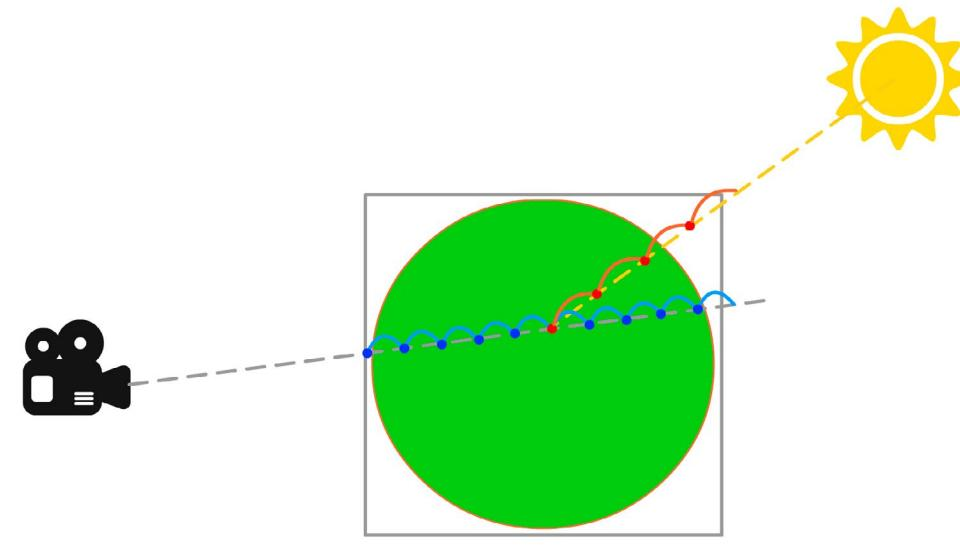

Ray marching

With this first version, a sphere is defined using a Vector4. XYZ defines the position of the sphere, relative to the object and W its radius. For each pixel, a direction is calculated for a ray that comes directly from the camera (represented by the dotted gray line in the diagram above). Set a density value to 0, then move along this line calculating at each blue dot inside the sphere to add a small value to density. When the ray has traveled through the sphere, you'll have a value for how much of the sphere is in a line directly from the camera to the pixel you're rendering. This density value is used as the Base Color in the Shader Graph. Ignore the Sun and the red dots for now; these will be considered later when it's time to add lighting, in the fourth version of this shader.

This graph uses a Custom Function Node based on the file via **Scripts > HLSL > Raymarch. hlsl**. For this first version, you'll use the function raymarchv1. The variable density is initialized to 0. Then you enter a for loop for numSteps count. The rayOrigin is moved by stepSize in the direction defined by rayDirection.

How far are you from the sphere origin? You can use the HLSL function distance to calculate the length of a vector from the sphere origin to the current value for rayOrigin. If this is less than the sphere radius (Sphere.w), then add 0.1 to the density value. The output value result is the accumulated density value times densityScale.


```
void raymarchv1_float( float3 rayOrigin, float3 rayDirection, float numSteps, 
 float stepSize, float densityScale, float4 Sphere, 
 out float result )
{
     float density = 0;
     for(int i =0; i< numSteps; i++){
 rayOrigin += (rayDirection*stepSize);

 //Calculate density
 float sphereDist = distance(rayOrigin, Sphere.xyz);
 if(sphereDist < Sphere.w){
 density += 0.1;
 }

     }
     result = density * densityScale;
}
```
For your calculations, you'll work in Object Space. You get the rayOrigin using a Position node, and to get the rayDirection you need a [Camera](https://docs.unity3d.com/Packages/com.unity.shadergraph@17.0/manual/Camera-Node.html?q=camera) node that links the position output to a [Transform](https://docs.unity3d.com/Packages/com.unity.shadergraph@17.0/manual/Transform-Node.html?q=transform) node, with the input set as World and the output Object.

You now have the pixel position and Camera Position in Object Space, which enables you to get the ray direction using a [Subtract](https://docs.unity3d.com/Packages/com.unity.shadergraph@17.0/manual/Subtract-Node.html?q=Subtract) node, with Position as input A and Camera Position as input B. This rayDirection is normalized using a Normalize Node. The other inputs to the Custom Function Node are the float properties, numSteps, number of blue dots per ray, stepSize, the distance between blue dots, densityScale, and the Vector4 sphere discussed earlier. The density output goes directly to Base Color and Alpha. Note that this shader is set to be transparent and unlit, requiring you to calculate the lighting.


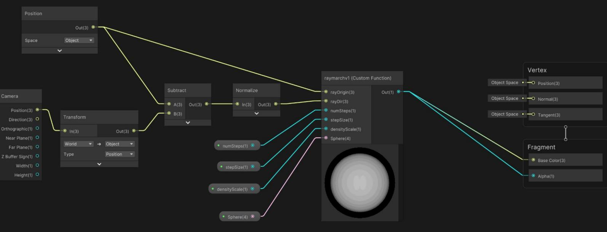

Version 1 of the Ray march shader

Ray marching comes to life when a 3D texture is added to determine the shape. You'll introduce a 3D texture in version 2. Start by setting RaymarchMat to use **Shader Graphs > Raymarch2SG.** The Custom Function used is raymarchv2.

```
void raymarchv2_float( float3 rayOrigin, float3 rayDirection, float numSteps, 
 float stepSize, float densityScale, UnityTexture3D volumeTex,
 UnitySamplerState volumeSampler, float3 offset, 
 out float result )
{
     float density = 0;
     float transmission = 0;
     for(int i =0; i< numSteps; i++){
 rayOrigin += (rayDirection*stepSize);

 //Calculate density
 float sampledDensity = SAMPLE_TEXTURE3D(volumeTex, volumeSampler, rayOrigin + 
offset).r;
 density += sampledDensity;

     }
     result = density * densityScale;
}
```


You'll notice there are three new inputs:

- A UnityTexture3D volumeTex that comes directly from a Material property.
- A MACRO, SAMPLE\_TEXTURE3D, necessary when working with 3D textures, that needs a SamplerState instance.
	- There is a node for SamplerState that allows you to select the wrapping option. You'll set that to clamp so that UV values outside of the range 0 - 1 are clamped at 0 for values less than 0 and at 1 for values above 1.
- Offset, which is a value you can use to move around our 3D texture inside the Cube.

Now, instead of checking whether you are inside a sphere, you'll get a sampledDensity value using the float3 sample position of rayOrigin plus offset. You only need one channel here, the red channel, R.

The image below shows a render of version 2. It's beginning to look like a cloud.


Version 2 of the shader


The final version of the shader introduces lighting. Use the shader named Shader Graphs/ Raymarchv3SG for the Material RaymarchMat. This time, you'll use the function raymarch. The function uses six new parameters: **numLightSteps**, **lightStepSize**, **lightDir, lightAbsorb**, and **transmittance**, and returns a float3 vector.

To build up the final values, initialize three new variables: **transmission**, **lightAccumulation** and **finalLight**. The code is the same as version 2 up to the light loop comment. Look again at the "ray marching" illustration shown earlier: For each step along the view direction ray, represented by the blue dots, you get a ray towards the main light, which is yellow in the diagram. The red dots represent the step-by-step sampling of the 3D texture. The more cloud you find, the less light that will hit that part of the view direction ray. This process determines how bright each pixel is.

```
void raymarch_float( float3 rayOrigin, float3 rayDirection, float numSteps, 
 float stepSize, float densityScale, UnityTexture3D volumeTex,
 UnitySamplerState volumeSampler, float3 offset, 
 float numLightSteps, float lightStepSize, float3 lightDir,
 float lightAbsorb, float darknessThreshold, float transmittance,
 out float3 result )
{
     float density = 0;
     float transmission = 0;
     float lightAccumulation = 0;
     float finalLight = 0;

     for(int i =0; i< numSteps; i++){
 rayOrigin += (rayDirection*stepSize);

 float3 samplePos = rayOrigin+offset;
 float sampledDensity = 
 SAMPLE_TEXTURE3D(volumeTex, volumeSampler, samplePos).r;
 density += sampledDensity*densityScale;
 //light loop
 float3 lightRayOrigin = samplePos;

 for(int j = 0; j < numLightSteps; j++){
 lightRayOrigin += -lightDir*lightStepSize;
 float lightDensity = 
 SAMPLE_TEXTURE3D(volumeTex, volumeSampler, lightRayOrigin).r;
 lightAccumulation += lightDensity;
 }
```


}

```
 float lightTransmission = exp(-lightAccumulation);
 float shadow = darknessThreshold + 
 lightTransmission * (1.0 - darknessThreshold);
 finalLight += density*transmittance*shadow;
 transmittance *= exp(-density*lightAbsorb);
     }
 transmission = exp(-density);
     result = float3(finalLight, transmission, transmittance);
```
The light loop is easy to understand, repeating the number of times that have been specified for the **numLightSteps** variable. Bear in mind that this is a nested loop, so keep the numLightSteps count as low as possible. You move from samplePos towards the main light by using minus lightDir. Then, lightDensity is added to lightAccumulation. Some math is required outside the light loop:

float lightTransmission = exp(-lightAccumulation);

First, lightTransmission is set as e-lightAccumulation . The [constant e](https://en.wikipedia.org/wiki/E_(mathematical_constant)), Euler's number, is about 2.718. The graph below shows the result of this function. The horizontal axis is the value of lightAccumulation and the vertical axis exp(-lightAccumulation). When the accumulated light density, lightAccumulation, is 0, exp(-lightAccumulation) equals 1. As lightAccumulation increases exp(-lightAccumulation) quickly drops away, nearing 0 if lightAccumulation is 5 or more.

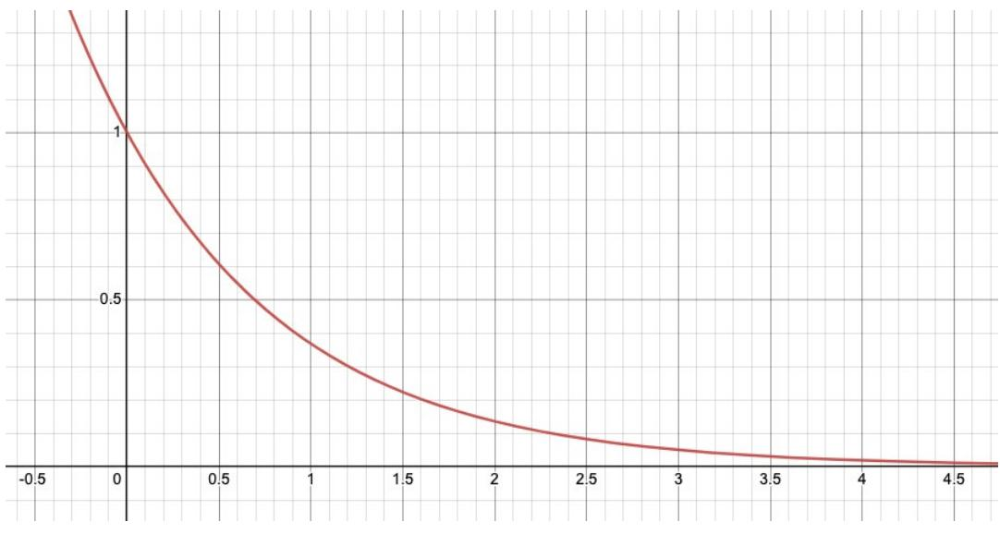

Graph of e-x for the range 0 to 4


float shadow = darknessThreshold + lightTransmission \* (1.0 - darknessThreshold);

A shadow value is calculated next. Use the property called **darknessThreshold**. The graph below shows the shadow value in the vertical axis, for a darknessThreshold of 0.15. If lightAccumulation is 0 then shadow equals 1, whereas if lightAccumulation approaches 5, then shadow tends to the darknessThreshold constant value.


finalLight += density\*transmittance\*shadow;

Density \* transmittance \* shadow is added to the finalLight accumulated value. If the accumulated light density, lightAccumulation, is high, then shadow will tend to 0 and therefore, the accumulated value for finalLight will be less.

transmittance \*= exp(-density\*lightAbsorb);

The initial value of transmittance is a passed-in property, but for each view direction step, its value is multiplied by e-density\*lightAbsorb. The property **lightAbsorb** controls how much light gets lost in the cloud by scattering.

For version 3, the result is a float3 containing the finalLight, transmission, and transmittance.

The graph for version 3 is shown below. Now that the output from the Custom Function is a float3, a Split node is added. Output R goes to a Lerp node T input. Version 3 has several new properties, including **color** and **shadowColor**, with the former the B input and the latter the A input.

If finalLight raymarch node Out.x is 0, then the shadowColor will be passed to the Lerp node output. If finalLight is 1, then color is passed to the output. In the range 0-1 a linear interpolation of shadowColor and color is the output. The Lerp node output goes directly to Fragment > Base Color.

Alpha uses the raymarch node with transmission value Out.y. This value is 0 when Alpha should be 1 and 1 when it should be 0. A [One Minus](https://docs.unity3d.com/Packages/com.unity.shadergraph@17.0/manual/One-Minus-Node.html) node is used to correct the Split node B value and link this to Fragment > Alpha.


Final version


#### This gives the result you see below.


A cloud with ray marching

Houdini is a useful tool when creating the 3D texture. Alternatives to a 3D texture include using multilayered [Perlin noise](https://en.wikipedia.org/wiki/Perlin_noise), or pre-baking a [tileable noise](https://www.ronja-tutorials.com/post/029-tiling-noise/) texture using Unity. Hopefully, this recipe will be a starting point for your journey into ray marching.

#### **More resources**

- [Volumetric ray marching cloud shader](https://www.youtube.com/watch?v=0G8CVQZhMXw) by dmeville
- [Coding adventure: Clouds](https://www.youtube.com/watch?v=4QOcCGI6xOU&t=2s) by Sebastian Lague
- [Creating Volumetric Clouds with Houdini](https://80.lv/articles/building-volumetric-clouds-with-houdini/) by Camelia Slimani
- [Altos sky system](https://assetstore.unity.com/packages/vfx/shaders/fullscreen-camera-effects/os-altos-volumetric-clouds-procedural-skybox-and-day-night-cycle-221227?utm_source=demand-gen&utm_medium=pdf&utm_campaign=render-with-quality-and-flexibility&utm_content=urp-cookbook), by OccaSoftware
- [Real Time Volumetric Clouds](https://github.com/adrianpolimeni/RealTimeVolumetricClouds) by Adrian Polimeni

## <span id="page-113-0"></span>Procedural noise

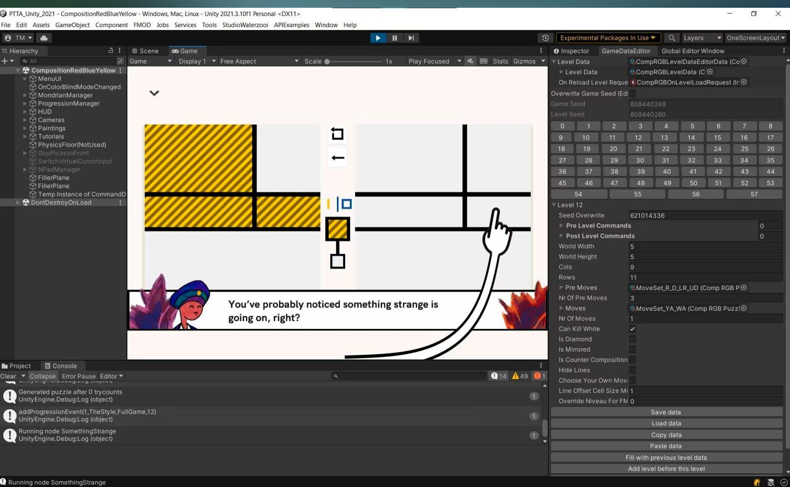

The game *Please, Touch the Artwork* [by Thomas Waterzool,](https://unity.com/case-study/please-touch-the-artwork) uses procedural generation to help speed up the level creation process, a good case for randomizing game design elements.

<span id="page-114-0"></span>Procedural noise is a powerful technique used for generating textures, terrains, and other environmental elements in a way that appears random but can be finely controlled. By using algorithms to generate these effects, developers can create vast, varied worlds without the need to handcraft every detail.

Unity supports several types of procedural noise, including Gradient/[Perlin](https://en.wikipedia.org/wiki/Perlin_noise) noise, [Simplex](https://en.wikipedia.org/wiki/Simplex_noise) noise, Voronoi/[Worley,](https://en.wikipedia.org/wiki/Worley_noise) each of which has unique applications and benefits. Understanding and implementing procedural noise can enhance both the aesthetic and performance aspects of a game or interactive experience.

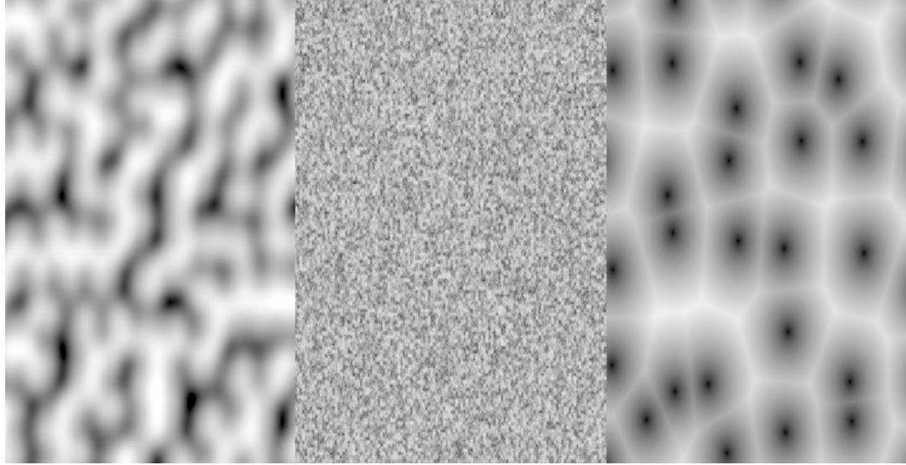

Procedural Noise examples left to right: Gradient, Simplex, and Voronoi

## Types of procedural noise

The most common types of procedural noise in Unity are Perlin noise and Simplex noise, both developed by Ken Perlin.

Perlin noise is the go-to algorithm for creating smooth, natural-looking variations in textures, terrains, and animations. It generates smooth, continuous patterns that avoid harsh edges, making it ideal for things like mountainous terrain, cloud textures, or water waves. Simplex noise is a more efficient alternative, especially for three-dimensional applications. It provides a smoother result and is computationally less intensive than Perlin noise, which is helpful for mobile games or VR environments where performance is critical.

## Implementing procedural noise in Unity

In Unity, procedural noise can be implemented through shaders or directly in C# scripts. For 2D textures, the Mathf.PerlinNoise() function is particularly accessible and useful. It generates noise values based on X and Y coordinates, which makes it easy to apply to terrains, textures, or particle effects. By adjusting parameters like frequency, amplitude, and scale, developers can control the noise output to achieve different visual effects.

<span id="page-115-0"></span>

For example, a developer might want to use Perlin noise to create a heightmap for a terrain. This can be done by generating a grid of Perlin noise values and mapping those values to height levels. As each noise value corresponds to a point on the terrain, this can result in hills, valleys, and other natural formations without the need to manually sculpt them. Unity's terrain tools can then apply these heightmaps to create a 3D terrain, which can be further refined by adding textures or using other procedural generation techniques.

#### **Procedural heightmap example**

Here's a basic example of how to generate a heightmap in Unity using Perlin noise in a C# script. This script will create a terrain with hills and valleys by applying Perlin noise to a Terrain GameObject.

- 1. Create a Terrain GameObject in Unity.
- 2. Attach the script below to Terrain.
- 3. Adjust the parameters as desired to control the look of the terrain.

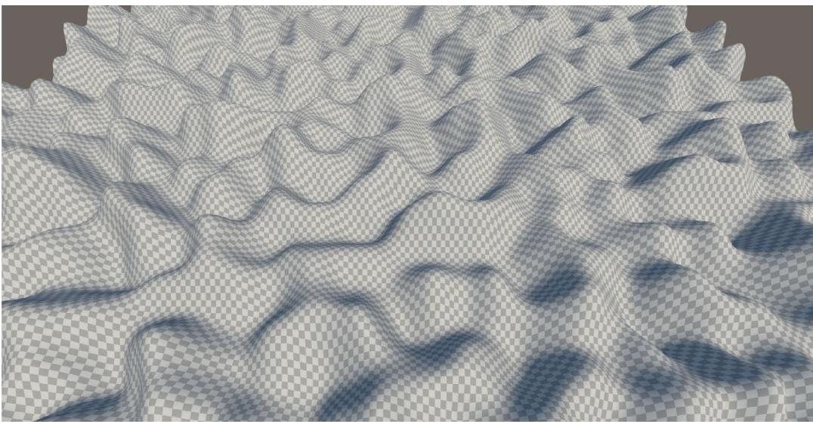

```
Procedural height example
```
using Unity.VisualScripting; using UnityEngine; [ExecuteInEditMode] public class ProceduralHeight : MonoBehaviour { public int depth = 20; // The max height of the terrain public float scale = 20f; // Controls how "stretched" the noise appears

```
 private int width = 256; // Width of the terrain
 private int height = 256; // Height of the terrain
 private float offsetX = 100f; // Offset for X coordinate (randomized at start)
 private float offsetY = 100f; // Offset for Y coordinate (randomized at start)
 private int _depth;
 private float _scale;
 private Terrain terrain;
 void Start()
 {
 // Randomize offsets for a unique terrain each time
 offsetX = Random.Range(0f, 9999f);
 offsetY = Random.Range(0f, 9999f);
 _depth = depth;
 _scale = scale;
 terrain = GetComponent<Terrain>();
 terrain.terrainData = GenerateTerrain(terrain.terrainData);
 }
 TerrainData GenerateTerrain(TerrainData terrainData)
 {
 terrainData.heightmapResolution = width + 1;
 terrainData.size = new Vector3(width, depth, height);
 terrainData.SetHeights(0, 0, GenerateHeights());
 return terrainData;
 }
 float[,] GenerateHeights()
 {
 float[,] heights = new float[width, height];
 for (int x = 0; x < width; x++)
 {
 for (int y = 0; y < height; y++)
 {
 float xCoord = (float)x / width * scale + offsetX;
 float yCoord = (float)y / height * scale + offsetY;
```

```
 heights[x, y] = Mathf.PerlinNoise(xCoord, yCoord);
 }
 }
 return heights;
 }
 void Update(){
 if ( depth != _depth || scale != _scale ){
 terrain.terrainData = GenerateTerrain(terrain.terrainData);
 _depth = depth;
 _scale = scale;
 }
 }
}
```
Let's look at some key values/properties in this script:

- **depth**: This is the vertical scale of the terrain; a higher value will create taller hills.
- **width and height**: These are the dimensions of the terrain.
- **scale**: This controls how "zoomed in" the noise is; a higher value creates smoother, broader hills.
- **offsetX and offsetY**: Random offsets are added to vary the terrain layout each time the script runs.

The GenerateHeights() function creates a 2D array representing the height values of each point on the terrain. Each value is generated using Mathf.PerlinNoise, which gives a smooth, natural variation based on xCoord and yCoord (scaled by width, height, and scale).

In the resources you will find this example at **Scenes > Procedural Noise > Terrain**. This simple heightmap generation technique can be modified to add more complexity, like using multiple layers of Perlin noise for fractal-like terrain or applying additional noise functions.

<span id="page-118-0"></span>

Examples of using procedural noise for a wood texture

Another use for procedural noise is to create shaders that mirror natural textures, like the wood textures pictured above. Take a look at **Scenes > Procedural Noise > Wood** to find this example. Here you'll see two different wood shaders, one highly stylised and the other more realistic. Let's start by creating the stylised version:

- 1. Create a Shader Graph via **Shader Graph > URP > Lit Shader Graph**
- 2. Add these properties:
	- a. ColorA (Color default: 7D490B)
	- b. ColorB (Color default: BB905D)
	- c. Frequency (Float default: 2)
	- d. NoiseScale (Float default: 6)
	- e. PatternIntensity (Float default: 0.6)
	- f. Contrast (Float default: 4)
- 3. Create a **Geometry > UV** node, Channel UV0.
- 4. Create a **Procedural > Noise > GradientNoise** node. Link the output from step 3 to the **UV** input and set the **Scale** input to **5**. Leave the **Hash Type** as **Deterministic**.
- 5. Create a **Multiply** node and set input **A** as the output from step 4 and input **B** as the property NoiseScale.
- 6. Create an **Add** node and link the output from step 5 to input **B**.
- 7. Return to the **UV** node of step 3. Above the **Gradient Noise** node create a **Split** node and link the output from the **UV** node to its input.


- 8. Create a **Multiply** node and set the Split node **G** output as input **A** and the property Frequency as input **B.**
- 9. Link the output from step 8 to input **A** of step 6.
- 10. Create a **Fraction** node and link the output from the **Add** node to its input.
- 11. Create a **One Minus** node and link its input to the output from step 10.
- 12. Create a **Multiply** node and link the output from step 11 to input **A** and the property Contrast to input **B**.
- 13. Create another **Multiply** node and link input **A** to the output from step 10 and input **B** to the output from step 12.
- 14. Create a **Power** node and link input **A** to the output from step 13 and input **B** to the property PatternIntensity.
- 15. Create an **Add** node and link input **A** to the **R** output of the **Split** node from step 7 and the **B** input link to the output from step 14.
- 16. Create a **Lerp** node and set input **A** to the property ColorA, input **B** to the property ColorB and input **T** to the output from step 15.

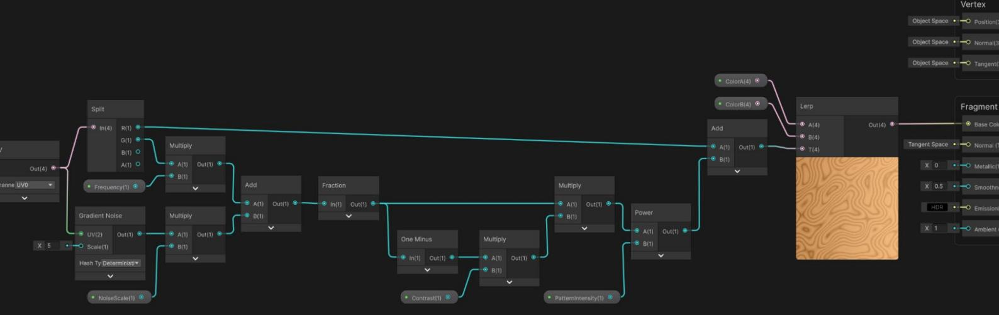

17. Link the output from step 16 to the **Fragment Base Color**.

The stylised wood Shader Graph

The UV **u value** is used to set the grain position that is passed directly to the final Add node. The **v value** goes through a complex chain of manipulation. Starting with Gradient Noise this is manipulated via Multiply nodes to adjust the frequency of the grain lines (pattern) and scale. The key to the shader is using the fractional part of the calculated value via the Fraction node. You can also use properties to adjust the contrast and intensity of the grain or pattern.


Stages of the shader: Gradient Noise (left); the effect of using the fractional part giving multiple grain lines (second to left); boosting the contrast (second to right), and adding color (right)

Lets look at the more realistic version that's achieved using a Custom Function node. This is an adapted version of [this example from ShaderToy](https://www.shadertoy.com/view/mdy3R1). ShaderToy is a great source of shader code, however all code uses the GLSL syntax, not HLSL, and will need to be adapted for use in a Shader Graph Custom Function. If you're knowledgeable in HLSL coding then the conversion should be somewhat straight-forward: vec -> float, fract -> frac, mix -> lerp.

| Shadertoy                                                                                                                                                                                                                   | Search                                                                                                                                                                                                                                                                                                                                                                                                                                                                                                    |                                                                                                                                                                                                                                            |                                                                                                                                                                                                                                                                                                                                                                                                                                                                                                                                                                                                                  |                                                                                                                       |                                                                                                                                                                                                                                                                                                                                                                                                                                                                            |                                                                                                                                      | Browse    | New Sign In |  |
|-----------------------------------------------------------------------------------------------------------------------------------------------------------------------------------------------------------------------------|-----------------------------------------------------------------------------------------------------------------------------------------------------------------------------------------------------------------------------------------------------------------------------------------------------------------------------------------------------------------------------------------------------------------------------------------------------------------------------------------------------------|--------------------------------------------------------------------------------------------------------------------------------------------------------------------------------------------------------------------------------------------|------------------------------------------------------------------------------------------------------------------------------------------------------------------------------------------------------------------------------------------------------------------------------------------------------------------------------------------------------------------------------------------------------------------------------------------------------------------------------------------------------------------------------------------------------------------------------------------------------------------|-----------------------------------------------------------------------------------------------------------------------|----------------------------------------------------------------------------------------------------------------------------------------------------------------------------------------------------------------------------------------------------------------------------------------------------------------------------------------------------------------------------------------------------------------------------------------------------------------------------|--------------------------------------------------------------------------------------------------------------------------------------|-----------|-------------|--|
|                                                                                                                                                                                                                             |                                                                                                                                                                                                                                                                                                                                                                                                                                                                                                           |                                                                                                                                                                                                                                            |                                                                                                                                                                                                                                                                                                                                                                                                                                                                                                                                                                                                                  |                                                                                                                       |                                                                                                                                                                                                                                                                                                                                                                                                                                                                            |                                                                                                                                      |           |             |  |
|                                                                                                                                                                                                                             |                                                                                                                                                                                                                                                                                                                                                                                                                                                                                                           |                                                                                                                                                                                                                                            |                                                                                                                                                                                                                                                                                                                                                                                                                                                                                                                                                                                                                  | Shader Inputs                                                                                                         |                                                                                                                                                                                                                                                                                                                                                                                                                                                                            |                                                                                                                                      |           |             |  |
|                                                                                                                                                                                                                             |                                                                                                                                                                                                                                                                                                                                                                                                                                                                                                           | 2<br>ന<br>ব<br>ഗ<br>ଚ<br>7<br>00<br>ರಿ<br>10<br>11<br>12<br>13<br>14                                                                                                                                                                       | 1 // 'Procedural Wood texture' dean_the_coder (Twitter: @deanthecoder)<br>// https://www.shadertoy.com/view/mdy3R1<br>/ / Processed by 'GLSL Shader Shrinker<br>// (https://github.com/deanthecoder/GLSLShaderShrinker)<br>11<br>/ / I spent some time working on some noise functions and then<br>// used them to make a wood texture. I'd never used musgrave<br>/ / noise before - Looks very useful!<br>11<br>/ / Thanks to Evvvvil, Flopine, Nusan, BigWings, Iq, Shane,<br>totetmatt, Blackle, Dave Hoskins, byt3_m3chanic, tater,<br>// and a bunch of others for sharing their time and knowledge!<br>11 |                                                                                                                       |                                                                                                                                                                                                                                                                                                                                                                                                                                                                            |                                                                                                                                      |           |             |  |
|                                                                                                                                                                                                                             |                                                                                                                                                                                                                                                                                                                                                                                                                                                                                                           |                                                                                                                                                                                                                                            | 15<br>16                                                                                                                                                                                                                                                                                                                                                                                                                                                                                                                                                                                                         |                                                                                                                       |                                                                                                                                                                                                                                                                                                                                                                                                                                                                            | // License: Creative Commons Attribution-NonCommercial-ShareAlike 3.0 Unported License                                               |           |             |  |
| Views: 1716, Tags:<br>procedural, texture, wood, material, nature<br>never used musgrave noise before - Looks very cool.<br>Comments (11)<br>Sign in to post a comment<br>TimelordQ, 2023-08-07<br>Amazing work. Thank you! | 40.21 60.1 fps 840 x 473<br>Procedural Wood texture<br>I spent some time working on some noise functions and them to make a wood texture. I'd<br>I've tried to keep the code size down - Let me know if you find this useful!                                                                                                                                                                                                                                                                             | ==============================================================================================================================================================================<br>REC<br>ba<br>Created by dean_the_coder in 2023-<br>03-07 | 17<br>18<br>19<br>20<br>21<br>22<br>23<br>24<br>25<br>26<br>27<br>28<br>29<br>30<br>31<br>32<br>33<br>34<br>35<br>36<br>37<br>38<br>39<br>40<br>41<br>42<br>43                                                                                                                                                                                                                                                                                                                                                                                                                                                   | #define R   iResolution<br>▼ float h31(vec3 p3) {<br>▼ float n31(vec3 p) {<br>vec3 ip = floor(p) ;<br>p = fract (p) ; | #define sat(x) clamp(x, 0., 1.)<br>#define S(a, b, c) smoothstep(a, b, c)<br>#define S01(a) S(0., 1., a)<br>float sum2(vec2 v) { return dot(v, vec2(1)); }<br>p3 = fract (p3 * . 1031) ;<br>p3 += dot(p3, p3.yzx + 333.3456);<br>return fract (sum2 (p3.xy) * p3.z) ;<br>float h21(vec2 p) { return h31(p.xyx); }<br>const vec3 s = vec3 (7, 157, 113) ;<br>p = p * p * (3. - 2. * p);<br>vec4 h = vec4(0, s.yz, sum2(s.yz)) + dot(ip, s);<br>h.xy = mix(h.xz, h.yw, p.y); | // Thanks Shane - https://www.shadertoy.com/view/lstGRB<br>h = mix(fract(sin(h) * 43758.545), fract(sin(h + s.x) * 43758.545), p.x); |           |             |  |
| Thanks everyone!                                                                                                                                                                                                            | dean_the_coder, 2023-03-09<br>@Shane My local version of this returns a vec4 where the w component is a 'depth'<br>value. I left it out here for simplicity ('an exercise for the user'), but can easily be<br>added by combining n1, n2, and grain.                                                                                                                                                                                                                                                      |                                                                                                                                                                                                                                            | 44<br>45                                                                                                                                                                                                                                                                                                                                                                                                                                                                                                                                                                                                         | Compiled in 0.1 secs                                                                                                  | return mix(h.x, h.y, p.z);                                                                                                                                                                                                                                                                                                                                                                                                                                                 | 1879 chars                                                                                                                           |           | S V         |  |
| Shane, 2023-03-09                                                                                                                                                                                                           | Nicely done. I have a few simple go-to timber texture routines that I use (using<br>noise and smooth fract), but they're not as detailed as this. One thing that I've<br>noticed is that a lot of textures already come prelit (probably using directional<br>derivative lighting) which can make them pop a bit more. I've been too lazy to<br>generate my own textures lately, but when I do, I usually find that I have to provide<br>a less detailed version for bump mapping and distance functions. |                                                                                                                                                                                                                                            | iChannel0                                                                                                                                                                                                                                                                                                                                                                                                                                                                                                                                                                                                        |                                                                                                                       | iChannel1                                                                                                                                                                                                                                                                                                                                                                                                                                                                  | iChannel2                                                                                                                            | iChannel3 |             |  |

An [example](https://www.shadertoy.com/view/mdy3R1) of a shader from the ShaderToy website

The Custom Function, seen in the code below, requires just setting the **Geometry > Position** node to **Object** if you are happy to take the default colors. Or add two **Color** properties to define the colors; ColorA provides the grain lines color, ColorB the base color.

| WoodBSG       |          |               |                        |             |     | Vertex                                      |                | Graph Inspector   |                              |                      |        |  |
|---------------|----------|---------------|------------------------|-------------|-----|---------------------------------------------|----------------|-------------------|------------------------------|----------------------|--------|--|
| Shader Graphs | +        |               |                        |             |     | Object Space · · O Position(3)              |                |                   | Node Settings Graph Settings |                      |        |  |
| · ColorA      | Color    |               |                        |             |     | Object Space · O Normal(3)                  |                |                   | wood (Custom Function) Node  |                      |        |  |
| · ColorB      | Color    |               |                        |             |     | Object Space · · O Tangent(3)               |                | Precision         |                              | Inherit              |        |  |
|               |          |               |                        |             |     |                                             |                | Preview<br>Inputs |                              | Inherit              |        |  |
|               |          |               |                        |             |     |                                             |                | position          |                              | Vector 3             |        |  |
| Position      |          |               | wood (Custom Function) |             |     | Fragment                                    |                | COIA<br>colB      |                              | Vector 4<br>Vector 4 |        |  |
|               | Out(3) O |               | 9 position(3)          | result(4) @ |     | --- @ Base Color(3)                         |                |                   |                              |                      | +<br>- |  |
| Space         | Object   | · ColorA(4) · | O colA(4)<br>O colB(4) |             |     | Tangent Space · O Normal (Tangent Space)(3) |                | Outputs           |                              |                      |        |  |
|               | >        |               |                        |             |     |                                             |                | result            |                              | Vector 4             |        |  |
|               |          | · ColorB(4) ● |                        |             | × 0 | · · · · Metallic(1)                         |                |                   |                              |                      | +      |  |
|               |          |               |                        |             |     | X 0.5 · · O Smoothness(1)                   |                | Type              | File                         |                      |        |  |
|               |          |               |                        |             |     |                                             | Name<br>Source | wood<br>wood      |                              | 0                    |        |  |
|               |          |               |                        |             |     | HDR · O Emission(3)                         |                |                   |                              |                      |        |  |
|               |          |               |                        |             |     | X 1 1 · · O Ambient Occlusion(1)            |                |                   |                              |                      |        |  |
|               |          |               |                        |             |     |                                             |                |                   |                              |                      |        |  |
|               |          |               |                        |             |     |                                             |                |                   |                              |                      |        |  |

Custom Function wood Shader Graph, using user defined colors

| #define sat(x)<br>clamp(x, 0.0, 1.0)<br>#define S(a, b, c)<br>smoothstep(a, b, c)<br>#define S01(a)<br>S(0.0, 1.0, a)      |
|----------------------------------------------------------------------------------------------------------------------------|
| float sum2(float2 v) { return dot(v, float2(1.0, 1.0)); }                                                                  |
| ///////////////////////////////////////////////////////////////////////////////                                            |
| float h31(float3 p3) {<br>p3 = frac(p3 * 0.1031);<br>p3 += dot(p3, p3.yzx + 333.3456);<br>return frac(sum2(p3.xy) * p3.z); |
| }                                                                                                                          |
| float h21(float2 p) { return h31(p.xyx); }                                                                                 |
| float n31(float3 p) {<br>const float3 s = float3(7, 157, 113);                                                             |

```
// Thanks Shane - https://www.shadertoy.com/view/lstGRB
      float3 ip = floor(p);
      p = frac(p);
      p = p * p * (3. - 2. * p);
      float4 h = float4(0, s.yz, sum2(s.yz)) + dot(ip, s);
      h = lerp(frac(sin(h) * 43758.545), frac(sin(h + s.x) * 43758.545), p.x);
      h.xy = lerp(h.xz, h.yw, p.y);
      return lerp(h.x, h.y, p.z);
}
// roughness: (0.0, 1.0], default: 0.5
// Returns unsigned noise [0.0, 1.0]
float fbm(float3 p, int octaves, float roughness) {
      float sum = 0.,
       amp = 1.,
       tot = 0.;
      roughness = sat(roughness);
      for (int i = 0; i < octaves; i++) {
 sum += amp * n31(p);
 tot += amp;
 amp *= roughness;
 p *= 2.;
      }
      return sum / tot;
}
float3 randomPos(float seed) {
      float4 s = float4(seed, 0, 1, 2);
      return float3(h21(s.xy), h21(s.xz), h21(s.xw)) * 1e2 + 1e2;
}
// Returns unsigned noise [0.0, 1.0]
float fbmDistorted(float3 p) {
      p += (float3(n31(p + randomPos(0.)), n31(p + randomPos(1.)), n31(p + randomPos(2.))) * 
2. - 1.) * 1.12;
      return fbm(p, 8, .5);
}
// float3: detail(/octaves), dimension(/inverse contrast), lacunarity
// Returns signed noise.
float musgraveFbm(float3 p, float octaves, float dimension, float lacunarity) 
{
```


```
float sum = 0.,
       amp = 1.,
       m = pow(lacunarity, -dimension);
      for (float i = 0.; i < octaves; i++) {
 float n = n31(p) * 2. - 1.;
 sum += n * amp;
 amp *= m;
 p *= lacunarity;
      }
      return sum;
}
// Wave noise along X axis.
float3 waveFbmX(float3 p) {
      float n = p.x * 20.;
      n += .4 * fbm(p * 3., 3, 3.);
      return float3(sin(n) * .5 + .5, p.yz);
}
///////////////////////////////////////////////////////////////////////////////
// Math
float remap01(float f, float in1, float in2) { return sat((f - in1) / (in2 - in1)); }
///////////////////////////////////////////////////////////////////////////////
// Wood material.
float3 matWood(float3 p, float3 colA, float3 colB ) {
      float n1 = fbmDistorted(p * float3(7.8, 1.17, 1.17));
      n1 = lerp(n1, 1.0, 0.2);
      float n2 = lerp(musgraveFbm(float3(n1, n1, n1) * 4.6, 8.0, 0.0, 2.5), n1, 0.85);
      float dirt = 1. - musgraveFbm(waveFbmX(p * float3(.01, .15, .15)), 15., .26, 2.4) * .4;
      float grain = 1. - S(.2, 1., musgraveFbm(p * float3(500, 6, 1), 2., 2., 2.5)) * .2;
      n2 *= dirt * grain;

 // The three float3 values are the RGB wood colors - Tweak to suit.
      return lerp(lerp(colA, colB, remap01(n2, .19, .56)), float3(.52, .32, .19), remap01(n2, 
.56, 1.));
}
```


```
//Hard coded colors
void wood_float( float3 pos, out float4 result){
 float3 colA = float3(.03, .012, .003);
 float3 colB = float3(.25, .11, .04);
 result = float4(pow(matWood(pos, colA, colB), float3(1,1,1) * 0.4545), 0);
}
//User selectable colors, colA provides the grain lines
```

```
void wood_float( float3 pos, float3 colA, float3 colB, out float4 result){
 result = float4(pow(matWood(pos, colA, colB ), float3(1,1,1) * 0.4545), 0);
```
}

Starting with the wood\_float function, the code calls the function matWood. This makes use of the functions fbmDistorted, musgraveFbm and waveFbm. There are a lot of carefully chosen "magic" numbers that the developer probably took a lot of time tweaking to get the best results. **[fBm](https://en.wikipedia.org/wiki/Fractional_Brownian_motion)** (Fractional Brownian motion) or multifractal noise, is a type of procedural noise developed by [Ken Musgrave](https://en.wikipedia.org/wiki/Ken_Musgrave), and consequently often called Musgrave noise. It's used for generating realistic textures and terrains. Unlike traditional noise functions such as Perlin noise, Musgrave noise simulates complex, natural phenomena like clouds, mountains, and flowing water by combining multiple layers (or octaves) of noise with varying frequencies and amplitudes.

Let's look in more detail at the musgraveFbm function, starting with its parameters:

- **P (float3)**: This is a position value, usually in object space.
- **octaves (float)**: Musgrave noise works by layering several octaves of noise functions. The result is a composite effect that builds detail as more layers are added, making the texture look progressively more complex.
- **dimension (float)**: This inversely controls the contrast.
- **lacunarity**: This controls the frequency ratio between octaves. Higher lacunarity values make each octave smaller and more detailed, resulting in more intricate patterns.

The function initializes three float values:

- 1. The returned sum value
- 2. An amplitude value, amp
- 3. A multiplier, m

The multiplier is the lacunarity raised to the power negative dimension. Then it enters a loop for each octave. The function n31 returns a Perlin noise value from a float3 input. Since this is in the range 0 to 1 you remap it to the range -1 to 1, then add this to the cumulative

<span id="page-125-0"></span>sum value after multiplying it by the current amplitude value, amp. Then, adjust the amp value by multiplying by the multiplier constant value m. Finally, change the sample position p by multiplying by the lacunarity parameter.

Musgrave noise is highly valued in computer graphics for its ability to produce realistic, natural textures that require minimal manual input. By layering and varying different noise functions, it creates intricate, fractal-like patterns that resemble the complexity of real-world landscapes, clouds, and organic materials such as the wood example described.


Raymarch clouds using Musgrave noise

### Benefits of procedural noise

In shaders, procedural noise can also be used to create animated textures or dynamic materials. For instance, adding noise to a water shader can create realistic ripple effects. By animating the noise over time, the water surface appears to move, giving a sense of fluidity and realism. You can combine procedural noise with color gradients and transparency effects to create varied and dynamic materials, such as clouds or swaying grass.

Using procedural noise offers several benefits, mainly for scalability and variety. Manually creating large, diverse environments can be time-consuming and require substantial memory. Procedural noise allows developers to create complex environments that are unique yet consistent, without using much storage space. Additionally, because procedural noise algorithms are deterministic, the same "random" environment can be recreated if needed by using the same seed values.

This technique also allows for infinite environments, which is useful in games that need continuous terrain, such as open-world or survival games. By generating the environment procedurally, Unity can load and unload sections of terrain as needed, reducing memory usage and improving performance.

<span id="page-126-0"></span>

## Challenges and optimization

Procedural noise can be computationally intensive, especially when used in 3D applications or for large environments. To optimize performance, you can limit the resolution of noise generation or employ caching strategies to store previously calculated noise values. Additionally, blending different noise values at different scales can add complexity and also improve realism by adding multiple layers of detail.

Overall, procedural noise in Unity is a versatile tool that can help you create diverse, scalable, and engaging worlds that adapt dynamically to player interactions.

## <span id="page-127-0"></span>Compute shaders

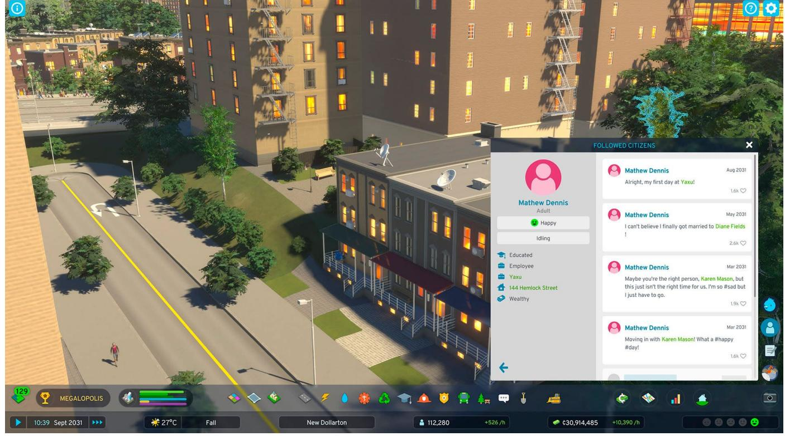

If you want your game to have complex simulations [like Cities](https://www.paradoxinteractive.com/games/cities-skylines-ii/about): Skylines II by Colossal Order and Paradox Interactive, you can consider offloading part of this work to the GPU thanks to compute shaders.

<span id="page-128-0"></span>This recipe uses compute shaders. A compute shader can be used for any computationally intensive task that involves the same calculations being applied to multiple entities. We'll look at particle effects and flocking as examples. If you are totally new to compute shaders then check out the resources at the end of this recipe.

Even though Unity provides two systems for creating particle systems, the Built-In Particle System and the VFX Graph, in this recipe you'll create your own. This will help you understand the techniques necessary to create shaders that work with instanced meshes, allowing you to create visual effects featuring tens of thousands of meshes. Depending on your GPU, a million low-polygon meshes are feasible. These techniques can be used to create grass, hair, water, armies, and crowds.

### ParticleFun

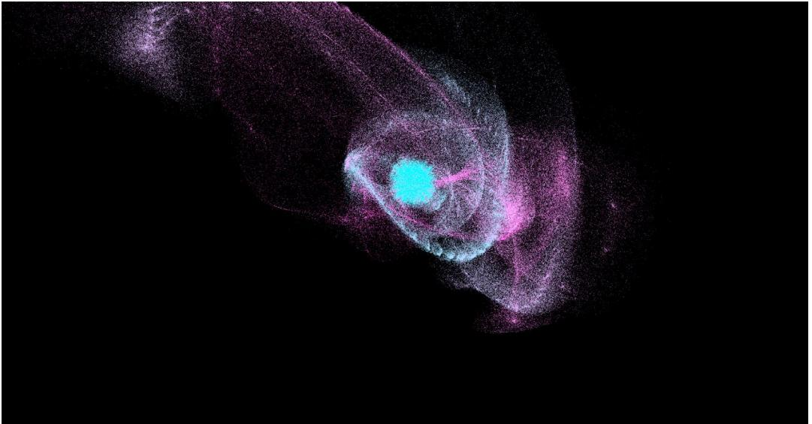

The ParticleFun recipe in action

Open **Scenes > Compute Shaders > ParticleFun > ParticleFun** and then in Visual Studio Code, open ParticleFun.cs, ParticleFun.compute and ParticleFun.shader from the same folder. If you run the program you'll see that particles move towards the mouse position and change color over time. But first let's review the code, starting with this script:

```
public class ParticleFun : MonoBehaviour
{
 private Vector2 cursorPos;
 // struct
 struct Particle
 {
 public Vector3 position;
 public Vector3 velocity;
```

```
 public float life;
 }
 const int SIZE_PARTICLE = 7 * sizeof(float);
 public int particleCount = 1000000;
 public Material material;
 public ComputeShader shader;
 int kernelID;
 ComputeBuffer particleBuffer;
 int groupSizeX;
 RenderParams rp;
```
The particle has a position, velocity, and life values. The data for an individual particle uses 7 floats, so the size of a particle is 7 times the size of a float. Then, declare a number of public variables that the user can adjust in the Inspector. The material will be the Particle material that uses the ParticleFun.shader and the shader will be ParticleFun.compute.

In the Start method, call Init. The Init method initializes each particle. The position is set to **Homogeneous Clip Space**. That is a value between -w and w for each axis; w is the fourth component of the coordinate. Assuming w=1, then -1, -1, -1 is bottom-left at near frustum and 1, 1, 1 is top-right, far frustum.

```
Vector v = new Vector3();
v.x = Random.value * 2 - 1.0f;
v.y = Random.value * 2 - 1.0f;
v.z = Random.value * 2 - 1.0f;
v.Normalize();
v *= Random.value * 5;
particleArray[i].position.x = v.x;
particleArray[i].position.y = v.y;
particleArray[i].position.z = v.z;
particleArray[i].velocity.x = 0
particleArray[i].velocity.y = 0;
particleArray[i].velocity.z = 0;
```
particleArray[i].life = Random.value \* 5.0f + 1.0f;


Start by creating a Vector3 with x, y, and z set to a random value between -1 and 1. Then, normalize this vector; remember to set the vector to have the length 1. Expand the length of 5. Using this vector, set the position of an individual particle in the particle array. Velocity is set to 0 and life to a random value between 1 and 6.

```
 // create compute buffer
 particleBuffer = new ComputeBuffer(particleCount, SIZE_PARTICLE);
 particleBuffer.SetData(particleArray);
 // find the id of the kernel
 kernelID = shader.FindKernel("CSParticle");
 uint threadsX;
 shader.GetKernelThreadGroupSizes(kernelID, out threadsX, out _, out _);
 groupSizeX = Mathf.CeilToInt((float)particleCount / (float)threadsX);
 // bind the compute buffer to the shader and the compute shader
 shader.SetBuffer(kernelID, "particleBuffer", particleBuffer);
 material.SetBuffer('"particleBuffer", particleBuffer);
```

```
 rp = new RenderParams(material);
 rp.worldBounds = new Bounds(Vector3.zero, 10000*Vector3.one);
```
The next step is to create a **[ComputeBuffer](https://docs.unity3d.com/6000.0/Documentation/ScriptReference/ComputeBuffer-ctor.html)**. Notice this has two parameters, the number of elements, count and the size of each element, stride. Then you need to populate the buffer using the SetData method. This transfers data from RAM to the GPU memory. To be accessed by a **[ComputeShader](https://docs.unity3d.com/6000.0/Documentation/ScriptReference/ComputeShader.html)** all data must be in GPU memory. You call code in a ComputeShader using a special type of function in the ComputeShader code called a kernel. Each kernel has a unique ID. You can find its ID by calling the [FindKernel](https://docs.unity3d.com/6000.0/Documentation/ScriptReference/ComputeShader.FindKernel.html) method using the function name as a parameter.

Each kernel has three thread parameters x, y, and z. The magic of compute shaders is the way they work in parallel. For the particle example the thread group sizes are set as 256, 1, 1. To get the best performance from the GPU you'll need to know about the actual device architecture.

From a C# script you can access the thread group sizes using the compute shader method [GetKernelThreadGroupSizes](https://docs.unity3d.com/6000.0/Documentation/ScriptReference/ComputeShader.GetKernelThreadGroupSizes.html). To make sure you have a thread covering every particle you'll need to dispatch the kernel for the number of times as shown in this code:

#### Mathf.CeilToInt((float)particleCount / (float)threadsX)


For this example, all the work is in the x thread. Notice that the particleBuffer is passed to the material as well as the compute shader.

```
shader.SetBuffer(kernelID, "particleBuffer", particleBuffer);
material.SetBuffer("particleBuffer", particleBuffer);
```
This is the principle trick of this example. You can use a shared ComputeBuffer, resident on the GPU, across the compute shader and a vertex-fragment shader. So, you can manipulate the content of the buffer in the compute shader and when it's time to render the object using a vertex-fragment shader, it makes use of the same buffer in the render.

You'll need to initialize a [RenderParams](https://docs.unity3d.com/6000.0/Documentation/ScriptReference/RenderParams.html) instance; simply set a large Bounds instance. This will be needed when you use [Graphics.RenderPrimitives](https://docs.unity3d.com/6000.0/Documentation/ScriptReference/Graphics.RenderPrimitives.html) to actually render the particles.

This brings you to the Update method. Here you set the deltaTime and mousePosition for the compute shader. Then, [Dispatch](https://docs.unity3d.com/6000.0/Documentation/ScriptReference/ComputeShader.Dispatch.html) the kernelID you found earlier. When you Dispatch you set the number of work groups for the x, y, and z dimensions. Since you want to run the kernel for particleCount times and the x thread group size is 256, you'll precalculate groupSizeX to be the integer ceiling of particleCount / 256. Ceiling simply means if it was 7/2 the floating point value is 3.5; by taking the integer ceiling you raise this to the next whole number, 4. Using groupSizeX for the x dimension ensures the kernel will run with the x value having each index value from 0 to particleCount-1 and higher, if particleCount is not an exact multiple of 256. Once the Dispatch has completed, the particleBuffer will contain the new position values for each particle.

From here, you'll use a method of the Graphics interface, however, it first requires some explanation. This method, RenderPrimitives takes four parameters:

- A RenderParams instance that at a minimum defines a Bounds area
- The type of mesh topology (here you're rendering points, but you could be rendering lines of triangles)
- The vertex count in a single instance; for points this will always be just one
- The instance count; for this example that is the number of particles

```
void Update()
 {
 float[] mousePosition2D = { cursorPos.x, cursorPos.y };
 // Send data to the compute shader
 shader.SetFloat("deltaTime", Time.deltaTime);
 shader.SetFloats("mousePosition", mousePosition2D);
```


```
 // Update the Particles
 shader.Dispatch(kernelID, groupSizeX, 1, 1);
```

```
 Graphics.RenderPrimitives(rp, MeshTopology.Points, 1, particleCount );
```
}

The actual rendering will be handled by the shader attached to the material. Let's look at that now.

In the ParticleFun.shader file we need to add a reference to the buffer. This will need a definition of the particle struct.

```
struct Particle{
float3 position;
 float3 velocity;
 float life;
};
```
StructuredBuffer<Particle> particleBuffer;

Set the buffer as a [StructuredBuffer](https://learn.microsoft.com/en-us/windows/win32/direct3dhlsl/sm5-object-structuredbuffer), not a [RWStructuredBuffer](https://learn.microsoft.com/en-us/windows/win32/direct3dhlsl/sm5-object-rwstructuredbuffer), because the shader will not be writing to this buffer. The compute shader will do that.

We have a \_PointSize property. Notice that the Attributes struct, an instance of which is passed to the vert function, has an instanceID property. For a point shader the instance id will be set to 0 through to particles count – 1. We use this value as an index into the buffer. Since the compute shader is going to update this position value we have a way of using the compute shader for positioning and the vertex-fragment shader to do the rendering. When using MeshTopology points, the shader must set the input parameter with the semantic PSIZE to the pixel point size of a point. Here you set it to the variable PointSize which was passed by the script.

```
Shader "Custom/ParticleFun"
{
 Properties
 {
 _PointSize("Point size", Float) = 5.0
 }
 SubShader
 {
 Tags { "RenderType" = "Opaque" "RenderPipeline" = "UniversalPipeline" }
```


{

```
 Pass
 HLSLPROGRAM
 #pragma vertex vert
 #pragma fragment frag
 struct Particle{
 float3 position;
 float3 velocity;
 float life;
 };
 StructuredBuffer<Particle> particleBuffer;
 #include "Packages/com.unity.render-pipelines.universal/ShaderLibrary/Core.hlsl"
 CBUFFER_START(UnityPerMaterial)
 float _PointSize;
 CBUFFER_END
 struct Attributes
 {
 float4 positionOS : POSITION;
 uint instanceID : SV_InstanceID;
 UNITY_VERTEX_INPUT_INSTANCE_ID
 };
 struct Varyings
 {
 float4 positionHCS : SV_POSITION;
 float4 color : COLOR;
 float size: PSIZE;
 };
 Varyings vert(Attributes IN)
 {
```

```
 Varyings OUT;
```

```
 Particle particle = particleBuffer[IN.instanceID];
 // Color
 float lerpVal = particle.life * 0.25f;
 OUT.color = half4(1.0f - lerpVal+0.1, lerpVal+0.1, 1.0f, lerpVal);
 // Position
 OUT.positionHCS = TransformObjectToHClip(particle.position);
 OUT.size = _PointSize;
 return OUT;
 }
 half4 frag(Varyings IN) : SV_Target
 {
 return IN.color;
 }
 ENDHLSL
 }
 }
```
Let's switch to the compute shader. Create a compute shader via **Create > Shaders > Compute Shader** by right-clicking in the Project view**.**

| Shader       |   | Standard Surface Shader   |  |  |
|--------------|---|---------------------------|--|--|
| Shader Graph | > | Unlit Shader              |  |  |
| Testing      | > | Image Effect Shader       |  |  |
| Terrain      | > | Compute Shader            |  |  |
| Text Core    | > | Ray Tracing Shader        |  |  |
| TextMeshPro  | > | Custom Render Texture     |  |  |
| Timeline     |   |                           |  |  |
| Tutorials    | A | Shader Variant Collection |  |  |
|              |   |                           |  |  |

Create a compute shader.

}

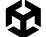

You need to define a buffer for your particles. It needs a struct that matches the one in the script and you need to declare a RWStructuredBuffer because this shader is going to write to the buffer.

```
// Particle's data
struct Particle
{
 float3 position;
 float3 velocity;
 float life;
};
```
// Particle's data, shared with the shader RWStructuredBuffer<Particle> particleBuffer;

In the CSParticle kernel you have:

```
Particle particle = particleBuffer[id.x];

particle.life -= deltaTime;
float3 delta = float3(mousePosition.xy, 0) - particle.position;
float3 dir = normalize(delta);
particle.velocity += dir;
particle.position += particle.velocity * deltaTime;
particleBuffer[id.x] = particle;

if (particle.life < 0) respawn(id.x);
```
Grab the particle from the buffer whose index is id.x. Because of the way you Dispatch this kernel this will have a value of 0 through to particleCount-1, as discussed. Then, decrement its life. Use the deltaTime property passed with each screen update to the compute shader by the script. It's the time in seconds that has elapsed since the last update. It will be a tiny value since Unity aims to display a new rendered frame at around 60 times a second. So deltaTime will be around 16ms or 0.016 seconds.

Create a vector from the particle to the mouse position, setting the **z** value to 0 – this is the default value for z for the particles. The mouse position value is set to the world position of the mouse. In the ParticleFun.cs file, use an OnGUI event.


```
void OnGUI()
 {
 Vector3 p = new Vector3();
 Camera c = Camera.main;
 Event e = Event.current;
 Vector2 mousePos = new Vector2();
 // Get the mouse position from Event.
 // Note that the y position from Event is inverted.
 mousePos.x = e.mousePosition.x;
 mousePos.y = c.pixelHeight - e.mousePosition.y;
 p = c.ScreenToWorldPoint(new Vector3(mousePos.x, mousePos.y, 
 c.nearClipPlane ));
 cursorPos.x = p.x;
 cursorPos.y = p.y; 
 }
```
This detects a mouse press and we use a bit of code to convert this into a screen position. Screen coordinates use bottom as 0, whereas Event.mousePosition uses top as 0. To invert the y value, subtract mousePosition.y from the Camera pixelHeight. Then use the Camera method ScreenToWorldPoint (this method requires a Z value) and finally, nearClipPlane ensures a successful result.

If you want to know more about converting mouse positions to world coordinates, see [this](https://gamedevbeginner.com/how-to-convert-the-mouse-position-to-world-space-in-unity-2d-3d/#screen_to_world_3d)  [post](https://gamedevbeginner.com/how-to-convert-the-mouse-position-to-world-space-in-unity-2d-3d/#screen_to_world_3d) from Game Dev Beginner.

Now you have a vector you can use to accelerate the particle, away from the mouse position. Then use the particle's velocity modulated by deltaTime.

If a particle's life is less than 0 then respawn the particle and use a fast-random function to generate the random values necessary. XorShift random number generators were a great discovery for real-time graphics by [George Marsaglia](https://en.wikipedia.org/wiki/George_Marsaglia).

The particle is positioned within a sphere of radius 0.8, centered around the mouse position and z=0. Reset the life of a new particle to four seconds and reset the velocity to zero.


```
void respawn(uint id)
{
      rng_state = id;
      float tmp = (1.0 / 4294967296.0);
      float f0 = float(rand_xorshift()) * tmp - 0.5;
      float f1 = float(rand_xorshift()) * tmp - 0.5;
      float3 normalF3 = normalize(float3(f0, f1, 0.0)) * 0.8f;
      normalF3 *= float(rand_xorshift()) * tmp;
      particleBuffer[id].position = float3(normalF3.x + mousePosition.x, normalF3.y + 
mousePosition.y, 0.0);
      // reset the life of this particle
      particleBuffer[id].life = 4;
      particleBuffer[id].velocity = float3(0,0,0);
}
```
Let's use the life property to control the color of the particle. Back in the vertex-fragment shader in the vert function add this code to the color assignment:

```
float life = particleBuffer[instance_id].life;
float lerpVal = life * 0.25f;
o.color = fixed4(1.0f - lerpVal+0.1, lerpVal+0.1, 1.0f, lerpVal);
```
Now the particles change color. The lerp value will be a value between 1 and 0, because life is set to 4 by the respawn function and you multiply this value by 0.25. The red channel will start at 0.1 and increase to 1.1 as life decreases, while the green channel starts at 1.1 and decreases over time to 0.1. Blue is always 1 and alpha decreases over time, causing the pixel to fade away.

This example shows how useful it can be to combine a compute shader and vertex-fragment shader when rendering multiple instances of the same asset. The simplest asset of all is used, a single pixel color value. The next example shows you how to extend this concept to render multiple mesh objects.

## <span id="page-138-0"></span>Adding a mesh object

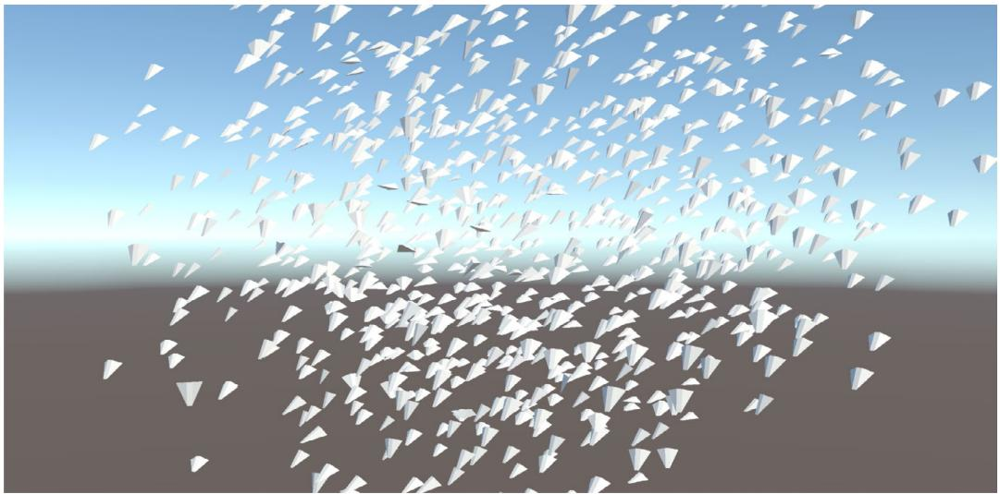

The Instanced Flocking scene

This mesh object example implements flocking. The idea of flocking came from observations of birds in flight, and the conclusion that the motion of a flock could be controlled with simple rules, the first one being that a bird could only know about the behavior of a small group of birds nearby and within eyesight. It was first suggested at [Siggraph 87](https://www.cs.toronto.edu/~dt/siggraph97-course/cwr87/) in a paper presented by [Craig Reynolds](https://www.red3d.com/cwr/). He called members of the flock Boids, a term that has stuck as a common term for an individual member of a computer simulated flock. Boid is short for "Bird-oid" object.

Once you've scanned the members of the flock that are within a certain user-defined radius and in the line of sight, use these three rules to adjust the position, orientation, and velocity of each boid.

1. **Separation**: Steer to avoid crowding other local boids. To achieve this, find the vector that points away from vectors from the current boid to other local boids.


Image by Craig Reynolds, *[Boids: Background and Update](https://www.red3d.com/cwr/boids/)*


2. **Alignment**: Steer towards the average heading of local boids. Lerp the current heading with the average heading of local boids.

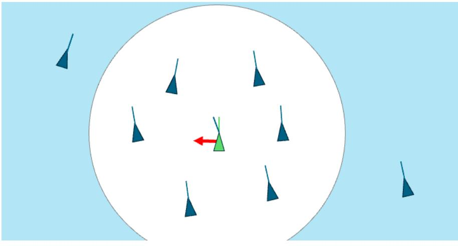

Image by Craig Reynolds, *[Boids: Background and Update](https://www.red3d.com/cwr/boids/)*

3. **Cohesion**: Steer to move toward the average position of local boids. Find the average position of local boids and steer towards it.


Image by Craig Reynolds, *[Boids: Background and Update](https://www.red3d.com/cwr/boids/)*

If separation and cohesion seem to be opposites of each other, remember that for separation you are working with vectors from the current boid. Whereas for cohesion you are considering the average position of a group of boids in the calculation.

Let's look at a concrete example.

Open the scene **InstancedFlocking** from **Scenes > ComputeShaders > Instanced** and in VS Code, open InstancedFlocking.cs and InstancedFlocking.compute from the same folder. You're going to be working with another ComputeBuffer, with this example focusing on the compute shader.


A boid has a position, direction, and a noise offset value. A constructor method is added to this struct, but the data in the struct is only two Vector3s and a float.

```
public struct Boid
 {
 public Vector3 position;
 public Vector3 direction;
 public float noise_offset;
 public Boid(Vector3 pos, Vector3 dir, float offset)
 {
 position.x = pos.x;
 position.y = pos.y;
 position.z = pos.z;
 direction.x = dir.x;
 direction.y = dir.y;
 direction.z = dir.z;
 noise_offset = offset;
 }
 }
```
There are a number of public properties that will allow the user to adjust the behavior of the flock; each will be examined as they come up when coding the shader.

InitBoids creates and populates a boids array. Position is a random value inside a sphere.

InitShader creates and sets the ComputeBuffer from the boids array and sets a number of properties in the compute shader.

The Update method sets time and delta time and then dispatches the kernel. Once the compute shader has calculated the new position and direction for each boid, use RenderMeshIndirect to actually render the boids. [RenderMeshIndirect](https://docs.unity3d.com/ScriptReference/Graphics.RenderMeshIndirect.html) needs a [RenderParams](https://docs.unity3d.com/ScriptReference/RenderParams.html) instance, a mesh, and a [GraphicsBuffer](https://docs.unity3d.com/ScriptReference/GraphicsBuffer.html) instance. The RenderParams instance is initialized in the Start method.

```
renderParams = new RenderParams(boidMaterial);
renderParams.worldBounds = new Bounds(Vector3.zero, Vector3.one * 1000);
```


Notice the constructor is passed a material. This material must support instancing. The method you'll use is to edit the URP Lit shader. To do this, copy the following files from the folder **Library/PackageCache/com.unity.render-pipelines.universal/Shaders**:

- Lit.shader
- LitForwardPass.hlsl
- ShadowCasterPass.hlsl, if shadows are supported

Put these files together into a subfolder.

Take a look at **Scenes > ComputeShaders > Instanced > Shader** in VS Code. Notice the three files copied from the PackageCache folder. The changes to Lit.shader are minimal. The shader name is changed.

```
Shader "Custom/Flocking/Instanced"
{
```
…

And the path to LitForwardPass.hlsl is changed to a single dot, meaning it will use the file in the same folder as the Lit.shader file. In the LitForwardPass.hlsl file, define the boid struct and the boidsBuffer.

```
struct Boid
{
 float3 position; 
 float3 direction; 
 float noise_offset;
};
```

```
StructuredBuffer<Boid> boidsBuffer;
```
We add a create\_matrix function. This creates a rotation and position matrix from a position, direction, and up vectors.

```
float4x4 create_matrix(float3 pos, float3 dir, float3 up) {
 float3 zaxis = normalize(dir);
 float3 xaxis = normalize(cross(up, zaxis));
 float3 yaxis = cross(zaxis, xaxis);
 return float4x4(
 xaxis.x, yaxis.x, zaxis.x, pos.x,
 xaxis.y, yaxis.y, zaxis.y, pos.y,
 xaxis.z, yaxis.z, zaxis.z, pos.z,
 0, 0, 0, 1
 );
}
```


It's important to add an SV\_instanceID element to the Attributes struct. This will allow access to the instanceID in the vertex shader.

```
struct Attributes
{
 float4 positionOS : POSITION;
 float3 normalOS : NORMAL;
 float4 tangentOS : TANGENT;
 float2 texcoord : TEXCOORD0;
 float2 staticLightmapUV : TEXCOORD1;
 float2 dynamicLightmapUV : TEXCOORD2;
 uint instanceID : SV_InstanceID;
 UNITY_VERTEX_INPUT_INSTANCE_ID
```
#### };

The Lit.shader defines the function LitPassVertex as the vertex shader. This function is in the LitForwardPass.hlsl for a Forward render pipeline.

Now that you have an instanceID in the input Attributes parameter, you can source an individual boid from the boidsBuffer. Use the create\_matrix function and the boid position and direction to create a matrix. Edit the parameter passed to GetVertexPosition in the default version of this file by multiplying input.positionOS by the matrix just created. GetVertexPosition is expecting a float3 so outside the mul function, add .xyz to change the float4 output to a float3. Do the same for the NormalInput:

```
Boid boid = boidsBuffer[input.instanceID];
```

```
float4x4 mat = create_matrix(boid.position, boid.direction, float3(0.0, 1.0, 0.0));
```

```
VertexPositionInputs vertexInput = GetVertexPositionInputs(mul(mat, input.positionOS).xyz);
```
VertexNormalInputs normalInput = GetVertexNormalInputs(mul(mat, input.normalOS), mul(mat, input.tangentOS));

Now you have a material to use. Let's look at how you use this to display multiple mesh objects.

An additional buffer, argsBuffer, which is a graphics buffer, has been added to the script. The vertex-fragment shader will use this buffer when rendering. You'll need to add the code to initialize the buffer.

When creating the buffer, set the type as IndirectArguments, the elements in the array as 1, and the size of an element as the size of an IndirectDrawIndexedArgs. Create an array of a single IndirectDrawIndexedArgs. Set the indexCountPerInstance to the vertex count of the boidMesh using the GetIndexCount method and set the instanceCount to the numOfBoids property.


Copy the data over to the argsBuffer using the SetData method. Now the data is resident on the GPU:

```
argsBuffer = new GraphicsBuffer(GraphicsBuffer.Target.IndirectArguments, 1, GraphicsBuffer.
IndirectDrawIndexedArgs.size);
```

```
GraphicsBuffer.IndirectDrawIndexedArgs[] data = new GraphicsBuffer.IndirectDrawIndexedArgs[1];
```

```
data[0].indexCountPerInstance = boidMesh.GetIndexCount(0);
```

```
data[0].instanceCount = (uint)numOfBoids;
```

```
argsBuffer.SetData(data);
```
This leads to the Update method. Set the Time and deltaTime in the compute shader. Dispatch it and once this has calculated the boid positions and directions, use RenderMeshIndirect to render the boids.

```
 void Update()
```

```
 {
```

```
 shader.SetFloat("time", Time.time);
 shader.SetFloat("deltaTime", Time.deltaTime);
```

```
 shader.Dispatch(this.kernelHandle, groupSizeX, 1, 1);
```

```
 Graphics.RenderMeshIndirect( renderParams, boidMesh, argsBuffer );
```
#### }

That is everything to know about the script. Let's switch focus to the flocking code in the compute shader.

This involves applying the three simple rules outlined earlier: Separation, alignment, and cohesion. First, get the boid from the buffer based on id.x. Then, set up the initial separation, alignment, and cohesion values. Only consider nearby boids when calculating these values. Inevitably, the current boid is inside this radius so nearbyCount starts at 1, not 0. Then for every boid you can ignore it if the loop is pointing at the current boid.

To apply the updates, i must not equal id.x. Then you get the boid pointed to by the i variable. There's one more check to see if the distance from the current boid to the temp boid is less than the property neighbor distance:

```
Boid boid = boidsBuffer[id.x];
float3 separation = 0;
float3 alignment = 0;
float3 cohesion = flockPosition;
```


```
uint nearbyCount = 1; // Add self that is ignored in loop
for (int i = 0; i < boidsCount; i++)
{
 if (i != int(id.x))
 {
 Boid tempBoid = boidsBuffer[i];
 if (distance(boid.position, tempBoid.position) < neighbourDistance){
 //position calculation goes here
 }
 }
}
```
The most complex calculation is separation, which is explained in more detail later in this section, but first, let's look at alignment and cohesion. For alignment, you'll get the sum of each boid's direction and for cohesion, the sum of each boid's position, with the cohesion variable having the value flock position:

```
alignment += tempBoid.direction;
cohesion += tempBoid.position;
nearbyCount++;
```
Then outside the loop you use the nearbyCount value to get the average of value for alignment and cohesion by dividing the accumulated values by the nearbyCount value. For cohesion you need to subtract the current boids position and normalize the result. This leaves the target direction as the sum of the three properties. But when applying the newly calculated direction, only use it at a very low blend with the existing boid direction. By using lerp, only 6% of the calculated direction is used to 94% of the existing.

Now that you have a boid direction (this is the forward vector not a rotation value), you can use it to update the position by multiplying it by the speed and deltaTime. The last step is to apply our updates back to the buffer.

```
float avg = 1.0 / nearbyCount;
alignment *= avg;
cohesion *= avg;
cohesion = normalize(cohesion - boid.position);
float3 direction = alignment + separation + cohesion;
boid.direction = lerp(direction, normalize(boid.direction), 0.94);
boid.position += boid.direction * boidSpeed * deltaTime;
boidsBuffer[id.x] = boid;
```


If you run the program now the boids will all merge into one, as you haven't yet applied a separation value. Let's fix that.

Back in the for loop you first get a vector, and its length, from the temporary boid to the boid you're currently setting. If the temporary boid is farther away than the value set as neighbor distance then ignore it. If it's less than this distance you need to allow for it in your separation value. Use the offset vector and scale this by a value that increases the nearer you get to the boid you're setting. Because you're using 1 over dist you'll need to make sure dist is never zero, so avoid division by zero.

So, what does 1/dist minus 1/neighbourDistance mean? Think about what happens when dist is small, 1/dist is very large and you can ignore the small value of 1/neighbor distance. Whereas if this boid is near the limit of neighbor distance then you get more or less 1/neighbor distance minus 1/neighbor distance or zero. So when a boid is close to the target boid, you massively increase the separation vector and when one is near the neighbor distance value you ignore it.

```
float3 offset = boid.position - tempBoid.position;
float dist = length(offset);
if (dist<neighbourDistance){
 dist = max(dist, 0.000001);
 separation += offset * (1.0/dist - 1.0/neighbourDistance);
}
```
Now you have a flocking example. After a few seconds all the boids come together and orbit around the flock position.

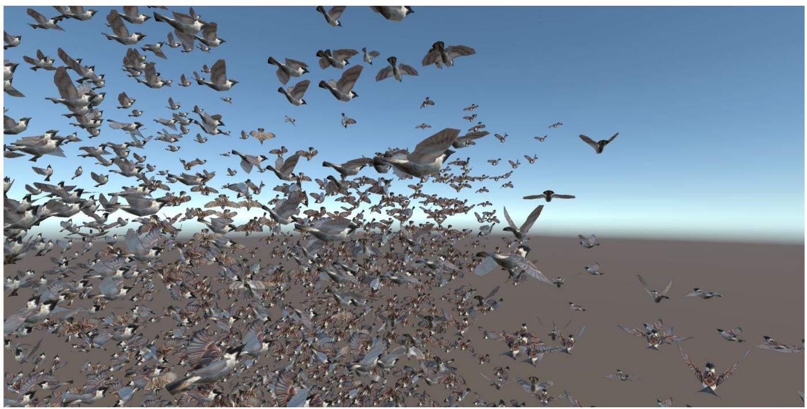

SkinnedFlocking scene


This final example uses a [Skinned Mesh Renderer](https://docs.unity3d.com/ScriptReference/SkinnedMeshRenderer.html). Open the scene called SkinnedFlocking via the **Scenes > ComputeShaders > Skinned** folder and run it. You'll see loads of birds flying around. In VS Code, open SkinnedFlocking.cs from the Scripts folder. From the Shader folder, open SkinnedFlocking.compute and LightForwardPass.hlsl.

 Let's start with the script. This is essentially the same as the previous example, with a few changes. First, the boid struct now has a frame property. Use this to select the animation frame to display. There is now a numOfFrames property that is passed to the compute shader and the custom Lit shader. The script also uses the EnableKeyword and DisableKeyword methods of the shader to add or remove a define from the shader. This example also has a third buffer, the vertexAnimationBuffer, and you might have noticed a new method, GenerateVertexAnimationBuffer. Let's review this method.

 Before the program starts you'll use an [Animator](https://docs.unity3d.com/ScriptReference/Animator.html) component to set the mesh into a series of poses. Then put the vertex positions in the pose into a buffer. By choosing the correct index from this buffer you can display a series of different poses of the mesh. The first thing you need is the Animator component. Animations in Unity can use layers, but keep it simple here and use just layer one.

```
animator = boidObject.GetComponentInChildren<Animator>();
int iLayer = 0;
```
You can see that the Animator is set to automatically play the animation clip FlapWings. To set a pose you'll need the state info, a new Mesh to store the pose and a couple of variables.

```
AnimatorStateInfo aniStateInfo = animator.GetCurrentAnimatorStateInfo(iLayer);
```

```
 Mesh bakedMesh = new Mesh();
 float sampleTime = 0;
 float perFrameTime = 0;
```
This script has a public property called animationClip that's set to the FlapWings animation. Use the frame rate and length properties included in the [AnimationClip](https://docs.unity3d.com/ScriptReference/AnimationClip.html) to determine the number of frames to bake. Because this value is going to be used so often to set the index in the vertexAnimationBuffer to use for a vertex, it will be more efficient if it's a power of two. The Mathf object has a useful method to set this value. Now you can get the duration of an individual frame.

```
numOfFrames = Mathf.ClosestPowerOfTwo((int)(animationClip.frameRate * animationClip.length));
 perFrameTime = animationClip.length / numOfFrames;
```


You'll need the vertex count of the mesh. Now you can set up an array of Vector4s to store the vertex data. It's going to be vertex count times numOfFrames long. You're all set to grab the vertex data, which is done in a for loop. Recall that you got an aniStateInfo object that you can use to get the animation to play, setting the layer and start time. Then, call update with a deltaTime of zero. This will update the mesh to the position defined by this animation. Now you can bake the mesh to your bakedMesh object and then iterate through the vertices to store their values in the vertex array.

```
var vertexCount = boidSMR.sharedMesh.vertexCount;
```

```
 Vector4[] vertexAnimationData = new Vector4[vertexCount * numOfFrames];
 for (int i = 0; i < numOfFrames; i++)
 {
 animator.Play(aniStateInfo.shortNameHash, iLayer, sampleTime);
 animator.Update(0f);
 boidSMR.BakeMesh(bakedMesh);
 //Grab the vertices into the vertex array here
 for(int j = 0; j < vertexCount; j++)
 {
 Vector4 vertex = bakedMesh.vertices[j];
 vertex.w = 1;
 vertexAnimationData[(j * numOfFrames) + i] = vertex;
 }
 sampleTime += perFrameTime;
 }
```
At this stage you'll have an array of vertices that you can use to set up your ComputeBuffer. Pass this buffer to the material. The compute shader doesn't need this buffer, only the shader. You'll only read from the buffer.

```
vertexAnimationBuffer = new ComputeBuffer(vertexCount * numOfFrames, 16);
vertexAnimationBuffer.SetData(vertexAnimationData);
boidMaterial.SetBuffer("vertexAnimation", vertexAnimationBuffer);
```
Now let's look at how the compute shader has been affected.

Use the current speed, deltaTime and the property boidFrameSpeed to adjust the boid frame property. A faster moving bird will flap quicker. Check that the frame property hasn't passed the numOfFrames property. If it has then subtract this value, so boid.frame will be in the range 0 to numOfFrames.


```
boid.frame = boid.frame + velocity * deltaTime * boidFrameSpeed;
if (boid.frame >= numOfFrames) boid.frame -= numOfFrames;
```
Now let's review the shader. It's essential that the Attributes instance passed to the vertex shader function includes vertexID as well as instanceID.

```
struct Attributes
{
 float4 positionOS : POSITION;
 float3 normalOS : NORMAL;
 float4 tangentOS : TANGENT;
 float2 texcoord : TEXCOORD0;
 float2 staticLightmapUV : TEXCOORD1;
 float2 dynamicLightmapUV : TEXCOORD2;
 uint instanceID : SV_InstanceID;
 uint vertexID : SV_VertexID;
 UNITY_VERTEX_INPUT_INSTANCE_ID
```
};

Now in the LitVertexPass function you'll get the boid from the boidsBuffer using the instanceID. If FRAME\_INTERPOLATION is not defined then set positionOS.xyz to the vertexAnimation buffer at index vertexID \* numFrames + boid.frame.

If FRAME\_INTERPOLATION is defined then set positionOS.xyz to a blend of the current boid.frame value and the next frame using lerp. The blend value is determined by the fractional part of boid.frame. If this is 0 then the blend will be just the frame value. If the fractional part is 0.5 then it will result in a linear interpolation of 50% frame and 50% next.

```
Boid boid = boidsBuffer[input.instanceID];
```

```
 #ifdef FRAME_INTERPOLATION
 uint next = boid.frame + 1;
 if (next >= numOfFrames) next = 0;
 float frameInterpolation = frac(boidsBuffer[input.instanceID].frame);
 input.positionOS.xyz = lerp(vertexAnimation[input.vertexID * numOfFrames + boid.
frame], vertexAnimation[input.vertexID * numOfFrames + next], frameInterpolation);
 #else
 input.positionOS.xyz = vertexAnimation[input.vertexID * numOfFrames + boid.frame];
 #endif
```


Play the app now and see how the speed of the birds flapping their wings is affected by their velocity. Do this by following these steps:

- 1. Set up a vertex buffer that stores a number of poses of the bird, performing the flap wings animation.
- 2. In the compute shader set the Boid property frame to a value between 0 and numOfFrames.
- 3. The speed at which this frame property updates is dictated by the velocity of the bird.
- 4. In the surface shader you'll get the current and next frames using the Boid property.
- 5. In the vertex shader, use a combination of vertexID and the current and next frame values to get the appropriate value from the vertex buffer.

This recipe moves from using a compute shader to position single points being rendered, to rendering multiple animated meshes. Compute shaders offer a great performance boost for some computationally expensive processes and are well worth learning to use effectively.

#### **More resources**

[Learn to Write Unity Compute Shaders](https://www.udemy.com/course/compute-shaders)

## <span id="page-150-0"></span>Conclusion

As mentioned in the introduction to this guide, the e-book *[Introduction to the Universal](https://resources.unity.com/games/introduction-universal-render-pipeline-for-advanced-unity-creators?UNGATED=TRUE?utm_source=demand-gen&utm_medium=pdf&utm_campaign=render-with-quality-and-flexibility&utm_content=urp-cookbook)  [Render Pipeline for advanced Unity creators](https://resources.unity.com/games/introduction-universal-render-pipeline-for-advanced-unity-creators?UNGATED=TRUE?utm_source=demand-gen&utm_medium=pdf&utm_campaign=render-with-quality-and-flexibility&utm_content=urp-cookbook)* is a valuable guide for helping experienced Unity developers and technical artists get the best out of the latest capabilities available with [URP](https://docs.unity3d.com/6000.0/Documentation/Manual/urp/urp-introduction.html).

All of Unity's advanced technical e-books are available from the [Unity best practices hub](https://unity.com/how-to?utm_source=demand-gen&utm_medium=pdf&utm_campaign=render-with-quality-and-flexibility&utm_content=urp-cookbook). The e-books can also be found on the [advanced best practices](https://docs.unity3d.com/6000.0/Documentation/Manual/best-practice-guides.html?utm_source=demand-gen&utm_medium=pdf&utm_campaign=render-with-quality-and-flexibility&utm_content=urp-cookbook) Documentation page.


[unity.com](https://unity.com/es)